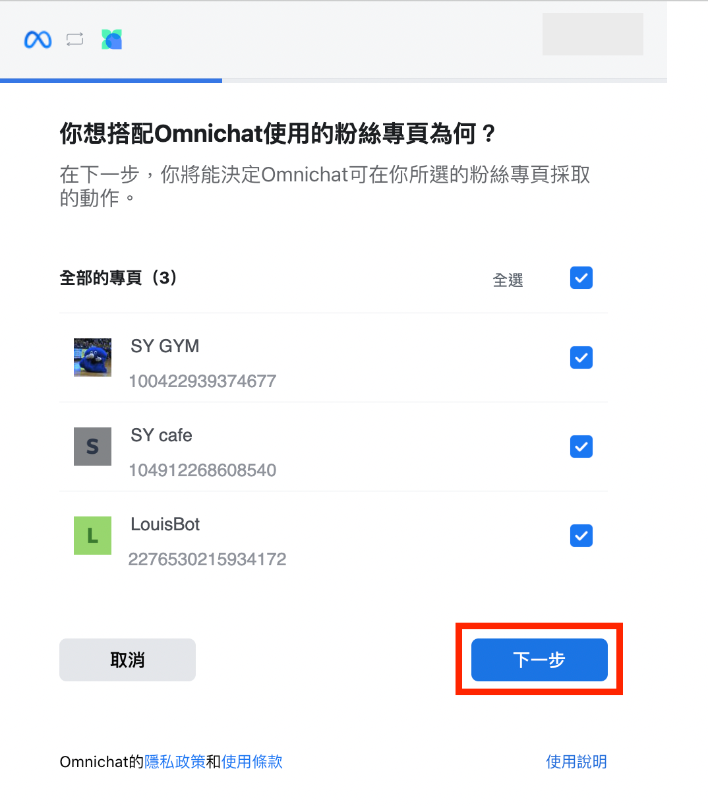
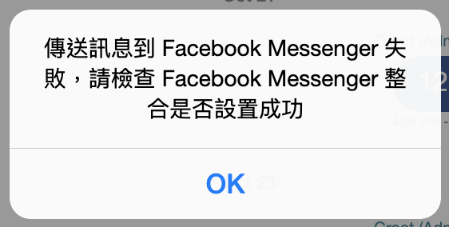
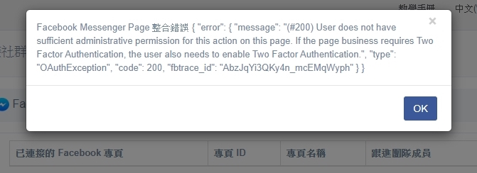
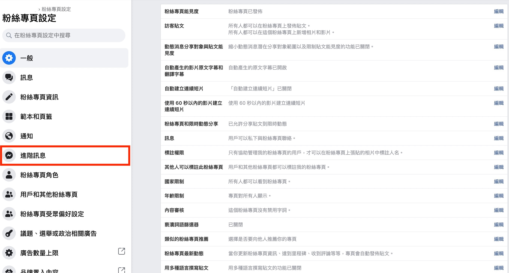
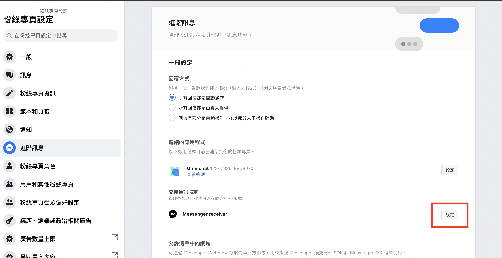
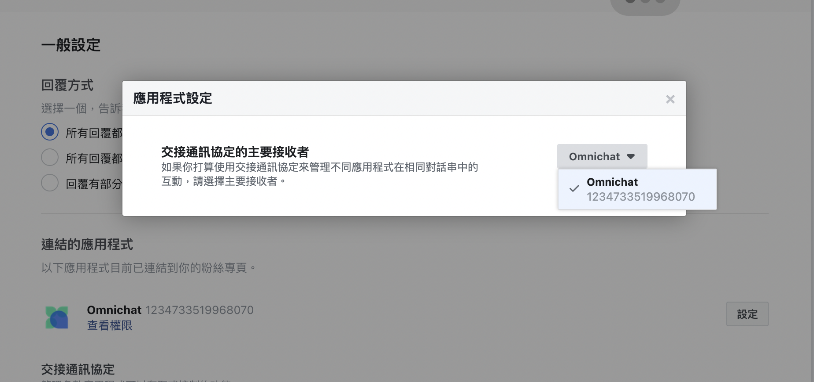

# Facebook Messenger | 整合到 Omnichat

## 如何整合 Facebook Messenger

### 前置條件

* 你的 Facebook 帳號需要擁有該 Facebook 專頁的 **「管理員」 權限**
* 檢查權限路徑：粉絲專頁頭像下拉 > 設定和隱私 > 設定 > 左側面 「🏳️粉絲專頁設定」

<figure><figcaption></figcaption></figure> <figure><figcaption></figcaption></figure>

### 串接步驟

1. 登入 [Omnichat 後台](https://app.omnichat.ai/)
2. 在左側選單選擇「**通訊渠道 >** [**串接社群通訊渠道**](https://console.omnichat.ai/social-channels-integration)」
3. 點擊 **Facebook Messenger** 分頁部份 -> 點擊「**串接 Facebook 專頁**」

<figure><figcaption></figcaption></figure>

4\. 會另開網站分頁，請點擊「**以 O O O 的身份繼續**」


如您尚未登入 Facebook 帳號，請先進行登入


<figure><figcaption></figcaption></figure>

<figure><figcaption></figcaption></figure>

5\. 勾選你想要連接的 Facebook 專頁，然後按 「**下一步**」


**注意：如有較多粉絲專頁，不確定如何完整授權，建議可選取 「所有」 粉絲專頁確保無遺漏。如果選擇第二種 「目前」 粉絲專頁，且您之前已串接其他專頁到 Omnichat 過，請勿取消打勾原本的專頁勾選狀態，另外勾選此次新加入的專頁即可。**


<figure><figcaption>
存取 「所有」 粉絲專頁
</figcaption></figure> <figure><figcaption>
存取 「目前」 粉絲專頁
</figcaption></figure>

6. 勾選你想要連接的商家，然後按「**下一步**」&#x20;


**注意：如有較多商家，不確定如何完整授權，建議可選取 「所有」 商家確保無遺漏。**


<figure><figcaption>
存取 「所有」 商家
</figcaption></figure> <figure><figcaption>
存取 「目前」 商家
</figcaption></figure>

7. Omnichat使用權限一覽，確認後點選右下角 「儲存」&#x20;

<figure><figcaption></figcaption></figure>

8. 點擊「**確定**」

<figure><figcaption></figcaption></figure>

9. 成功授權的 Facebook 專頁會在「**串接 Facebook 專頁**」部份列出，請勾選需要串接的 Facebook 粉專後點擊「**串接**」。

<figure><figcaption></figcaption></figure>

<figure><figcaption></figcaption></figure>

## 常見問題

### 1. 回覆 Facebook 事件時，彈出錯誤「_傳送訊息到 Facebook Messenger 失敗，請檢查 Facebook Messenger 整合是否設置成功_」

如果回覆 Facebook 事件時，出現以下畫面，請先初步確認只有ㄧ個事件有出現，還是多個事件都有出現：

* **單一事件出現：**&#x8ACB;完整截圖該事件的畫面，並從後台聯繫 Omnichat 線上客服
* **多個或所有事件出現：**&#x5C6C;於串接權限失效問題，請參考「[**如何排解權限失效狀態**](facebook-messenger.md#ru-he-pai-jie-quan-xian-shi-xiao-zhuang-tai)」步驟

### 2. 出現整合錯誤

如果你看到上圖的錯誤提示，請先確認您的 Facebook 帳號是否已經擁有想要串接的 Facebook 專頁管理員權限。

### 3. 串接前，顧客與Facebook專頁的過往對話是否同步進到 Omnichat 後台中？

如果在您串接Facebook專頁到Omnichat以前，顧客已經與您產生過對話，串接後之前的這些對話是不會同步進來到Omnichat的。這是因爲Facebook原生後台並未開放回訊息回溯功能與權限給第三方系統廠商。但是在您串接後，顧客回覆您的對話都可以進到Omnichat後台中。

### 4. 串接後，若您在 Facebook 原生後台回覆顧客訊息是否進到 Omnichat 後台中？ 

若您直接從 Facebook 原生後台 Messenger 收件夾回覆顧客，該回覆的訊息<mark style="color:red;">**不保證**</mark>能進到 Omnichat 的對話事件中，這是由於 Meta 官方針對第三方系統商分享對話資料經常有系統 Bug 導致該訊息無法正常出現在 Omnichat 後台，因此建議您非必要時<mark style="color:red;">**仍可以 Omnichat 系統端為主要回覆 Facebook 對話事件的平台**</mark>。

## 如何排解權限失效狀態

### 1. 重新授權

Facebook 的授權會因為以下原因而失效，授權失效後會影響 Omnichat 系統的功能：

* 負責授權的 Facebook 用戶帳號更改密碼
* 負責授權的 Facebook 用戶帳號開啟了雙重驗證
* Facebook 偵測到用戶有異常行為，基於安全原因把授權取消

你可以根據以下步驟重新授權：

1. 登入 [Omnichat 後台](https://app.omnichat.ai/)
2. 在左側選單選擇「**通訊渠道 >** [**串接社群通訊渠道**](https://app.omnichat.ai/integration.html)」 _（點擊連結可直接進入團隊後台串接頁面）_
3. 打開 **Facebook Messenger 分頁**
4. 在**已串接的Facebook 專頁**，點擊「**解除串接**」把需要重新授權的 Facebook 專頁斷開連接

<figure><figcaption></figcaption></figure>

5\. 斷開連接後，點擊「**串接** **Facebook** 專頁」

<figure><figcaption></figcaption></figure>

6\. 點擊「**以** **OOO** **的身份繼續**」完成重新授權

<figure><figcaption></figcaption></figure>

7\. 成功重新授權後， Facebook 專頁會列出，請勾選需要串接的 Facebook 粉專後點擊「**串接**」。

<figure><figcaption></figcaption></figure>


如果想要串接的專頁沒有出現，請回到「第6步」點擊下方 「**編輯設定**」 檢查是否有勾選想要串接的 Facebook 專頁及授權所有 Omnichat 要求的權限

如果未跳出『編輯設定』可重新確認 Facebook 粉專設定，請查看是否點擊「**以** **OOO** **的身份繼續**」後可至『企業整合工具設定』調整。


<figure><figcaption></figcaption></figure>

### 2. 更改 Facebook 粉絲專頁的訊息主要接收者

若您&#x70BA;**「舊版粉絲專頁」**&#x8ACB;參考此步驟，新版請往下繼續瀏覽。

1. 粉絲專頁設定 > 進階訊息&#x20;

<figure><figcaption></figcaption></figure>

2. 找到交接通訊協定，並點擊「Messenger reciever」旁的設定按鈕

<figure><figcaption></figcaption></figure>

將「主要接收者」設定成 Omnichat

<figure><figcaption></figcaption></figure>

若您&#x70BA;**「新版粉絲專頁」**&#x8ACB;參照下列圖文步驟

1. 管理粉絲專頁頁面 > 從右上角的頭像點擊「設定與隱私」

<figure><figcaption></figcaption></figure>

2. 再點選「設定」>並選擇左側欄位的「粉絲專頁設定」

<figure><figcaption></figcaption></figure>

3. 在粉絲專頁設定當中點選 「進階訊息」 右側&#x7684;**「查看」**&#x6309;鈕

<figure><figcaption></figcaption></figure>

4. 頁面找到 應用程式設定-交接通訊協定 > 在「Messenger 接收者」右側設定 > 選擇 「Omnichat」

<figure><figcaption></figcaption></figure>

<figure><figcaption></figcaption></figure>

## 串接失敗之後台自動錯誤提示


系統每小時會判斷一次串接是否有效，若串接失效會寄信通知，並在後台提示錯誤。


<figure><figcaption></figcaption></figure>

**渠道串接失效信件**

* 失效後只會寄出**一封**提醒信。
* 團隊方案已結束的客戶將不會收到信件。
* 失效原因及如何重新授權請參考[此處說明](facebook-messenger.md#id-1.-chong-xin-shou-quan)。

<figure><figcaption></figcaption></figure>
