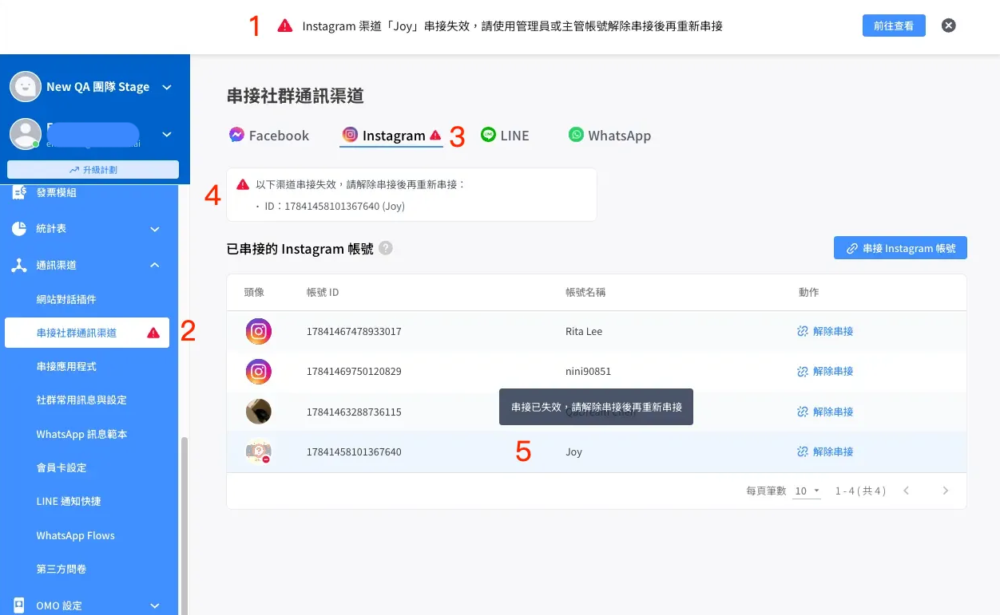

# Instagram Messenger | 整合到 Omnichat

## 如何整合 Instagram Messenger

### 前置條件

* 你的 Instagram 帳號必須是「**商業帳戶**」 （設定方法可參考：[https://help.instagram.com/502981923235522](https://help.instagram.com/502981923235522) ）
  * **注意：請選 「商家」 類型（「創作者帳戶」會無法正常整合）**
  * **切換成商業帳戶的過程中，將要求選擇一個Facebook粉專與將Instagram相連結（此為必要動作，兩者相連才能與Omnichat系統串接）**
  * 如何判定是否已為商業帳號：可以到「Instagram App > 「≡」 設定和動態 > 商業工具和控制項 > 切換帳號類型 確認目前類型。若帳號為「商業帳號」，切換時只會出現切換為個人帳號或創作者帳號。

<figure><figcaption>
中英文介面參考
</figcaption></figure>

* 如先前切換商業帳戶時未與FB粉專相連，請再次確認先將你需要整合的 Instagram 帳號連接到你的 Facebook 粉專（可參考： [https://www.facebook.com/business/help/connect-instgram-to-page](https://www.facebook.com/business/help/connect-instgram-to-page) ）
* 你的Facebook帳號需要擁有該 Facebook 粉專的**管理員權限**
* 在 Instagram App 內，個人檔案 > 「≡」 設定和動態 > 訊息和限時動態回覆：
  * 訊息控制項&#x20;
    * 將 「潛在聯繫對像 / Potential connections」 底下，開啟接收 「你的 Instagram 粉絲 陌生訊息」
    * 將 「其他 Instagram 用戶」 底下，開啟接收 「 其他 Instagram 用戶 陌生訊息 」

<figure><figcaption></figcaption></figure>

### 串接步驟

1. 登入 [**Omnichat 後台**](https://app.omnichat.ai/)
2. 在左側選單選擇「**通訊渠道 >** [**串接社群通訊渠道**](https://console.omnichat.ai/social-channels-integration)」
3. 打開「已串接的 Instagram 帳號」部份 -> 點擊「**串接 Instagram 帳號**」 （請使用Chrome瀏覽器，請勿使用Safari瀏覽器容易串接失敗）


無需先將FB粉專連結到 Omnichat，才能串接Instagram到Omnichat。兩者獨立，**可直接串接Instagram到Omnichat**。

但是如果你<mark style="color:red;">**已經有串接 Facebook 粉專到 Omnichat**</mark>，請使用負責串接 Facebook 粉專的<mark style="color:red;">**同一個 Facebook 用戶串接 Instagram。**</mark>


<figure><figcaption></figcaption></figure>

4\. 點擊「**串接 Instagram 帳號**」後會另開一個分頁，並出現以下 Facebook 視窗，請點擊「**以 O O O 的身份繼續**」


如您尚未登入 Facebook，請先登入


<figure><figcaption></figcaption></figure>

5\. 出現連結到 Instagram ，點擊「立即開始」 並輸入該 Instagram 帳密

<figure><figcaption></figcaption></figure> <figure><figcaption></figcaption></figure>

6\. 如IG已事先連好FB粉專，會出現左圖畫面，請勾選已經連接了 Instagram 帳號的 Facebook 粉專（建議可直接勾選上方 「存取所有」 ）; 如IG尚未連結好FB粉專，將出現右圖畫面，再次提醒請選一個FB粉專相連。


**注意：如果你有串接其他 Facebook 粉專到 Omnichat，請勿把本身已經勾選的 Facebook 粉專取消勾選，否則會使串接失效**


<figure><figcaption>
如IG已事先連好FB粉專，會到此畫面
</figcaption></figure> <figure><figcaption>
如IG尚未連好FB粉專，會到此畫面
</figcaption></figure>

&#x20;7\. Omnichat存取權限，建議可直接選擇「所有」


**注意：請勿把表列的權限取消，否則會影響 Omnichat 的功能**


<figure><figcaption></figcaption></figure> <figure><figcaption></figcaption></figure>

8\. 授權完成，點擊「儲存」及「知道了」。

<figure><figcaption></figcaption></figure> <figure><figcaption></figcaption></figure>

9\. 成功授權的 Instagram 帳號會在原本頁面彈出視窗，請勾選要串接的 Instagram 帳號後，點擊「**串接**」，即完成串接。

<figure><figcaption></figcaption></figure>


如果您看不到您想串接的 Instagram 帳號，請檢查：

* 是否擁有連接了 Instagram 帳號的 Facebook 專頁的管理員權限
* 在第 6 步是否有勾選連接了 Instagram 帳號的 Facebook 專頁


## 如何重新授權

Instagram 的授權會因為以下原因而失效，授權失效後會影響 Omnichat 系統的功能：

* 負責授權的 Instagram 用戶帳號更改密碼
* 負責授權的 Instagram 用戶帳號開啟了雙重驗證
* Instagram 偵測到用戶有異常行為，基於安全原因把授權取消

如果你在 Omnichat 後台 對話頁面看到以下錯誤，請重新授權 Instagram 帳號權限。


**如果串接時遇到「整合IG帳號失敗」的錯誤提示，請確認是使用串接 Facebook 粉專的同一個 Facebook 用戶串接 Instagram，或是可以取消兩個平台的串接後，再次同時由同一個 Facebok 用戶重新串接。**


你可以根據以下步驟重新授權：

1. 登入 [Omnichat 後台](https://app.omnichat.ai/)
2. 在左側選單選擇「**通訊渠道 >** [**串接社群通訊渠道**](https://app.omnichat.ai/integration.html)」
3. 打開「**Instagram 帳號整合**」部份
4. 在「**已連接的 Instagram 帳號**」部份，點擊「**不連接**」把需要重新授權的 Instagram 帳號斷開連接

<figure><figcaption></figcaption></figure>

5\. 斷開連接後，點擊「**串接 Instagram 帳號**」

<figure><figcaption></figcaption></figure>

6\. 點擊「**以 OOO 的身份繼續**」完成重新授權

<figure><figcaption></figcaption></figure>

7\. 成功授權的 Instagram 帳號會在原本頁面彈出視窗，請勾選要串接的 Instagram 帳號後，點擊「**串接**」，即完成串接。

<figure><figcaption></figcaption></figure>


如果彈出的視窗沒有列出您想要整合的 Instagram 帳號，請在「第 6 步」點擊「**編輯設定**」，檢查是否有勾選整合的 Instagram 帳號及連接該 Instagram 帳號的 Facebook 粉專


<figure><figcaption></figcaption></figure>

## 串接後無法在 Omnichat 後台收到訊息解決方法


> Instagram 需&#x70BA;**『商業帳號』**&#x624D;可完成整合串接，如果&#x70BA;**『創作者帳號』**&#x8ACB;參考以下連結設定 Instagram 商業帳號：[https://help.instagram.com/50298192323552](https://help.instagram.com/502981923235522)&#x20;


1.在Facebook 專頁 > 設定和隱私 > 設定 > 已連結的帳號，斷開 Instagram 與 Facebook 專頁連接

<figure><figcaption></figcaption></figure> <figure><figcaption></figcaption></figure>

2\. 重新連接 Instagram 到 Facebook 專頁

<figure><figcaption>
步驟1
</figcaption></figure> <figure><figcaption>
步驟2
</figcaption></figure> <figure><figcaption>
步驟3
</figcaption></figure> <figure><figcaption>
步驟4
</figcaption></figure> <figure><figcaption>
步驟5
</figcaption></figure>

3\. 在 Facebook 專頁 > 設定和隱私 > 設定 > 粉絲專頁設定 > 進階訊息，檢視 「通訊協定主要接收者」 是否為Omnichat (如已是，可重複點擊Omnichat一次移除後，再選取一次）

<figure><figcaption>
步驟1
</figcaption></figure> <figure><figcaption>
步驟2
</figcaption></figure> <figure><figcaption>
步驟3
</figcaption></figure> <figure><figcaption>
步驟4
</figcaption></figure>

4\. 再請到 Omnichat 重新串接 Instagram

## 串接失效-後台錯誤提示


系統會每小時會判斷一次串接是否有效，若串接失效會寄信通知，並在後台提示錯誤


* 失效後只會寄出**一封**提醒信。
* 團隊方案已結束的客戶將不會收到信件。
* 失效原因及如何重新授權請參考[此處說明](instagram.md#ru-he-chong-xin-shou-quan)。

<figure><figcaption></figcaption></figure>

### 渠道串接失效信件

<figure><figcaption></figcaption></figure>
