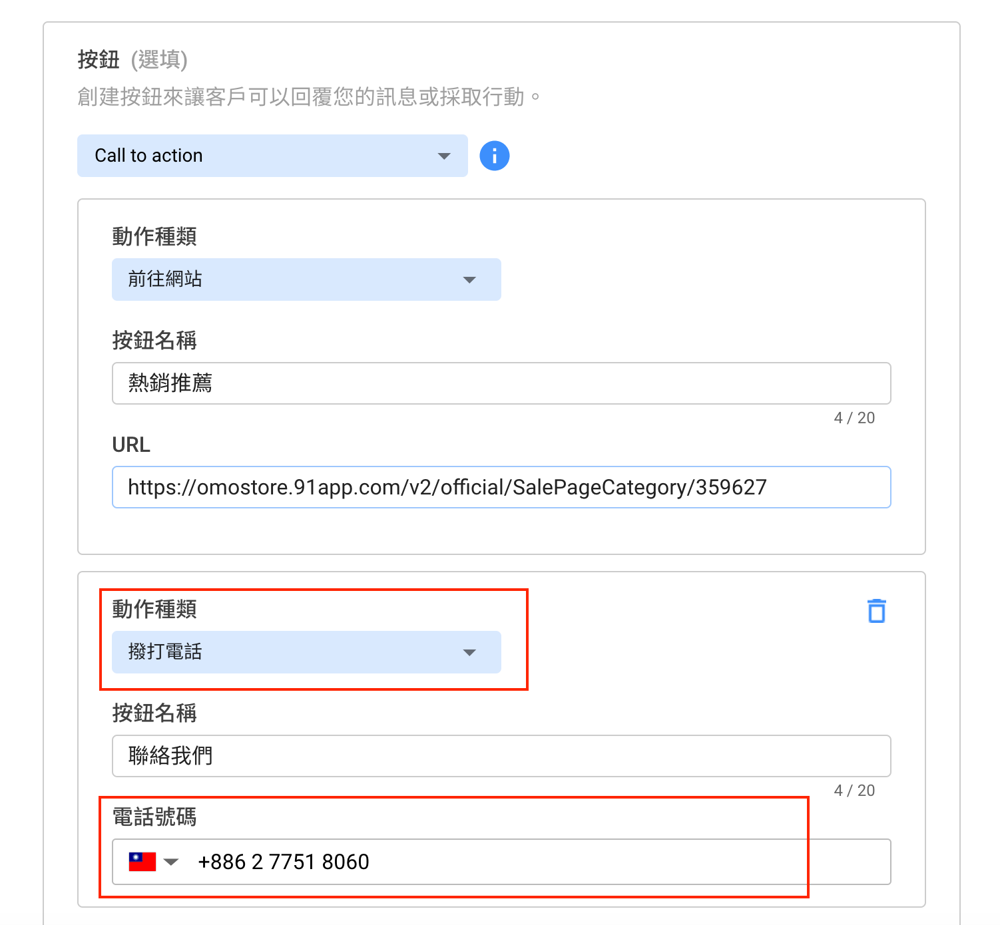

# 創建 WhatsApp 範本訊息

為了能在 Omnichat 發送 ＷhatsApp 推播訊息，需先在 Omnichat 後台建立『範本訊息』（Message Template) 且需通過 ＷhatsApp 審查，才可以使用此範本訊息進行推播。另外，範本訊息也可使用在『對話』頁面一對一聊天功能中，可與24小時以後互動的消費者展開對話


注意：

1. 範本訊息建立數量限制為 250 個，如超過需要刪除後才能再建立
2. 範本訊息審查時間及狀態依照 ＷhatsApp 官方為主，詳情請見[ＷhatsApp Template Guidelines](https://developers.facebook.com/docs/whatsapp/message-templates/guidelines#status)


### Step 1

至『通訊渠道』-> 『串接社群通訊渠道』->『ＷhatsApp』，點選鉛筆圖示來建立範本訊息

<figure><figcaption></figcaption></figure>

### Step 2. 按下『新增訊息範本』開始建立

請先確認 ＷhatsApp 電話號碼是否正確，如為正確號碼，按下『新增訊息範本』開始建立

<figure><figcaption></figcaption></figure>

### Step 3. 設定『名稱』、『類別』、『語言』

1. 名稱: 為這個範本訊息命名
2. 分類: 有「Authentication」、「Marketing」、「Utility」，依照推播訊息類型選擇，分類說明請見[Meta官方文件](https://developers.facebook.com/docs/whatsapp/updates-to-pricing/new-template-guidelines?locale=zh_TW)。
   * **Authentication 驗證範本**：通常用來傳送身分驗證的一次性密碼，例如客人登入網站的一次性密碼
   * **Marketing 行銷範本**：發送推廣優惠產品發佈及其他用於提升品牌互動、知名度的訊息
   * **Utility 公用範本**：發送帳號通知、意見回饋問卷調查、訂單相關通知，或其他重要訊息
3. 語言: 選擇消費者看到的範本訊息語言 （選擇單一語言，例如只選擇英文版或者中文版）

### Step 4. 設定標題（Header ）

選擇兩種類型（文字 Text, 媒體Media)

1.文字（可新增參數）

按下新增參數（Add Variable） 建立參數（格式：\{{ \}}），須事先建立參數（Variable）才可以在Omnichat後台使用範本訊息時進行這個區域內的文字調整。


範本訊息通過審核後可以修改內容，但修改後需重新提交給Meta審核。


2.選擇 Media, 選擇三種檔案類型-圖片（image）, 影片（Video）, 文件（Document）


檔案格式限制可以參考以下規格：

* 圖片支援 JPG/PNG (限制: 5MB，1125px(W) by 600px(H)
* 影片支援 MP4 (限制: 16MB，H.264 video codec)
* 文件支援 PDF (限制: 64MB)


### Step 5. 設定內文（ Body）

按下新增參數（Add Variable） 建立參數（格式：\{{ \}}），須事先建立參數（Variable）才可以在Omnichat後台使用範本訊息時進行這個區域內的文字調整。


1. 範本訊息通過審核後可以修改內容，但修改後需重新提交給Meta審核。
2. 如需斷行需要事先設定，如以下範例：熱銷主打星與本月優惠兩行就需要個別設定\{{1\}}, \{{2\}} 兩組變數


.png>)


內文定義限制如下：

1. 不可以放參數在內文的最前面或是最後面
   * e.g. `{{1}} 請聯絡我們 {{2}}`
2. 不可以有兩個連續的參數（中間加空行也不行）
   * e.g. `{{1}} {{2}} 請聯絡我們`
3. 參數與內文文字數量的比例不可太高
4. 提交範本訊息送審時，URL 按鈕不可以使用短網址（但過審核後就可以）


### Step 6 設定頁尾 （Footer）

僅能選擇純文字，此區無法添加變數

可以在此區域設定『如果你不想收到來自 WhatsApp 的訊息，請輸入「取消訂閱」』這段文字，讓消費者如不想收到推播訊息可以自行取消訂閱，以降低帳號的封鎖率


注意：帳號發送顧客品質將影響帳號每日可推播數量，詳請請查閱[ＷhatsApp Quality Rating](https://developers.facebook.com/docs/whatsapp/api/rate-limits#quality-rating-and-messaging-limits)


.png>)

### Step 7 設定按鈕（ Buttons）

按鈕可以可以選擇兩種類型：Call To Action 或 Quick Reply (快速回覆）

1. Call To Action：可以選擇『前往網站』或者『撥打電話』兩個不同動作。可設置：

* 快速回覆：最多 10 組&#x20;
* Call to Action - 前往網站：最多 2 組&#x20;
* Call to Action - 撥打電話：最多 1 組&#x20;
* Call to Action - 前往訂單（對話下單）：最多 1 組

若選擇前往網站，網址欄位請先隨意填寫一個網址（如你的官網首頁），後續使用 Template Broadcast 時可再重新替換。


注意： 按鈕名稱文字內容在範本訊息通過審核後可以修改內容，但修改後需重新提交給Meta審核。


.png>)

2\. Quick Reply (快速回覆）：消費者點擊就會回覆指定文字，通常搭配關鍵字自動回覆 或機器人模組使用，最多可以設置 3 個快速回覆按鈕。


注意：&#x20;

按鈕名稱文字內容在範本訊息建立完成後即不可修改，僅有變數中的文字才可在Omnichat 的後台修改。選擇快速回覆的話，設定的文字後續不能修改，但是快速回覆的動作（如觸發什麼自動回應、Chatbot）可再調整。


### Step 8 設定範例：Add Sample (務必填寫以加速審查）

按下『新增範例』後開始新增，在『參數』中輸入 預計發送的訊息內容，按下『完成』

.png>)

.png>)

## Step9. 提交申請訊息範本審查

## Step 10. 列表檢視審核狀態

設定完成後，如已通過審核可以預覽範本訊息，並且會出現『已通過審核』提示。

點擊動作中的「預覽」，即可看到當時設定的範本訊息；也可以刪除該範本

接著即可至Omnichat後台進行ＷhatsApp推播 （推播功能請詳閱：[使用 CSV 檔案推播個人化 WhatsApp Template Message](broken-reference)）

## 推播 WhatsApp 訊息 ｜取消訂閱


如進行推播 WhatsApp 訊息，**必須**加入取消訂閱設定，以保障客人消費體驗。


### 方法一：設定WhatsApp Template Message的快速回覆按鈕

**在 通訊渠道->串接社群通訊渠道 ，在WhatsApp Template 下 按「前往編輯」**

**再按下新增訊息範本**

在**完成設定訊息範本**所有內容後，在按鈕位置，新增多一個「快速回覆」按鈕-> 輸入按鈕名稱為"取消訂閱"/"Unsubscribe"字眼

完成後按「**新增訊息範本」**

在範本審批完成後，在需要推播此訊息時，點選 聯絡人及推播訊息 -> 推播WhatsApp訊息，"Unsubscribe" 按鈕旁的動作中選擇「取消訂閱通知」

### 方法2：在WhatsApp Template Message的內容中指引顧客取消訂閱

在**設定訊息範本**內容時，輸入**訊息內容示意客人需輸入**「取消訂閱」/「Unsubscribe」，Omnichat系統會自動識別「取消訂閱」或「Unsubscribe」字眼，自動幫助客人取消WhatsApp 訊息訂閱

在在需要推播此訊息時，頁面如下：

