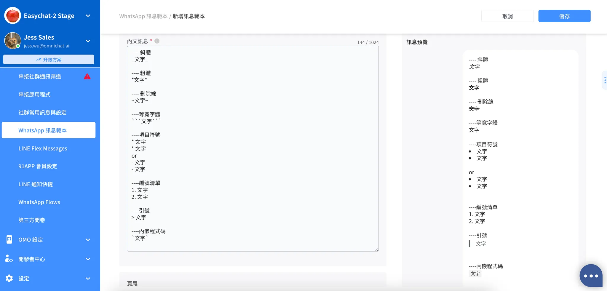

# 創建 WhatsApp 訊息範本

為了能在 Omnichat 發送 ＷhatsApp 推播訊息，需先在 Omnichat 後台建立『訊息範本』（Message Template) 且需通過 ＷhatsApp 審查，才可以使用此範本訊息進行推播。另外，範本訊息也可使用在『對話』頁面一對一聊天功能中，可與24小時以後互動的消費者展開對話。


注意：

1. 範本訊息建立數量限制為 250 個，如超過需要刪除後才能再建立
2. 範本訊息審查時間及狀態依照 ＷhatsApp 官方為主，詳情請見[ＷhatsApp Template Guidelines](https://developers.facebook.com/docs/whatsapp/message-templates/guidelines#status)


### Step 1. 前往訊息範本頁面 與 按下『新增訊息範本』 開始建立

至『通訊渠道』-> 『社群帳號（原：串接社群通訊渠道）』->『ＷhatsApp』，點選鉛筆圖示前往訊息範本頁面

<figure><figcaption></figcaption></figure>

或是直接點選『通訊渠道』-> 『ＷhatsApp訊息範本』頁面，點選右上角「新增訊息範本」按鈕來建立訊息範本

<figure><figcaption></figcaption></figure>

### Step 2. 基本設定：『顯示名稱』、『適用帳號』、『適用對象』、『類別』

1. 顯示名稱：請輸入顯示名稱，此為顯示在Omnichat後台的名稱
2. 適用帳號：請選擇這則訊息範本要建立在哪一組WhatsApp帳號底下
3. 適用對象：
   * 所有成員
   * 只有自己：只有自己可以看得到這則訊息範本
   * 指定權限：根據團隊成員的角色權限來限制使用
4. 類別：此為在Omnichat系統中的類別，為訊息範本進行分類，後續可方便搜尋

<figure><figcaption></figcaption></figure>

### Step 3. 內容設定：『範本名稱』、『分類』、『語言』、『範本類型』

1. 範本名稱：此為給Meta送審使用的名稱，僅能輸入小寫英文字母、數字和下底線。
2. 分類：有「Authentication」、「Marketing」、「Utility」，依照推播訊息類型選擇，分類說明請見[Meta官方文件](https://developers.facebook.com/docs/whatsapp/updates-to-pricing/new-template-guidelines?locale=zh_TW)。
   * **Authentication 驗證範本**：通常用來傳送身分驗證的一次性密碼，例如客人登入網站的一次性密碼
   * **Marketing 行銷範本**：發送推廣優惠產品發佈及其他用於提升品牌互動、知名度的訊息
   * **Utility 公用範本**：發送帳號通知、意見回饋問卷調查、訂單相關通知，或其他重要訊息
3. 語言：選擇消費者看到的範本訊息語言 （選擇單一語言，例如只選擇英文版或中文版）
4. 範本類型：
   * 標準範本（預設公版）
   * Flow（需加購，**Marketing** 和 **Utility** 兩種分類皆可使用，詳細說明請見[這邊](chuang-jian-whatsapp-xun-xi-fan-ben.md#flow)）
   * 媒體卡片輪播範本（需加購，僅有 **Marketing** 分類可使用，詳細說明請見[這邊](chuang-jian-whatsapp-xun-xi-fan-ben.md#mei-ti-ka-pian-lun-bo-she-ding)）

<figure><figcaption></figcaption></figure>

### Step 4. 設定標題（Header ）

共有三種類型：無、文字、媒體。

1. 無：不設定標題內容
2.  文字

    * 按下新增參數（Add Variable） 建立參數（格式：\{{ \}}），須事先建立參數（Variable）才可以在Omnichat後台使用範本訊息時進行這個區域內的文字調整。
    * 範本訊息通過審核後可以修改內容，但修改後需重新提交給Meta審核。

    <figure><figcaption></figcaption></figure>
3.  媒體：：又可分為圖片、影片、文件，三種類型檔案格式限制可以參考以下規格：

    * 圖片：支援 JPG/PNG ，限制: 5MB，1125px(W) by 600px(H)
    * 影片：支援 MP4 (限制: 16MB，H.264 video codec)
    * 文件：支援 PDF (限制: 64MB)

    <figure><figcaption></figcaption></figure>

### Step 5. 設定內文（ Body）

按下新增參數（Add Variable） 建立參數（格式：\{{ \}}），須事先建立參數（Variable）才可以在Omnichat後台使用範本訊息時進行這個區域內的文字調整。


1. 範本訊息通過審核後可以修改內容，但修改後需重新提交給Meta審核。
2. 如需斷行需要事先設定，如以下範例：熱銷主打星與本月優惠兩行就需要個別設定\{{1\}}, \{{2\}} 兩組變數


<figure><figcaption></figcaption></figure>


內文定義限制如下：

1. 不可以放參數在內文的最前面或是最後面
   * e.g. `{{1}} 請聯絡我們 {{2}}`
2. 不可以有兩個連續的參數（中間加空行也不行）
   * e.g. `{{1}} {{2}} 請聯絡我們`
3. 參數與內文文字數量的比例不可太高
4. 參數的內容不支援URL格式，由於後續在正式狀態下使用範本要填寫參數時，不能填入URL否則會發送失敗
5. 提交範本訊息送審時，URL 按鈕不可以使用短網址（但過審核後就可以）


* 支援 WhatsApp 訊息範本預覽區塊即時顯示訊息格式的對應樣式：
  * 斜體： `_文字_`
  * 粗體： `*文字*`
  * 刪除線： `~文字~`
  * 等寬字體：` ```文字``` `
  *   項目符號清單：

      * `*文字`
      * `*文字`

      或者

      * `-文字`
      * `-文字`
  * 編號清單：
    * `1. 文字`
    * `2. 文字`
  * 引號：
    * `> 文字`
  * 內嵌程式碼：
    * `` `文字` ``

<figure><figcaption></figcaption></figure>

### Step 6. 設定頁尾 （Footer）

僅能選擇純文字，此區無法添加變數

可以在此區域設定『如果你不想收到來自 WhatsApp 的訊息，請輸入「取消訂閱」』這段文字，讓消費者如不想收到推播訊息可以自行取消訂閱，以降低帳號的封鎖率。


注意：帳號發送顧客品質將影響帳號每日可推播數量，詳請請查閱[ＷhatsApp Quality Rating](https://developers.facebook.com/docs/whatsapp/api/rate-limits#quality-rating-and-messaging-limits)


<figure><figcaption></figcaption></figure>

### Step 7. 設定按鈕（ Buttons）


須選完範本 「分類」 （Marketing, Utility），才能出現 「按鈕設定」 介面。


<figure><figcaption></figcaption></figure>

按鈕可以可以選擇兩種類型：Call To Action 或 Quick Reply (快速回覆）

1. Call To Action：可以選擇『前往網站』或者『撥打電話』兩個不同動作。可設置：

* 快速回覆：最多 10 組
* Call to Action - 前往網站：最多 2 組&#x20;
* Call to Action - 撥打電話：最多 1 組&#x20;
* Call to Action - 前往訂單（對話下單）：最多 1 組

若選擇前往網站，網址欄位請先隨意填寫一個網址（如你的官網首頁），後續使用訊息範本進行推播時，可再重新替換。


注意： 按鈕名稱文字內容在範本訊息通過審核後可以修改內容，但修改後需重新提交給Meta審核。


<figure><figcaption></figcaption></figure>

2\. Quick Reply (快速回覆）：消費者點擊就會回覆指定文字，通常搭配關鍵字自動回覆 或機器人模組使用，最多可以設置 10 個快速回覆按鈕。


注意：&#x20;

按鈕名稱文字內容在範本訊息建立完成後即不可修改，僅有變數中的文字才可在Omnichat 的後台修改。選擇快速回覆的話，設定的文字後續不能修改，但是快速回覆的動作（如觸發什麼自動回應、Chatbot）可再調整。


<figure><figcaption></figcaption></figure>

### Step 8. 儲存與提交申請訊息範本審查

請務必確認參數內容、範例檔案皆有填寫完成後，點擊頁面右上角的「儲存」按鈕即會提交範本給Meta審查囉！

<figure><figcaption></figcaption></figure>

### Step9. 列表檢視審核狀態

設定完成後，可以在「狀態」欄位查看目前訊息範本的審核狀態。

也可以透過右側「動作」按鈕，來進行「預覽」當時設定的範本訊息，或是「刪除」該範本。

<figure><figcaption></figcaption></figure>

接著即可至Omnichat後台進行ＷhatsApp推播 （推播功能請詳閱：[使用 CSV 檔案推播個人化 WhatsApp Template Message](/broken/pages/zLwf5e7UVGSgJglEG3sq#fa-song-tui-bo-whatsapp)）

## Flow範本設定（需加購）


此範本類型需另外加購，並且在 Marketing 與 Utility 分類下才能使用。若有需要，請再來訊線上客服或團隊顧問協助加購開啟。


請先確認是否有設定完成 Flow 表單，若尚未建立，請聯繫線上客服或團隊顧問，我們會協助您在 WhatsApp Manager 帳號中建立並客製化 Flow。

確認 Flow 已有完成後，即可在Marketing 與 Utility 分類下選擇「Flow」的範本進行設定。

在「按鈕」區塊會由系統預設帶入 Flow 格式，只需輸入按鈕名稱以及選擇 Flow ID 即可，更多詳細說明請點擊[這邊](https://app.gitbook.com/o/-L_qBouk_wijumBR7PT3/s/-LaFmilpuDQ-f7VKjHCH/~/diff/~/changes/1982/features/marketing/new-chatbot/whatsapp-flow-ka-pian-whatsapp-only#whatsapp-xun-xi-fan-ben)查看。

<figure><figcaption></figcaption></figure>

## 媒體卡片輪播範本設定（需加購）


此範本類型需另外加購，並且在 Marketing 分類下才能使用。若有需要，請再來訊線上客服或團隊顧問協助加購開啟。


* 支援於對話、推播、旅程、群發發送此類型訊息範本，不支援在群組對話發送。
* 支援複製 JSON 格式。
* 不支援送審後再次編輯 (WhatsApp API 暫不開放)，因此當範本被拒絕時或是需要修改範本格式時須另新增範本。僅允許 Omnichat 本身功能的設定調整，如：顯示名稱、適用對象、類別。
* 不適用於「系統通知」類型，例如：Chat-to-order 訂單通知。

<figure><figcaption></figcaption></figure>

### Step 1. 設定文字訊息

必填欄位，每個媒體輪播範本只能設定一組文字訊息，最多1024個字元，可以支援變數、emoji。

<figure><figcaption></figcaption></figure>

### **Step 2. 設定媒體卡片的「卡片格式」**

點擊右側的鉛筆按鈕進行設定，每一張卡片的標題、按鈕格式皆需相同。

預設有兩張媒體卡片，若有需要更多卡片，請點擊下方的「新增卡片」按鈕。

<figure><figcaption></figcaption></figure>

**標題**

* 每張卡片的標題格式需相同（圖片及影片格式二擇一），但每張卡片的內容可以不同。
* 格式說明：
  * 圖片
    * 格式：.jpg / .jpeg / .png
    * 大小：最大 5 MB
    * 尺寸：建議長寬 1125\*660 px
  * 影片
    * 格式：.mp4
    * 大小：最大 16 MB

**按鈕**

* 每張卡片的按鈕格式需相同，但內容可以不同，例如：組合為前往網站 & 快速回覆，十張卡片都需使用同一組合。
  * 前往網站：可輸入不同的 URL，可以發送時再更改。（因Meta系統端限制，目前暫時無法使用）
  * 撥打電話：可輸入不同的手機號碼，發送時無法再更改。
  * 快速回覆：發送時才需要定義回覆何種訊息。
* 至少一組按鈕，最多兩組，可混合以下按鈕類型進行設定：
  * 前往網站（因Meta系統端限制，目前暫時無法使用）
  * 撥打電話（最多只能一組）
  * 快速回覆

<figure><figcaption></figcaption></figure>

### Step 3. 設定個別媒體卡片

* 每個媒體輪播卡片最少需新增兩組卡片，最多十組卡片，可左右滑動進行編輯。
* 每張卡片必須上傳標題圖片或影片。
* 每張卡片內文為必填欄位。
  * 最多 160 字元，支援使用變數、emoji。
  * 最多只能有 2 個換行符號，超過後 error 提示「換行次數不可以超過 2 次」。
* 每張卡片按鈕為必填，動作類型以及按鈕順序必須每張一致，名稱以及按鈕行為可以不同。

<figure><figcaption></figcaption></figure>

## 推播 WhatsApp 訊息 ｜取消訂閱


如進行推播 WhatsApp 訊息，**必須**加入取消訂閱設定，以保障客人消費體驗。


### 方法一：在WhatsApp訊息範本的「按鈕」新增快速回覆按鈕

**在 通訊渠道->社群帳號 ，在WhatsApp Template 下 按「前往編輯」**

在**訊息範本的**內容設定中，在按鈕區塊新增多一個「快速回覆」按鈕 -> 輸入按鈕名稱為"取消訂閱"或"Unsubscribe"

<figure><figcaption></figcaption></figure>

後續範本審核完成後，在推播此訊息範本時，即可針對這顆按鈕設定動作為「取消訂閱通知」。\
設定路徑為：推播 -> 點擊右上角「新推播」 -> 新增WhatsApp渠道的推播 -> 推播內容選擇該則訊息範本 -> 編輯內容中將按鈕動作設定為「取消訂閱通知」

<figure><figcaption></figcaption></figure>

### 方法二：在WhatsApp訊息範本的「內文」或「頁尾」中指引顧客取消訂閱

在設定訊息範本內容時，在「內文」或「頁尾」註明引導客人需輸入「取消訂閱」或「Unsubscribe」，Omnichat系統會自動識別「取消訂閱」或「Unsubscribe」字眼，自動幫助客人取消WhatsApp訊息訂閱。

<figure><figcaption></figcaption></figure>
