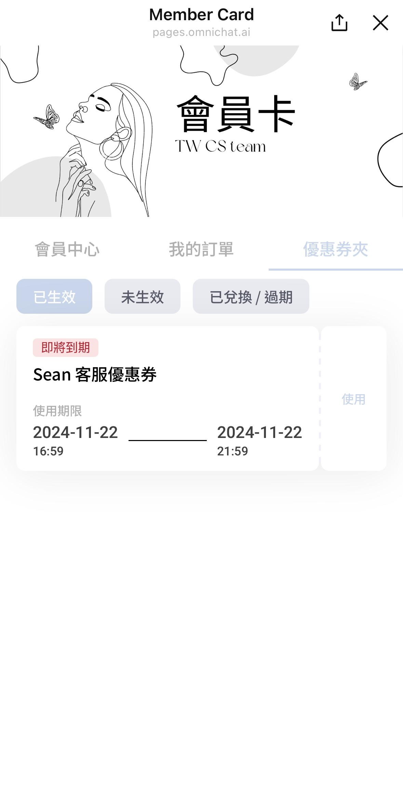

# LINE 會員卡設定（加購功能）


1. 目前支援開店平台系統為 SHOPLINE, Cyberbiz 之品牌可自動同步官網會員資料使用。若您的開店平台系統為其他系統商（包含自架網站）者，則需要透過手動匯入顧客資料與完成手機綁定來比對，關於這個情境請與您的品牌顧問聯繫了解！
2. 該功能目前僅限使用在 **LINE** 渠道
3. 在正式使用會員卡前，請先完成 **「手機簡訊費用儲值」** 流程，若尚未完成手機簡訊費用儲值，請洽詢您的 Omnichat 專人顧問，或可於線上聯繫我們。



若需要自動同步串接官網會員資料，請先確認是否已完成以下功能後，再接續進行會員卡設定：

* 條件 1 [串接應用程式 SHOPLINE](chuan-jie-ying-yong-cheng-shi/chuan-jie-shopline.md) / [串接應用程式 Cyberbiz ](chuan-jie-ying-yong-cheng-shi/chuan-jie-cyberbiz.md)
* 條件 2[ 手機綁定](../she-qun-bang-ding-guan-li/shou-ji-bang-ding-jia-gou-gong-neng.md)


## 後台設定畫面（品牌方畫面） 

### 1 會員卡設定

在此處品牌端可設定於會員卡中預計需要顯示的資料

<figure><figcaption></figcaption></figure>

* 初次進入會員卡設定後，會員中心、我的訂單、優惠券夾，預設為 「停用中」
* 點擊 「鉛筆 icon」 可開啟並設定欲顯示的資訊
* **會員卡顯示條件：**&#x662F;指當顧客開啟會員中心時，是否需要完成手機綁定才能顯示頁面，若不勾選，則有些資料會無法在會員卡中使用

<figure><figcaption></figcaption></figure>


除了 「我的訂單」  因需取用官網的即時貨態所以不能取消勾選外，另外兩個都可以在沒有手機綁定的狀態下顯示，此狀態下觸發的會員卡呈現如下：



### 1-1 會員中心（CYBERBIZ) 

依照不同開店平台系統的 API 技術文件規範，可支援顯示的項目不同，各項目可依照需求決定是否開啟顯示該項目，以下以 CYBERBIZ 開店平台者可設定之顯示資訊作為說明：

<figure><figcaption></figcaption></figure>

1. 開啟功能後右側會顯示預覽畫面
2. 可選擇是否開啟會員條碼


* 會員條碼的內容是根據會員編號顯示
* 可選擇條碼格式，支援格式：Code128、Code39、EAN-13、QR Code
* 若須於線下門市掃描，請選擇與 POS 機相同的條碼格式


3. 可設定要否開啟會員資訊 icon
4. 可以拖曳改變會員資料的顯示順序
5. 可自訂客人端參考的顯示名稱，可與電商資料的名稱不同
6. 若開啟會員資訊 icon，可以自訂 icon 圖片（限制為 PNG 檔，大小 1mb 內，尺寸 1:1）
7. 可以新增其他支援的開店平台會員資料，或是顯示儲存在 Omnichat 的自訂屬性內容

<figure><figcaption></figcaption></figure> <figure><figcaption></figcaption></figure>

### 1-2 各開店平台會員中心可設定的欄位 


此資訊欄位為依據不同開店平台系統商可支援之 API 技術文件規範，若開店平台系統商有做更新項目，Omnichat 這端將於未來同步更新


<table><thead><tr><th width="184">顯示項目</th><th width="261" align="center">SHOPLINE</th><th align="center">CYBERBIZ</th></tr></thead><tbody><tr><td>會員名稱</td><td align="center">O</td><td align="center">O</td></tr><tr><td>會員編號</td><td align="center">O</td><td align="center">O</td></tr><tr><td>會員點數</td><td align="center">O</td><td align="center">O</td></tr><tr><td>會員購物金</td><td align="center">O</td><td align="center">X</td></tr><tr><td>會員等級</td><td align="center">O</td><td align="center">O</td></tr><tr><td>會員等級到期日</td><td align="center">O</td><td align="center">O</td></tr><tr><td>續會門檻</td><td align="center">O</td><td align="center">O</td></tr><tr><td>升等門檻</td><td align="center">O</td><td align="center">O</td></tr><tr><td>累積升等消費額</td><td align="center">O</td><td align="center">X</td></tr><tr><td>續會累積差額</td><td align="center">X</td><td align="center">O</td></tr><tr><td>距下一等級差額</td><td align="center">X</td><td align="center">O</td></tr></tbody></table>

### 1-4 自訂會員卡顯示資訊 

目前會員卡內的內容標題可以自訂為品牌想要呈現的文案與ICON。

<figure><figcaption></figcaption></figure>

1，可上傳會員卡上的標題icon，可設定是否顯示 icon，格式如下：

* 建議使用 png 檔
* 尺寸長寬比 1:1
* 大小低於 1MB

2，可以將會員卡標題設定為品牌想要呈現的標題。

3，設定好的 icon 和標題，可以在這個位置做預覽。

### 1-5會員卡條碼設定

### 2 我的訂單設定 

<figure><figcaption></figcaption></figure>

1. 開啟我的訂單後，客人可在會員卡查看訂單狀態/出貨狀態，內容無法編輯並與開店平台資訊同步
2. 開啟後可在右側預覽查看我的訂單預覽畫面

### 3 優惠券夾 

<figure><figcaption></figcaption></figure>

1. 需加購 [優惠券管理](../you-hui-quan-guan-li-jia-gou-gong-neng/) 方可支援開啟優惠卷夾頁面
2. 顯示的優惠券是來自 Omnichat 後台發出的優惠券，並且根據生效狀態區分

### 4 外觀設定 

<figure><figcaption></figcaption></figure>

* 可設定主題色：設定頁籤、按鈕顏色
* 可設定品牌圖片，建議圖片尺寸為 <mark style="color:red;">**1200 \* 512 px**</mark>
* 上傳圖片後，可在右側預覽顧客端視角畫面，並且預覽畫面可以點擊互動

### 5 會員卡使用方式 

#### 方式一 搭配 LINE 圖文選單 / LINE 圖文訊息 

<figure><figcaption></figcaption></figure>

1. 開啟會員中心、我的訂單後，可產生個別連結做後續應用
2. 點擊產生連結，選擇有完成手機綁定設定的 LINE 渠道，即可產生連結
3. 產生的連結可以放置在 LINE 圖文選單、LINE 圖文訊息的 「 開啟 URL 」 中做使用

#### 方式二 在 LINE 限定的機器人模組中選用相關預設模組 

<figure><figcaption></figcaption></figure>

* 若使用了會員卡模組相關功能，在進階自助設計機器人的系統預設模組當中，會新增以下三種模組：
  * 手機綁定
  * 會員中心
  * 我的訂單
* 可於自助設計機器人使用系統預設模組：會員中心、我的訂單
* 支援機器人：**LINE (請選擇只限用在 LINE 的機器人模組）**
* 可支援機器人卡片類型：<mark style="background-color:red;">**文字訊息、輪播訊息、圖片輪播訊息**</mark>

## 會員中心（顧客端顯示畫面） 


若顧客端需成功顯示「我的會員卡」畫面，顧客需先完成手機綁定流程！\
若**尚未進行過手機綁定**，點選會員中心<mark style="color:red;">**會先跳轉進行手機綁定**</mark>，引導顧客完成手機綁定後，再次點擊會員中心進入即可查看會員資料。


<figure><figcaption></figcaption></figure>

* 觸發會員中心、我的訂單
  1. 透過點選 LINE 圖文選單（須先於圖文選單中放上會員中心、我的訂單的連結）
  2. 顧客收到帶有會員中心按鈕卡片的推播
  3. 透過關鍵字自動回覆觸發含有會員中心模組的機器人按鈕

## 我的訂單（顧客端顯示畫面） 

<figure><figcaption></figcaption></figure>

顧客可以在我的訂單中查看以下資訊：訂單列表、訂單詳情、訂單資訊、商品明細

## 優惠券夾（顧客端顯示畫面） 

<figure><figcaption></figcaption></figure>

客人可於上方的 「已生效」 「未生效」 「已兌換/過期」 中切換顯示不同狀態的優惠卷

## 實際於 LINE 當中顯示的畫面


