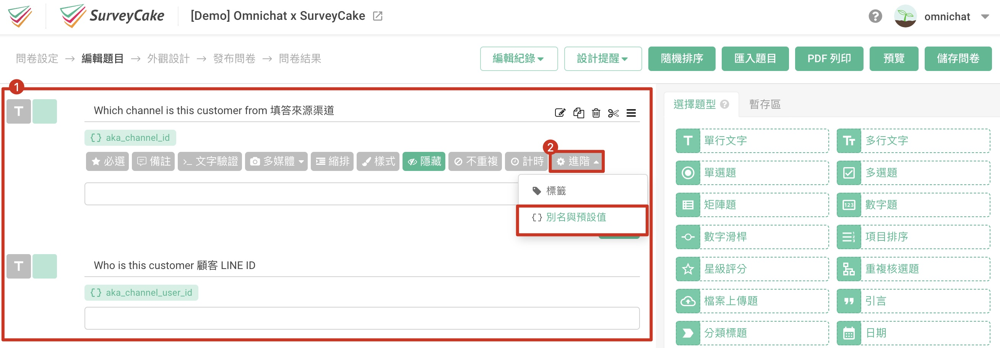
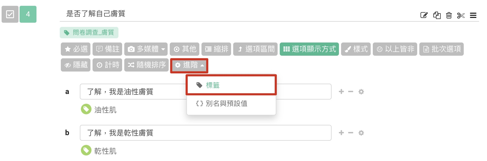
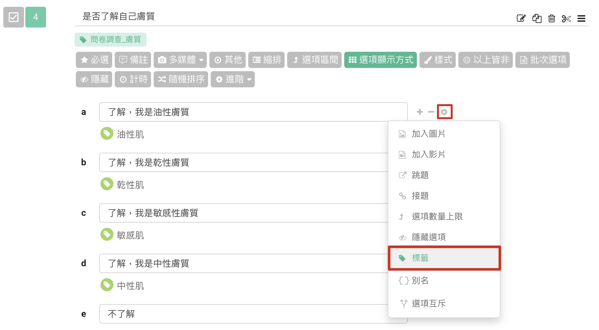
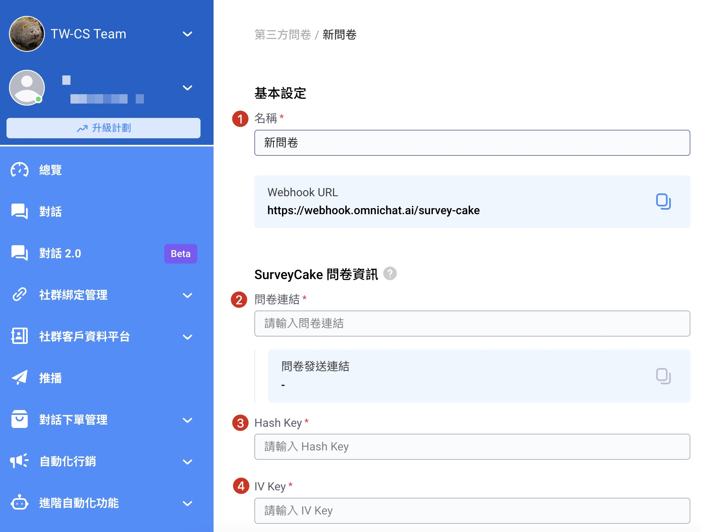
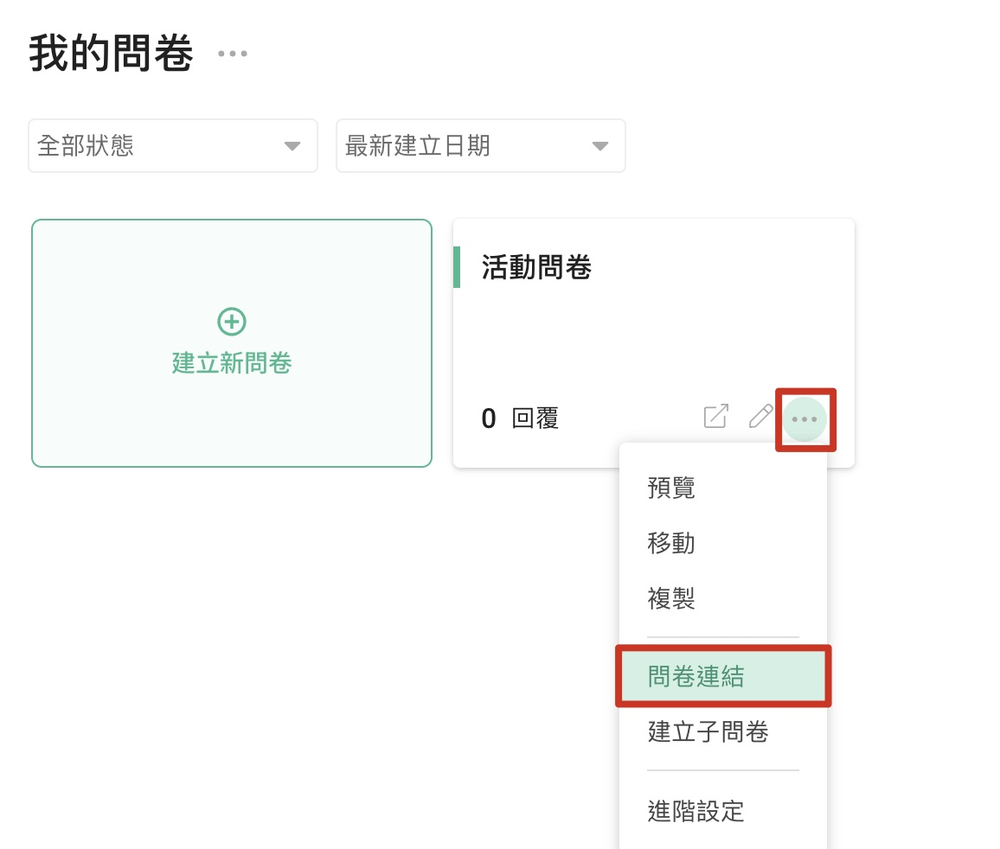
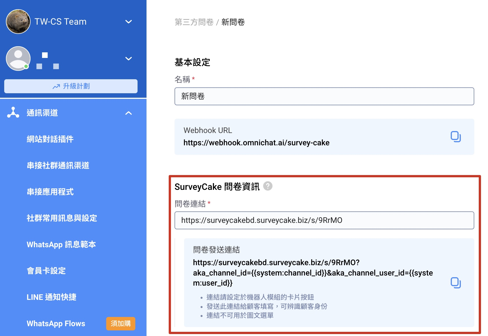
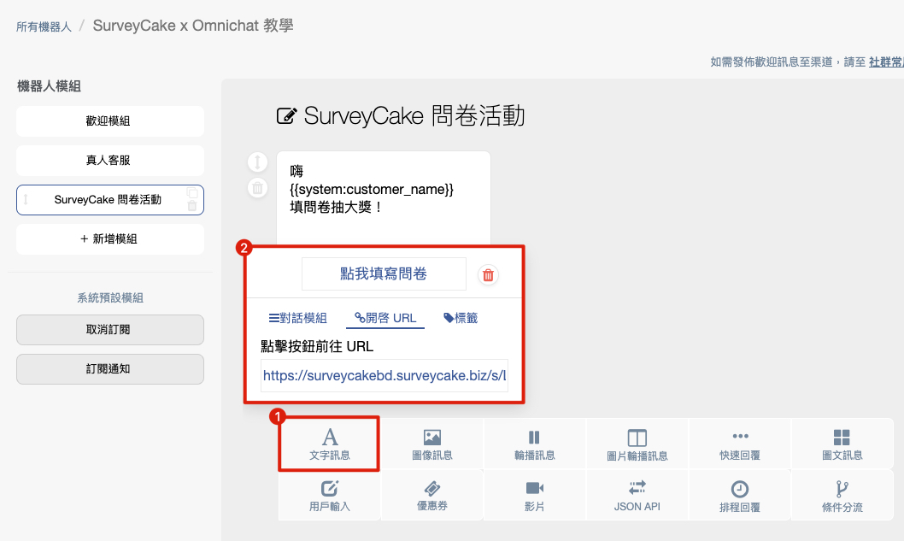
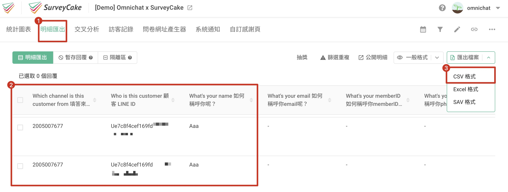

# SurveyCake 設定（加購功能）


需升級 **SurveyCake 專業版**以上方案，才支援整合功能哦！免費版無法支援。


## 步驟 1

登入 SurveyCake 後台，進到建立好的問卷編輯題目頁設定「別名與預設值」

1. 在問卷<mark style="background-color:blue;">**最上方**</mark>新增兩道 「單行文字」 題，分別搜集填答的 <mark style="color:red;">**「來源渠道」 與 「用戶 ID」**</mark>
2. 點開題目工具列，選擇 「進階」  >  「別名與預設值」


為避免被顧客修改資料，可將題目設為 <mark style="color:blue;">**「隱藏」**</mark>


<figure><figcaption></figcaption></figure>

3. 於題目的別名欄位，輸入 Omnichat 指定的題目別名：

* 填答來源渠道：輸入 <mark style="color:red;">**`channel_id`**</mark>

<figure><figcaption></figcaption></figure>

* 用戶 ID：輸入 <mark style="color:red;">**`channel_user_id`**</mark>

<figure><figcaption></figcaption></figure>

## 步驟 2

於 SurveyCake 後台，為問卷題目與選項設定標籤，後續即可針對顧客填寫的資料，自動在 Omnichat 聯絡人身上貼上標籤


若您有多項題目需搜集標籤，則每一題的選項都需要設定標籤唷！


* 題目標籤：點開題目工具列，選擇 「進階」 後，選擇 「標籤」

<figure><figcaption></figcaption></figure>

* 選項標籤：於選項右側點擊齒輪圖示後，選擇 「標籤」

<figure><figcaption></figcaption></figure>

## 步驟 3

完成問卷內容設定後，登入您的 Omnichat 後台

1. 進到 通訊渠道 > 第三方問卷 頁面
2. 點擊右上方「+ 新增問卷」

<figure><figcaption></figcaption></figure>

## 步驟 4

為了整合 Omnichat 與 SurveyCake 之間的串接，需於 Omnichat 第三方問卷頁面，填寫以下內容：

<figure><figcaption></figcaption></figure>

1. **名稱**（可自行設定問卷活動名稱，該名稱不會顯示於前台，僅供 Omnichat 後台檢視使用）
2. **問卷連結**
3. **Hash Key**&#x20;
4. **IV Key**&#x20;

## 步驟 5&#x20;

**如何取得 SurveyCake 問卷連結**

進到 SurveyCake 後台，於問卷右下角點擊 `...` 後，選擇 「問卷連結」，複製取得問卷連結

<figure><figcaption></figcaption></figure>

回到 Omnichat 後台，貼上問卷網址，問卷發送連結區塊將自動產出帶有參數的專屬連結

<figure><figcaption></figcaption></figure>

## 步驟 6&#x20;

**如何取得 SurveyCake Hash Key 與 IV Key**

進到 SurveyCake 後台，於問卷右下角點擊 `...` 後，選擇 「進階設定」

<figure><figcaption></figcaption></figure>

進到系統通知頁後，點擊 Webhook 分頁，接著取得 Hash Key & IV Key 後，貼回 Omnichat 後台的第三方問卷頁面

<figure><figcaption></figcaption></figure>

## 步驟 7

回到 Omnichat 後台，將 Omnichat  Webhook URL 貼到 SurveyCake 後台的 Webhook 欄位

<figure><figcaption></figcaption></figure>

進到 SurveyCake 後台的 Webhook 頁面，貼上 Omnichat Webhook URL 後，點擊 「儲存」

<figure><figcaption></figcaption></figure>

## 步驟 8 &#x20;

於機器人卡片按鈕中帶入 Omnichat 系統稍早產出的問卷發送連結

1. 於 Omnichat 第三方問卷頁，複製取得<mark style="color:red;">**「問卷發送連結」**</mark>

<figure><figcaption></figcaption></figure>

2. 進到自助設計機器人頁，新增機器人卡片與按鈕
3. 於 開啟 URL 中，貼入稍早複製的「問卷發送連結」


<mark style="color:red;">**請勿任意變更問卷網址參數，避免影響資料自動帶入問卷中**</mark>


<figure><figcaption></figcaption></figure>

機器人卡片設定完畢後，接著您就可以透過各式情境，將機器人卡片分享給客人填寫問卷囉！

當客人透過機器人卡片中的問卷專屬連結填寫問卷時，問卷將自動帶入渠道名稱和用戶 ID

<figure><figcaption></figcaption></figure>

當顧客送出問卷後，填答資料的標籤也將自動同步回 Omnichat 的聯絡人身上

同時，您可於 **SurveyCake 後台的明細匯出頁**看到帶入的變數與填答結果

也可將填答資料匯出 csv 檔，**人工整理資料後匯入 Omnichat 後台**

<figure><figcaption></figcaption></figure>

