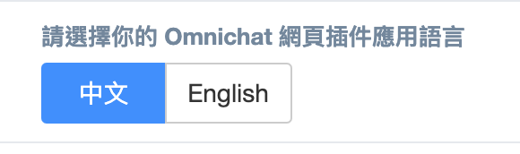
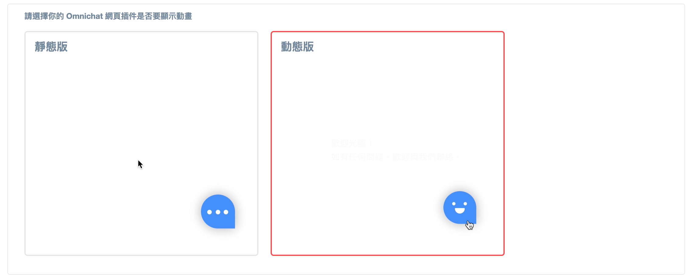
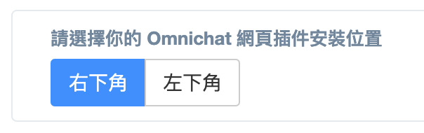

# 安裝對話插件

## 請輸入欲安裝Omnichat的網址

如您有多個網域想安裝Omnichat插件，可在此處輸入多組網址並使用 「;」 分號隔開。e.g: https://www.omnichat.ai/;https://blog.omnichat.ai/

每個網站皆需參考[以下步驟](./#qing-cha-kan-yi-xia-ping-tai-de-an-zhuang-omnichat-dao-guan-wang-de-jiao-xue)設定插件原始碼。

<figure><figcaption></figcaption></figure>

## 插件語言

後台支援讓用戶調整插件的顯示語言，調整後無需重新埋 code

## 動畫版插件

用戶可以自行選擇插件是一般無動畫版或是動畫版，動畫版插件指的是當滑鼠游標移至插件上方或是點擊插件時，會有不同的表情

## 插件顏色

插件顏色可由用戶自訂

## 網站插件標題＆子標題

* 標題 Title
  * 更新改版之後，在還沒去設定標題的時候，會顯示『嗨 👋』
  * （所以大家趕快去設定～）
* 子標題 Subtitle
  * 可以留白不顯示
  * 可以再輸入設定的時候，換行顯示

.png>)

.png>)

## 插件位置

用戶可於後台調整插件要顯示於右側或左側，調整後無需重新埋 code

## 請查看以下平台的安裝 Omnichat 到官網的教學


[website.md](website.md)



[shopify.md](shopify.md)



[91app.md](91app.md)



[cyberbiz-an-zhuang-omnichat.md](cyberbiz-an-zhuang-omnichat.md)



[waca.md](waca.md)



[easystore.md](easystore.md)



[shopline.md](shopline.md)



[wordpress.md](wordpress.md)



[magento.md](magento.md)



[joomla.md](joomla.md)



[drupal.md](drupal.md)



[opencart.md](opencart.md)



[squarespace.md](squarespace.md)



[weebly.md](weebly.md)



[bigcommerce.md](bigcommerce.md)



[strikingly.md](strikingly.md)



[google-tag-manager.md](google-tag-manager.md)

