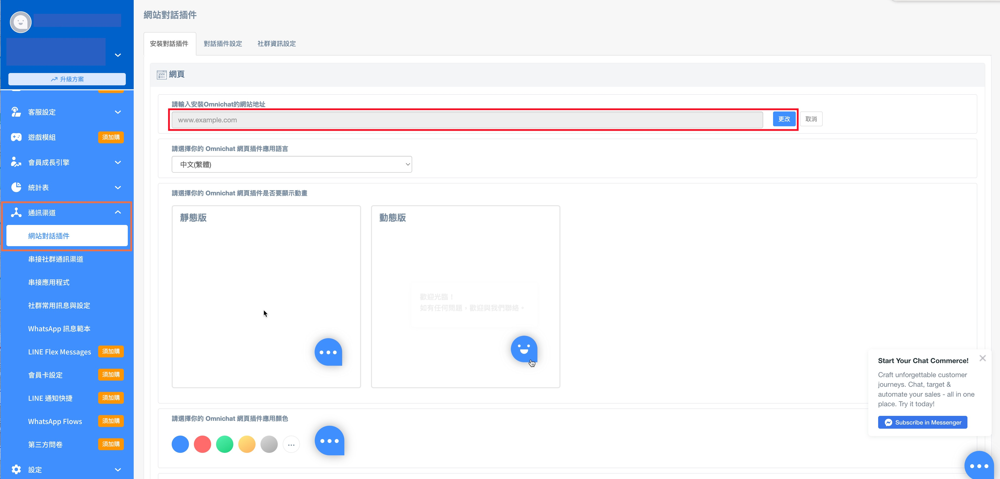
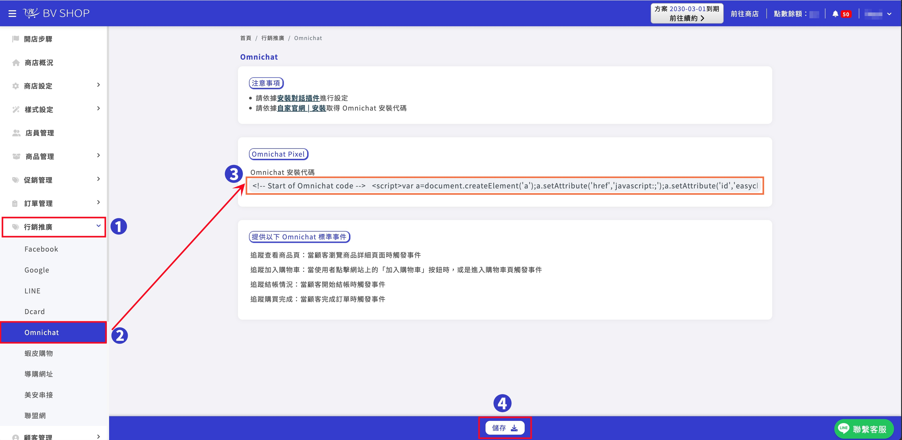

# BV SHOP | 安裝 Omnichat

## 步驟一

登入 [Omnichat 後台](https://console.omnichat.ai/index-legacy)

## 步驟二

前往 通訊渠道 > 網站對話插件 > [安裝對話插件](https://app.easychat.co/install.html) 頁面

1. 輸入安裝 Omnichat 的網站地址
2. 選擇你的 Omnichat 網頁插件應用顏色
3. 選擇你的 Omnichat 網頁插件應用語言
4. 複製 Omnichat 安裝代碼

<figure><figcaption></figcaption></figure>

<figure><figcaption></figcaption></figure>

## 步驟三

前往BV SHOP店家管理頁面，行銷推廣 > Omnichat > 貼上Omnichat安裝代碼並「儲存」

<figure><figcaption></figcaption></figure>

## 步驟四

設定完成後，在您的網站頁面中集會出現對話插件囉！如下圖紅框處所示：

<figure><figcaption></figcaption></figure>

## 步驟五

若有需要調整對話插件相關設定，可以回到 Omnichat 管理員頁面 > [對話插件設定](https://console.omnichat.ai/install-legacy) > 即可調整對話插件囉！

<figure><figcaption></figcaption></figure>

## **完成，立即在您的 BV SHOP 網站上用** Omnichat **跟客戶即時聊天吧！**
