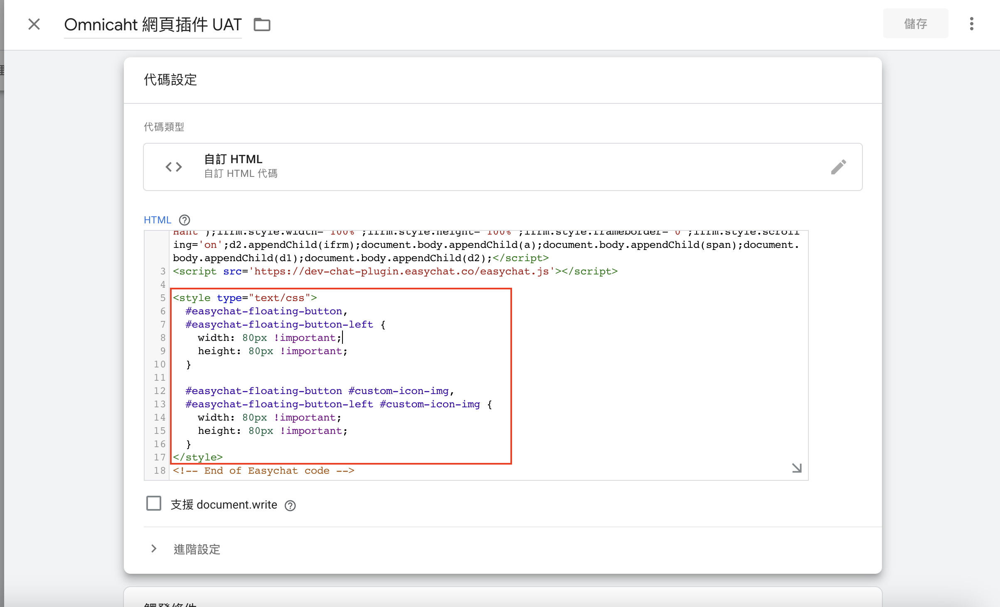
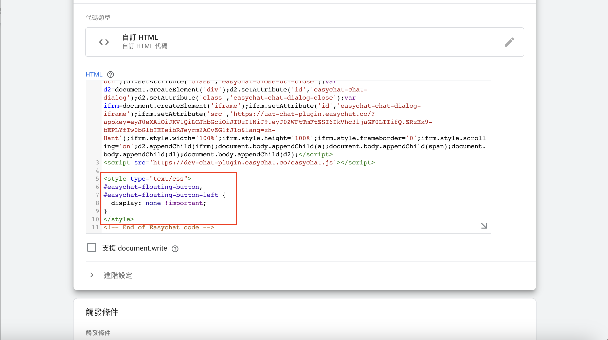

# 調整網站對話插件顯示

## 調整對話插件顯示位置

在 Omnichat 安裝代碼中的 `</script>` 後面 **加上** 以下代碼 (二選一，依照您的對話插件位置左右去選擇):

#### 若您的對話插件設定在右邊請加入以下代碼:

```markup
<style type="text/css">
  #easychat-floating-button {
    bottom: 15px;
    right: 15px;
  }
</style>
```

* `bottom` 後面的數字 `15px` 代表對話插件與 **網頁的最底邊界** 的距離 (預設是 15px)，若您想要讓您的插件出現在比較上面一點，請改成比 `15` 更大的數字，實際需要多大的數字可以根據您的網站 UI 配置。
* `right` 後面的數字 `15px` 代表對話插件與 **網頁的最右邊界** 的距離 (預設是 15px)，若您想要讓您的插件出現在比較左邊一點，請改成比 `15` 更大的數字，實際需要多大的數字可以根據您的網站 UI 配置。

#### 若您的對話插件設定在左邊請加入以下代碼:

```markup
<style type="text/css">
  #easychat-floating-button-left {
    bottom: 15px;
    left: 15px;
  }
</style>
```

* `bottom` 後面的數字 `15px` 代表對話插件與 **網頁的最底邊界** 的距離 (預設是 15px)，若您想要讓您的插件出現在比較上面一點，請改成比 `15` 更大的數字，實際需要多大的數字可以根據您的網站 UI 配置。
* `left` 後面的數字 `15px` 代表對話插件與 **網頁的最左邊界** 的距離 (預設是 15px)，若您想要讓您的插件出現在比較右邊一點，請改成比 `15` 更大的數字，實際需要多大的數字可以根據您的網站 UI 配置。


bottom / right / left，並不需要全部都設定，若您只需要調整與下方邊界的距離，則 `left: 15px` 或者是 `right: 15px` 就不需要設定，可以整行刪除，就會維持預設的距離。



### 範例

若設定的代碼為：

```markup
<style type="text/css">
  #easychat-floating-button {
    bottom: 50px;
    right: 50px;
  }
</style>
```

則對話插件距離 **右邊邊界** 會變成 `50px` ，距離 **下方邊界** 也會變成 `50px` 。


## 調整對話插件顯示大小

在 Omnichat 安裝代碼中的 `</script>` 後面 **加上** 以下代碼：

```markup
<style type="text/css">
  #easychat-floating-button,
  #easychat-floating-button-left,
  #easychat-floating-button.omnichat-icon-wrapper.plugin-animation,
  #easychat-floating-button-left.omnichat-icon-wrapper.plugin-animation {
    width: 80px !important;
    height: 80px !important;
  }
</style>
```

`width:` 以及 `height:` 後面的 `80px` 代表插件顯示的大小，您可以依照需求去調整。


**提醒：若您的對話插件有使用自訂對話插件圖片請改用以下代碼：**


```html
<style type="text/css">
  #easychat-floating-button,
  #easychat-floating-button-left,
  #easychat-floating-button.omnichat-icon-wrapper.plugin-animation,
  #easychat-floating-button-left.omnichat-icon-wrapper.plugin-animation {
    width: 80px !important;
    height: 80px !important;
  }
  
  #easychat-floating-button #custom-icon-img,
  #easychat-floating-button-left #custom-icon-img {
    width: 80px !important;
    height: 80px !important;
  }
</style>
```

<figure><figcaption></figcaption></figure>


## 隱藏對話插件

若您希望在網站上不要顯示網站對話插件，也可以利用 CSS 來達成。

在 Omnichat 安裝代碼中的 `</script>` 後面 **加上** 以下代碼：

```markup
<style type="text/css">
  #easychat-floating-button,
  #easychat-floating-button-left {
    display: none !important;
  }
</style>
```

<figure><figcaption><p>利用 GTM 隱藏對話插件</p></figcaption></figure>

## 在手機版網頁調整對話插件顯示

在手機版網頁，由於顯示區域相較桌機的瀏覽器小很多，所以對話插件會有機會擋到您網站上的 **加入購物車** 或是 **結帳按鈕**，您可以依照下列方式去小整插件高度以及大小。


注意：以下的程式碼**只會調整手機版網頁的對話插件顯示**，若您在桌機瀏覽器也需要調整，還是需要加上上方的教學中的調整代碼


在 Omnichat 安裝代碼中的 `</script>` 後面 **加上** 以下代碼：

若您的對話插件設定在右邊，又希望在手機版把插件縮小到 40px，並將插件顯示位置提高到 50px，請這樣設定：

```html
<style type="text/css">
@media (max-width: 575px) {
  #easychat-floating-button,
  #easychat-floating-button-left {
    width: 40px !important;
    height: 40px !important;
  }
  
  #easychat-floating-button {
    bottom: 50px;
  }
}
</style>
```

<figure><figcaption><p>調整後的效果</p></figcaption></figure>


## 調整社群身份綁定插件位置 (手機簡易版)


關於社群身份綁定插件手機簡易版設定方式請參考：[社群身份綁定設定](../../she-qun-bang-ding-guan-li/social-subscriber-integration/)


如果手機簡易版的社群身份綁定插件會擋到您頁面上的某些區塊，若想要調整綁定插件位置，可以依照以下方式調整：

在 Omnichat 安裝代碼中的 `</script>` 後面 **加上** 以下代碼：

```html
<style type="text/css">
@media (max-width: 575px) {
  #social-subscriber-position-right,
  #social-subscriber-position-left {
    bottom: 60px !important;
  }
}
</style>
```

bottom 後面的 px 數字越大代表插件距離底部越遠，您可以自行調整數字大小以符合您的手機版官網的排版。

<figure><figcaption><p>調整後效果</p></figcaption></figure>



注意：若您調整了手機版社群身份綁定插件，也需要同時同整歡迎訊息 / 官網顧客行銷訊息的彈窗位置，才不會讓兩個區塊重疊


在 Omnichat 安裝代碼中的 `</script>` 後面 **加上** 以下代碼：

```html
<style type="text/css">
@media (max-width: 575px) {
  #social-subscriber-position-right,
  #social-subscriber-position-left {
    bottom: 60px !important;
  }
  
  .easychat-chat {
    bottom: calc(95px + 60px) !important;
  }
}
</style>
```

在 `calc(95px + 60px)` 這段裡的 `60px` 要跟上面的 `bottom: 60px` 的 px 數值要相同，這樣歡迎訊息 / 官網顧客行銷訊息的彈窗位置才不會跟社群身份綁定插件重疊。

<figure><figcaption><p>調整後效果</p></figcaption></figure>
