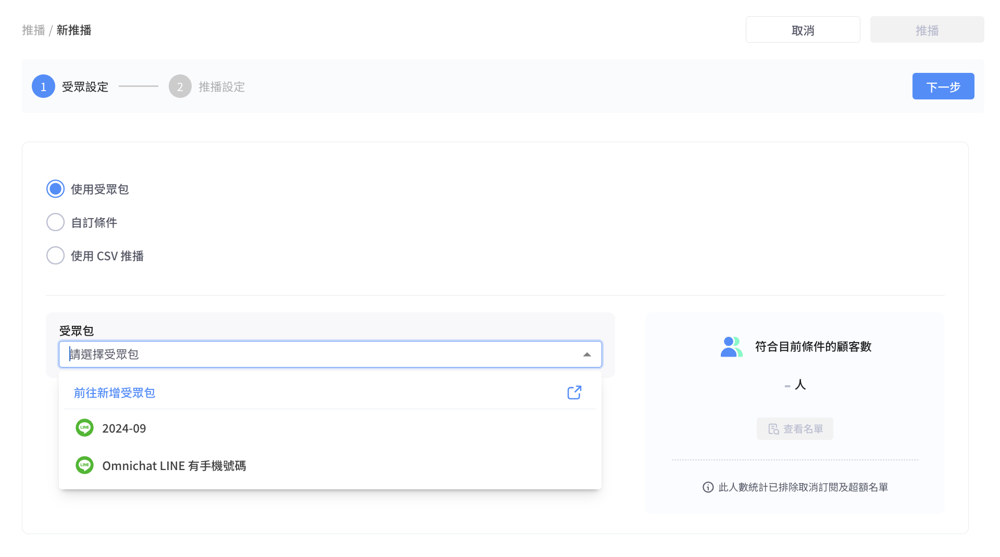
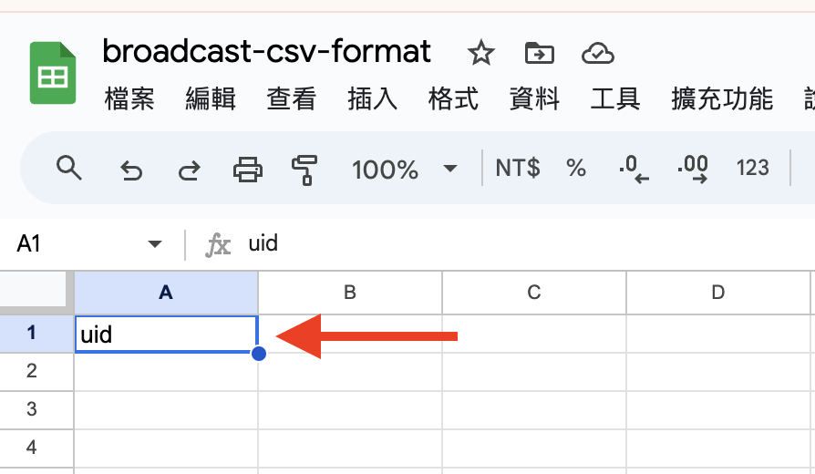
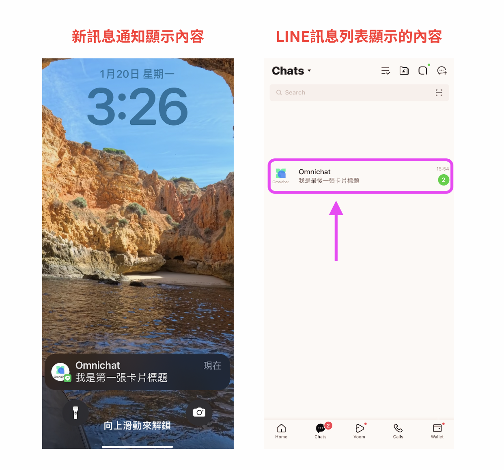

# 設定新推播

點擊推播紀錄右上角的 「新推播」 按鈕即可設定新的推播內容

<figure><figcaption></figcaption></figure>

推播流程共有下方兩個步驟：

* 受眾設定
* [推播設定](./#tui-bo-she-ding-line)

### 受眾設定

可利用以下三種方式篩選受眾：

1. 使用受眾包 （需加購，詳細介紹請參考 [shou-zhong-guan-li-jia-gou-xiang-mu](../../she-qun-ke-hu-zi-liao-ping-tai/shou-zhong-guan-li-jia-gou-xiang-mu/ "mention")）
2. [使用自訂條件](./#shi-yong-zi-ding-tiao-jian)
3. [上傳CSV檔案推播](./#shi-yong-csv-tui-bo)

### 使用受眾包（需要加購）

#### 推播設定頁面

<figure><figcaption>
推播受眾設定
</figcaption></figure>

1. 下拉選單選擇受眾包，每次點擊都會重整受眾包最新清單

<figure><figcaption>
受眾包清單
</figcaption></figure>

2. 選擇受眾包後會自動帶入受眾包設定的通訊渠道
3. 也會自動帶入受眾包設定的條件，**此時不可編輯通訊渠道以及受眾條件**
4. 套用至自訂條件：上方選項將切換為「自訂條件」，可編輯所有條件，且不會影響原受眾包的條件設定
5. 編輯受眾包：跳轉至受眾管理 / 受眾包編輯頁
6. 點擊後更新以下內容
   * 受眾包條件
   * 符合條件的聯絡人數
   * 受眾包列表
7. 查看名單：預覽受眾名單

#### 選擇受眾包時機與對應功能

<table><thead><tr><th width="114">推播狀態</th><th align="center">更改受眾包</th><th width="204" align="center">套用至自訂條件</th><th align="center">編輯受眾包</th></tr></thead><tbody><tr><td>草稿</td><td align="center">〇</td><td align="center">〇</td><td align="center">〇</td></tr><tr><td>排程中</td><td align="center">X</td><td align="center">X</td><td align="center">〇（見下方注意事項）</td></tr><tr><td>等待中</td><td align="center">X</td><td align="center">X</td><td align="center">X</td></tr><tr><td>處理中</td><td align="center">X</td><td align="center">X</td><td align="center">X</td></tr></tbody></table>


如果推播狀態為<mark style="color:red;">**「排程中」**</mark>，且需修改受眾包內容，由於系統會在<mark style="color:red;">**實際推播前15分鐘**</mark>抓取最新的受眾資料，為避免資料未能即時同步，**請務必於實際推播時間前15分鐘或更早完成受眾包的編輯**。


### 使用自訂條件

若使用**自訂條件**，需要依照 **通訊渠道 ⮕ 篩選條件** 的順序設定受眾包，通訊渠道可以選擇串接進後台的 **Facebook / LINE / WhatsApp** 帳號來推播。

選擇好推播的平台帳號後，可以接著選擇篩選條件，如不需要篩選可直接點擊右上角的下一步，進入推播設定介面。

根據不同平台和不同方案，篩選條件會有所差異，詳情請參考下列的表格：


Instagram 目前尚未支援發送推播訊息，但可以進行手動貼標


<table><thead><tr><th width="118"></th><th width="202">Facebook</th><th width="225">LINE</th><th width="219">WhatsApp</th><th data-hidden></th></tr></thead><tbody><tr><td>相同條件</td><td>
<mark style="color:blue;">顧客資料</mark>

• 標籤 • 自訂屬性（須加購） • 姓名

<mark style="color:blue;">時間相關</mark> • 加入訂閱時間 • 客人最後互動時間 • 團隊最後行銷時間 • 團隊最後互動時間 • 最後完成結帳時間

<mark style="color:blue;">互動情況</mark> • 社群身份綁定 
</td><td>同左</td><td>同左</td><td></td></tr><tr><td>專屬條件</td><td>
<mark style="color:blue;">互動情況</mark>

• 訂閱 FB 定期通知
</td><td>
<mark style="color:blue;">互動情況</mark>

• 手機綁定 (須加購)

• 91App會員綁定 (須加購) <mark style="color:blue;">OMO 相關 (OMO方案）</mark> • OMO 綁定狀態 • OMO 綁定成員 • OMO 綁定分店
</td><td><mark style="color:blue;">顧客資料</mark> • 電話 <mark style="color:blue;">OMO 相關 (OMO方案）</mark> • OMO 綁定狀態 • OMO 綁定成員 • OMO 綁定分店</td><td></td></tr></tbody></table>


最後時間定義補充：

* 團隊最後互動時間：一對一品牌端客服人員發出
* 團隊最後行銷時間：購物車再行銷訊息、手動推播皆算在內
* 客人最後互動時間：聯絡人跟您的粉專或官方帳號最後互動時間，例如：發送訊息給您、跟您設計的機器人互動、訂閱您粉專或帳號


若選擇與時間相關的篩選條件時，將滑鼠停留在條件上方，即會顯示相關說明

<figure><figcaption></figcaption></figure>


若新增兩個以上的篩選條件，條件之間彼此的關係為 「交集」。\
例如：同時新增 「客人最後互動時間-30 天內」 與 「社群身份綁定-已綁定」，則篩選出來的名單為同時符合這兩個條件的名單，只符合其中一項的受眾會被排除在外。


完成篩選條件的選擇後，可以點擊右側的 「更新人數」 按鈕，即會顯示符合該條件的受眾包人數

若**點擊人數數字**或是**點擊 「查看名單」** 按鈕，會彈出詳細的受眾包名單

<figure><figcaption></figcaption></figure>

### 使用 CSV 推播


Omnichat 支援使用客人的 「**社群編號**」、「**會員編號**（ **Member ID** ）」、「**Email**」、「**電話**」 擇一資料來上傳推播名單，系統將會依照這些資料與 Omnichat 資料庫中的聯絡人名單去做核對

* **社群編號：Facebook Messenger** 的社群編&#x865F;**（PSID）、LINE** 的社群編號（ **UID）。**
* 若使用 **會員編號 / Email / 電話** 這三種類型資料做推播，系統會核對該平台是否有社群帳符合檔案中的資料，若有符合系統就能成功發送推播出去。
* 若系統在社群名單中沒有任何帳號符合檔案中的資料，那麼這些人的推播將不會發送成功，亦不會計算在推播報告中的推播人數中。

例如：若在 Omnichat 的 LINE 名單中有一位叫做 「小明」 的聯絡人，該聯絡人因完成社群身份綁定而同步了客人在官網會員資料的 Email，此時使用從官網下載的 Email 名單做 CSV 檔推播，系統就會核對該組 Email 對應到 LINE 名單中的小明這個聯絡人，而成功發送推播。


使用 CSV 推播時，需要先**下載範例檔案**，再根據範例檔案的格式上傳對應的客人資料，若格式正確則會在下方顯示首五筆資料的預覽


**注意**：

1. CSV 檔案如非為 UTF-8 encoding 版本會**呈現亂碼**。為避免版本問題，用戶可使用 [**Google Sheet**](https://docs.google.com/spreadsheets/) 進行操作。
2. 使用**CSV推播無法更改內容**，如需更改內容，請先取消原來的推播，然後**重新建立。**


<figure><figcaption>
需先下載範例檔案編輯受眾資料
</figcaption></figure>

如果在上傳 CSV 時選擇以「**電話**」為項目，可以勾選「**檢查是否符合 Email 標準格式或國際電話號碼格式**」選項。

勾選後，系統會檢查上傳的電話號碼是否有加入國碼，若未包含國碼，將會導致上傳失敗。

<figure><figcaption></figcaption></figure>


注意：「CSV檔案」 與 「社群聯絡人」 的**電話格式須**一致。

舉例來說，如果社群聯絡人的電話是 09xxxxxxxx，那麼在 CSV 檔案中電話的格式也必須是 09xxxxxxxx，且<mark style="color:red;">不要勾選「比對國碼」這個選項</mark>（如果勾選了，因為電話沒有國碼，會導致上傳失敗）。


<figure><figcaption></figcaption></figure>


反之，如果您收集到的「社群聯絡人」電話是 8869xxxxxxxx，那麼在「CSV 檔案」中也必須使用 8869xxxxxxxx。此時，<mark style="color:red;">無論是否勾選「比對國碼」選項，都可以成功上傳</mark>，因為電話號碼已包含國碼。


<figure><figcaption></figcaption></figure>

### CSV檔案上傳失敗/成功畫面

**失敗（上傳後將提示錯誤原因）**

* 例1：標題列名稱與範例不同

<figure><figcaption></figcaption></figure>

**排解方法**：如果您是以「社群編號」下載範例檔案，標題列的名稱會顯示為 uid，請勿修改範例檔案裡的欄位名稱，以下圖為例，如果欄位名稱不是 uid，上傳檔案後就會出現此警示訊息。

<figure><figcaption></figcaption></figure>

* 例2：CSV檔案內容有誤

<figure><figcaption></figcaption></figure>

<figure><figcaption></figcaption></figure>

**成功（預覽會顯示首5筆內容，也會自動過濾重複聯絡人）**

<figure><figcaption></figcaption></figure>

### 推播設定（**LINE）**

<figure><figcaption></figcaption></figure>

1. 推播訊息數統計會抓取您 LINE 官方帳號月費方案的剩餘額度，數據約一個小時更新一次（關於Line免費訊息則數可參考下方註釋）。
2. 在推播紀錄上顯示的名稱。
3. 設定點擊 「推播」 後要立即發送，或是排程推播。
4. 替在受眾包內的客人貼上標籤（**此標籤僅表示這群人被成功推播，不表示他們有點開推播**）。
5. 可以使用純文字的自訂訊息或是使用機器人模組，若選擇機器人模組，兩個下拉式選單分別需要選擇機器人列表名稱與模組名稱才可送出推播，詳情可以參考[這個頁面](../../marketing/chatbot-builder/)\
   點擊 「編輯模組」 會前往該機器人的編輯界面，點擊 「更新」 則會抓取最新的模組內容顯示預覽。
6. 若使用機器人模組推播，則會顯示該模組可以在推播紀錄追蹤的數據類型（如：開封率、點擊率、回應率、營業額...）。
7. 會顯示自訂訊息或是機器人模組的預覽畫面。
8. 點擊 「上一步」，會回到前一頁的 「受眾設定」。
9. 點擊 「推播」 後，會根據設定好的內容與發送時間進行推播，並可回至最剛開始設定推播頁面，查看該則的推播紀錄與推播詳情數據。


**LINE 免費訊息則數說明：**

* 上圖可看到您 LINE 官方帳號目前的訊息用量
* 圖中的 「131/3000」 表示 「目前使用量 / 貴司選擇方案訊息量＋加購訊息數量」
* LINE 2.0 不同用量的用戶，會有不同的免費訊息則數（ [LINE@ 官方帳號收費計算機](https://blog.omnichat.ai/tw/line-2-0-official-account-pricing/)）
* 如您 LINE 官方帳號的訊息用量即將用完，請至 LINE OA 後台進行加購或升級訊息方案



**LINE 訊息種類 API 類型及收費表**

LINE 官方針對使用任何第三方平台串接 LINE 對話時，將會依據使用者的對話行為判定其 API 類型為何。並針對 Push API 類型的動作收取訊息費用，Reply API 類型動作則為免費。 \
（[LINE 訊息種類 API 類型及收費表](https://docs.omnichat.ai/features/tong-xun-qu-dao/integrations/line-2.0/line-2.0-message-fee)）\
收取費用端為 LINE 官方，非第三方平台商。收費標準將依照貴司現有選擇的訊息方案進行計價，因此相關收費情況，請至 LINE Offical Account 後台查看。


### 推播預覽支援顯示及點擊連結

支援在推播中預覽畫面中可以點擊 URL 按鈕，確認設定是否正確


預覽僅支援點擊「自訂 URL 類型」的按鈕


<figure><figcaption>
預覽僅支援點擊「自訂 URL 類型」的按鈕
</figcaption></figure>

### 常見問題

*   為什麼收到的Line推播標題和我設定的推播標題不一樣呢？

    * 推播訊息發出後，客人手機的新訊息通知會顯示推播中第一則訊息卡片的文字內容，而在LINE的訊息列表中，預覽顯示的會是最後一則訊息卡片的文字內容。

    <figure><figcaption>
推播設定
</figcaption></figure>

    <figure><figcaption>
通知顯示
</figcaption></figure>

### 推播設定（Faceboo&#x6B;**）**

當推播平台為 Facebook 時，會需要額外選擇訊息標籤，其餘推播的設定可以參考上方 LINE 的說明

<figure><figcaption></figcaption></figure>

### Facebook 推播的訊息標籤分類與定義

* **標準訊息**：受 Facebook Messenger 24 小時政策限制，只可發送給 24 小時內有互動的客人，可以推送推廣性內容。
* **活動通知**：發送活動通知給已登記或購買門票的客人。例如：上課/活動時間提醒、活動確認。(不受 24 小時對話限制，但只可推送**非推廣性質內容**)
* **購買後通知**：發送與客人最近購買有關的通知。例如：出貨狀態變更提醒、訂單狀態變更提醒。(不受 24 小時對話限制，但只可推送**非推廣性質內容**)
* **帳戶通知**：發送與客人帳號有關的通知。例如：帳號申請狀態變更提醒、帳號有異常變更提醒。(不受 24 小時對話限制，但只可推送**非推廣性質內容**)
* <mark style="color:red;">**限制**</mark>**：除「標準訊息」外，其他訊息標籤：活動通知、購買後通知、帳戶通知皆不可以用於發送推廣內容，包括但不限於推廣優惠，優惠券和折扣**。我們的系統會自動偵測推播內容是否符合 Facebook Messenger 的規定，如有違規，系統會自動把使用訊息標籤推播的功能封鎖，以保障你的專頁不會被 Facebook 判定為不當使用，導致你的專頁無法傳送訊息。


**Facebook Messenger 政策**

客人發送訊息到你的 Facebook 專頁&#x5F8C;**：**

* **24小時內**：你可以**無限制地**發送推播訊息給客人，且內容可以是推廣性質。
* **24小時後 （任何時間）：**&#x4F60;只可以使用「**訊息標籤**」發送**非推廣性**訊息給客人。**不當使用可能導致你的專頁無法傳送訊息。**

**詳情可查看**：[https://developers.facebook.com/docs/messenger-platform/policy/policy-overview/](https://developers.facebook.com/docs/messenger-platform/policy/policy-overview/)


### 發送推播（ WhatsApp ）

當推播平台為 WhatsApp 時，推播需要使用 **「訊息範本」** 推播，訊息範本相關的說明可以參考[這裡](../../tong-xun-qu-dao/integrations/whatsapp-business-api-zheng-he-dao-omnichat/chuang-jian-whatsapp-fan-ben-xun-xi.md)

點擊訊息範本的下拉式選單後，會開啟在 Omnichat 提出申請的訊息範本一覽表

<figure><figcaption></figcaption></figure>


訊息範本時新增尺寸及規格請參考：聯絡人與推播訊息-功能素材尺寸


以下針對訊息範本介面做說明

<figure><figcaption></figcaption></figure>

1. 訊息範本的名稱，格式是 「語言+範本名稱」&#x20;
2. 點擊後會前往訊息範本的申請頁面，可以前往提出範本的審核
3. 可以根據範本名稱快速搜尋
4. 可以根據設定好的範本類別做快速篩選
5. 顯示範本訊息的預覽，若有參數會以 「數字+底線」 顯示
6. 點擊 「編輯內容」 ，前往下一步進行參數編輯或媒體內容的上傳


請注意：

1. 如有設計**參數**的話，可於「**參數1**」輸入自訂的文字或編號\
   **EX：** **1** 對應「**參數1**」、 **2**對應「**參數2**」、 **3** 對應「**參數3**」以此類推...
2. 若您在列表中無法找到某則訊息範本，可能是該範本的狀態並非 「通過審核」 狀態


按照您的參數類型及媒體類型完成編輯後，點擊 「套用」 就會回到推播設定介面，點擊推播就會按照設定的時間進行排程

<figure><figcaption></figcaption></figure>

### WhatsApp CSV 推播

* CSV 檔案內的 「電話號碼」 必需加上 「**國碼**」（強制性），否則無法正常送出
* 使用 CSV推播的 「電話號碼」 如果是不在你的聯絡人名單，會**自動建立為新聯絡人**
* 「個人化內容參數」只可以是單行文字
