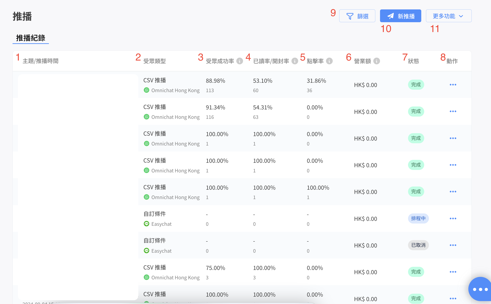
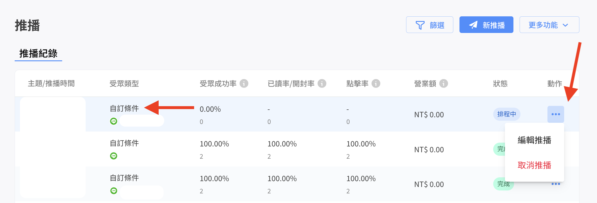
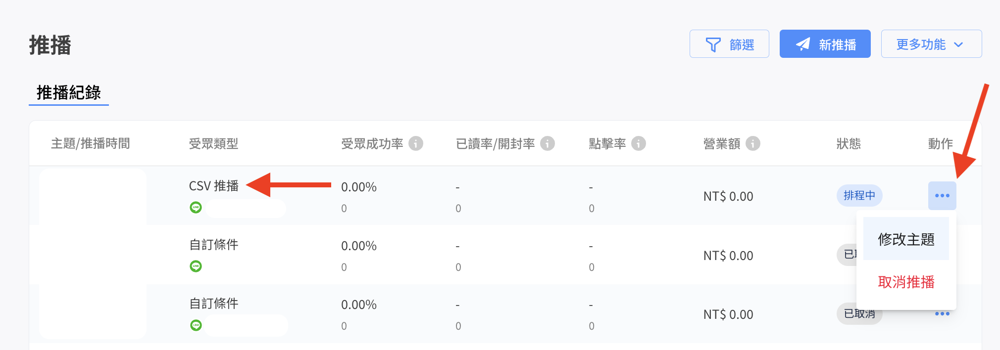
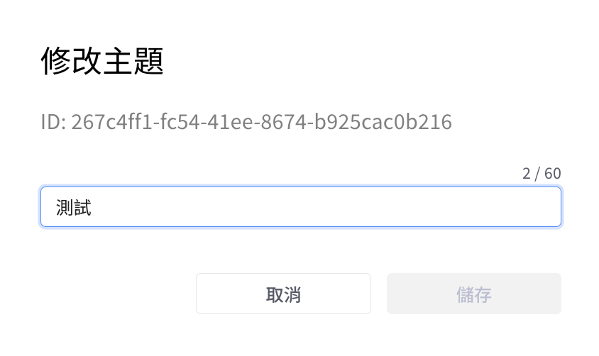
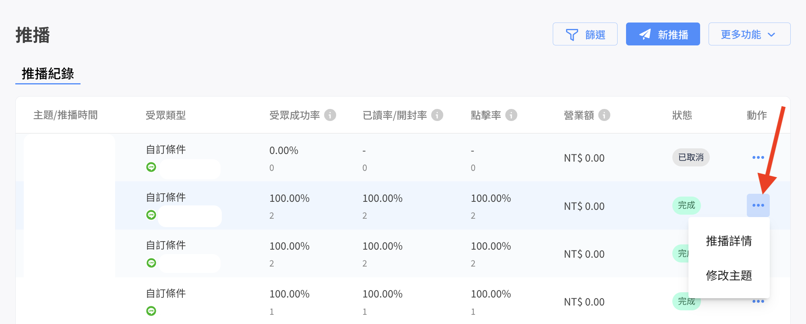

# 推播紀錄

<figure><figcaption>
推播紀錄一覽表
</figcaption></figure>

1. 推播的主題以及推播時間，推播時間為系統開始發送推播的時間點。

紀錄的預設排序是以建立時間新到舊排序，點擊 「主題/推播時間」 可將所有記錄按照時間排序：

* 點擊第一次：推播時間從舊到新
* 點擊第二次：推播時間從新到舊
* 點擊第三次：回到預設

2. 受眾類型共分為三種：自訂條件、CSV 推播。

* 自訂條件為在推播介面使用篩選條件自行篩選受眾包進行推播的類型。
* CSV 推播是使用 CSV 檔案上傳後核對受眾資料推播的類型。

3. 受眾成功率的計算方式為：`受眾成功收到訊息的人數/受眾人數`
4. 已讀率與開封率的分別：

* 已讀率（限定 Facebook/WhatsApp 平台）的計算方式：`已讀人數/受眾成功收到訊息的人數`
* 開封率（限定 LINE 平台）的計算方式：`不重複開封人數/成功收到訊息的人數`，開封率僅計算有設定按鈕的文字訊息、輪播訊息卡片、圖文訊息、優惠券卡片等。

5. 點擊率的計算方式為：`按鈕連結點擊人數/受眾成功收到訊息的人數`

* 同一次推播的訊息，不管訊息數或按鈕數多寡，點擊數最多只會計算一次。
* 若按鈕為觸發下一層機器人或是觸發文字訊息回覆，不會計算。
* 文字內的連結不計算。

6. 針對有埋放追蹤碼的官網，只計算 30 天內的營業額，數據約每小時更新一次。
7. 狀態會分成：完成/失敗/排程中/已取消。\
   針對失敗的推播，可以進入 「推播詳情」 頁面，確認失敗名單裡備註提供的失敗原因。
8. 動作選單中，若推播狀態仍為排程中，可以選擇 「編輯推播」、「取消推播」。其他狀態點擊選單可以選擇 「推播詳情」、「修改主題」。推播詳情的說明請參考[這個頁面](tui-bo-xiang-qing.md)


營業額歸因時間30天：表示從推播點擊過機器人按鈕連結的顧客，30天內的下單都可以被追蹤到（不管瀏覽器或裝置，但保險起見顧客需登入網站官網會員，能追蹤得到）。


* 受眾類型若為<mark style="color:red;">**自訂條件**</mark>的推播，且推播狀態在<mark style="color:red;">**排程中**</mark>，動作可選擇 「編輯推播」、「取消推播」。

<figure><figcaption>
自訂條件受眾，動作可選擇「編輯推播」、「取消推播」
</figcaption></figure>


僅受眾類型為<mark style="color:red;">**自訂條件**</mark>的推播，可在排程中的狀態編輯內容。

針對排程推送的訊息，若有需要在推播前修改推播內容，建議在 <mark style="color:red;">**實際推播時間 1 小時前進行修改**</mark>，在實際發送時會以修改後的推播訊息內容進行推播。


* 受眾類型若為<mark style="color:red;">**CSV**</mark>的堆播，且推播狀態在`排程中`，動作可選擇「修改主題」、「取消推播」，不可編輯推播內容。

<figure><figcaption>
CSV受眾，動作可選擇「修改主題」、「取消推播」，不可編輯推播內容
</figcaption></figure>

<figure><figcaption>
修改主題畫面
</figcaption></figure>

* 其他狀態（完成/失敗/已取消）點擊選單可以選擇 「推播詳情」、「修改主題」，下圖以推播狀態為「完成」為例：

<figure><figcaption>
推播狀態為「完成」為例
</figcaption></figure>

9. 篩選按鈕可以讓您根據推播時間、推播狀態（可同時選擇多個狀態）以及推播渠道（可同時選擇多個渠道）來篩選推播列表。
10. 點擊後可以設定一則新的推播內容，推播教學請見[這個頁面](https://docs.omnichat.ai/features/tui-bo-2.0/she-ding-xin-tui-bo)
11. 更多功能中可以批量匯出推播報告，請先使用篩選功能設定**推播時間區間**與**單一渠道**。


請務必<mark style="color:red;">**先篩選時間區間**</mark>，並<mark style="color:red;">**選擇一個渠道**</mark>，才能使用匯出功能。

如果未篩選時間區間，或已篩選時間但選擇了多個渠道，都無法使用匯出功能。


