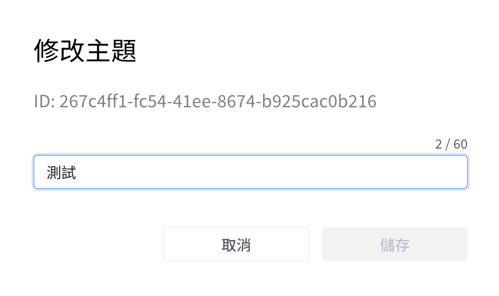

# 推播紀錄

<figure><figcaption></figcaption></figure>

1. **推播主題／ID**
2. **推播時間：**&#x7CFB;統開始發送推播的時間點。\
   推播列表預設排序是以推播建立時間新到舊依序向下排列，點擊 「 推播時間 」 四字，可將所有記錄從舊到新排序，再點擊一次則會變回預設的新到舊排序。
3. **受眾類型：**&#x5171;分為三種，使用受眾包（此為加購項目）、自訂條件、CSV 推播
   1. **使用受眾包：**&#x9078;擇在[受眾分群](../she-qun-ke-hu-zi-liao-ping-tai/shou-zhong-guan-li-jia-gou-xiang-mu/)建立的受眾包進行推播（此為加購項目）。
   2. **自訂條件：**&#x5728;推播介面使用篩選條件自行篩選進行推播的顧客類型。
   3. **CSV 推播：**&#x4F7F;用 CSV 檔案上傳後核對受眾資料推播的類型。
4. **受眾成功率：**&#x8A08;算方式為 <mark style="color:orange;">`受眾成功收到訊息的人數/受眾人數`</mark>
5. **已讀率或開封率：**
   1. **已讀率（限定 Facebook / WhatsApp 平台）計算方式：**<mark style="color:orange;">`已讀人數/受眾成功收到訊息的人數`</mark><mark style="color:$primary;">。</mark>
   2. **開封率（限定 LINE 平台）計算方式：**<mark style="color:orange;">`不重複開封人數/成功收到訊息的人數`</mark>，開封率僅計算有設定按鈕的文字訊息、輪播訊息卡片、圖文訊息、優惠券卡片等。


**LINE 圖文訊息在兩種情況下，不支援出現推播的開封率：**

若推播 LINE 圖文訊息，且該圖文訊息設定有「定義動作-影片訊息」或者是「背景圖片-顯示透明背景」，則推播開封率數字會高於實際開封情形

* 當 OC 後台的圖文訊息，需要支援「影片」或「透明背景的圖片」時，Omnichat系統會使用 `imagemap` 的 LINE message type 發送訊息，其他時候使用 `flex message` 發送。
* LINE 原生行為，在使用者使用 WIFI 連線時，`imagemap` 會預先下載影片/圖片，傳送開封的 webhook 給 OC，導致使用者看到的推播開封率非常高。


6. **點擊率：**&#x8A08;算方式為 <mark style="color:orange;">`按鈕連結點擊人數/受眾成功收到訊息的人數`</mark>
   1. 同一次推播的內容，不管機器人卡片數或按鈕數多寡，點擊數最多只會計算一次。
   2. 若按鈕為觸發下一層機器人或是觸發文字訊息回覆，不會計算。
   3. 文字內（非按鈕）的連結不計算。
7. **營業額：**&#x91DD;對有埋放追蹤碼的官網，只計算 30 天內的營業額，數據約每小時更新一次。


**營業額歸因時間30天：**

從推播發送的時間起算30天內，只要客人有點擊推播中的機器人按鈕，且在這之後完成下單（不管瀏覽器或裝置，但保險起見顧客需登入網站官網會員，系統就能追蹤得到），這筆訂單就會被納入該次推播的營業額統計中。


8. **狀態：**&#x5206;為 完成／失敗／等待中／排程中／已取消。


針對失敗的推播，可以進入 「 推播詳情 」 頁面，確認失敗名單裡備註提供的失敗原因。


9. **動作：**&#x5305;含編輯推播、取消推播、推播詳情、修改主題等動作。

* 受眾類型若為 <mark style="color:red;">**自訂條件**</mark> 的推播，且推播狀態在 <mark style="color:red;">**`排程中`**</mark>，動作可選擇 「 編輯推播 」、「 推播詳情 」、「 取消推播 」。

<figure><figcaption></figcaption></figure>


僅受眾類型為<mark style="color:red;">**自訂條件**</mark>的推播，可在排程中的狀態編輯內容。



針對排程推送的訊息，若有需要在推播前修改推播內容，建議在 <mark style="color:red;">**實際推播時間 1 小時前進行修改**</mark>，在實際發送時會以修改後的推播訊息內容進行推播。


***

* 受眾類型若為 <mark style="color:red;">**CSV 推播**</mark> 的堆播，且推播狀態在 <mark style="color:red;">`排程中`</mark>，動作可選擇 「 推播詳情 」、「 修改主題 」、「 取消推播 」，**不可編輯推播內容**。

<figure><figcaption></figcaption></figure>

<figure><figcaption>
修改主題畫面
</figcaption></figure>

***

* 其他狀態（完成／失敗／已取消）點擊選單可以選擇 「 推播詳情 」、「 修改主題 」，下圖以推播狀態為 <mark style="color:red;">`完成`</mark>  為例：

<figure><figcaption></figcaption></figure>

10. **搜尋：**&#x53EF;依 「 推播主題 」 或 「 推播ID 」 搜尋特定推播
11. **篩選：**&#x6839;據推播時間、推播狀態（可同時選擇多個狀態）以及推播渠道（可同時選擇多個渠道）來篩選推播列表。

<figure><figcaption></figcaption></figure>

12. **新推播：**&#x9EDE;擊後可以設定一則新的推播內容，設定新推播教學可以看[這裡](she-ding-xin-tui-bo/)
13. **更多功能：**&#x6279;量匯出推播報告，請先使用篩選功能選擇**推播時間區間**與**單一渠道**。


請務必<mark style="color:red;">**先篩選時間區間**</mark>，並<mark style="color:red;">**選擇一個渠道**</mark>，才能使用匯出功能。

如果未篩選時間區間，或已篩選時間但選擇了多個渠道，都無法使用匯出功能。


