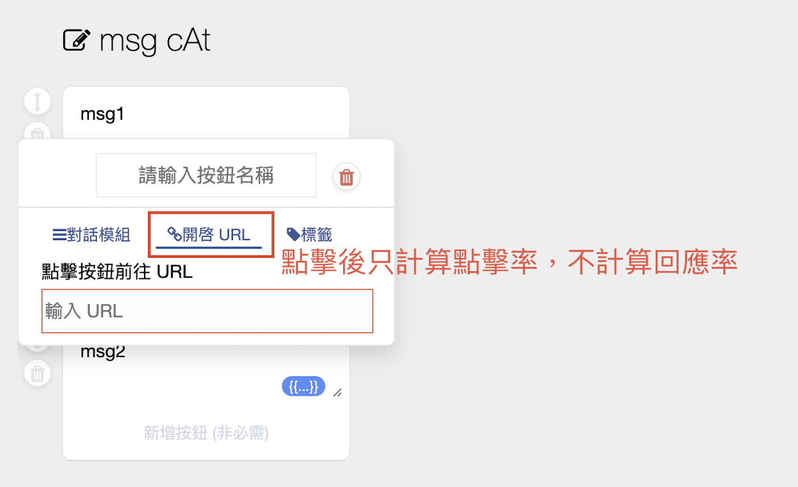
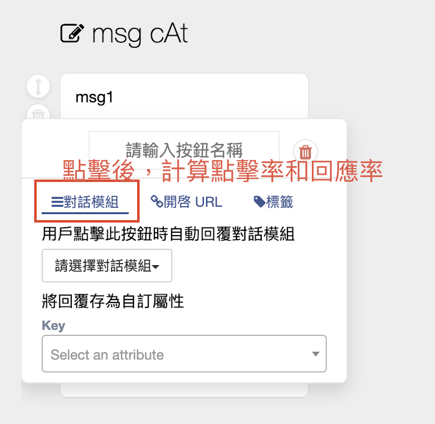
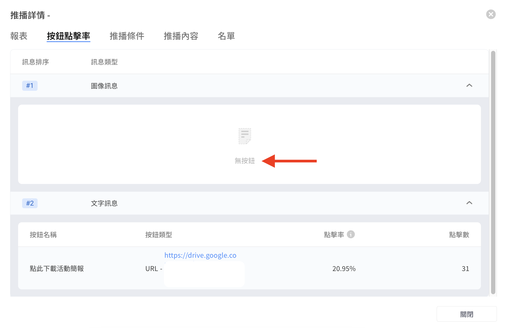
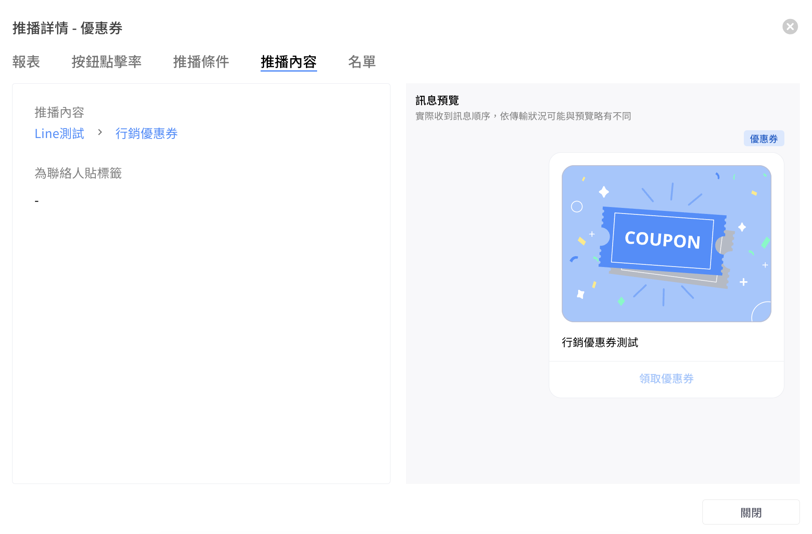

# 推播詳情

推播詳情介面整合了以下的內容：

* [報表](tui-bo-xiang-qing.md#bao-biao)
* [推播條件](tui-bo-xiang-qing.md#tui-bo-tiao-jian)
* [按鈕點擊率](tui-bo-xiang-qing.md#an-niu-dian-ji-lv)
* [推播內容](tui-bo-xiang-qing.md#tui-bo-nei-rong)
* [名單](tui-bo-xiang-qing.md#ming-chan)

### 報表

該頁面中整合了該則推播的詳細數據，若不清楚某個數據的計算方式，可以將滑鼠移到數據名稱右側的 「 `i` 」 圖示，就會顯示該數據的計算方式與注意事項


若要在報表頁面查看推播數據，需要至少使用 「進階行銷方案」 以上的方案，並完成埋放網站追蹤碼後，方可查看。

訊息成本估算的數字請參考下列：

* LINE 訊息費用為 NT$0.2/每則成功發送的訊息，此為 LINE 用量方案中的加購訊息收費。高用量方案的加購訊息價格會隨著加購訊息數量變動，實際費用請參考 [LINE 官方頁面](https://tw.linebiz.com/column/LINEOA-2023-Price-Plan/)。
* WhatsApp：依團隊設定地區&#x20;
  * HK：0.7\*訊息成功數 (HK$)&#x20;
  * TW：2.724\*訊息成功數 (NT$)&#x20;
  * SG：0.089\*訊息成功數 (US$)
* Facebook：由於此費率是浮動的，此數字是依照 Facebook 廣告帳號回傳的數字&#x20;



若您的推播是使用「Facebook 行銷訊息推播」，基於 Meta 隱私政策，有以下限制：

1. 12/24/48 小時回應率無法追蹤計算
2. 退訂封鎖無法追蹤計算
3. 我們無法得知哪些顧客完成推播，因此無法顯示推播名單


<figure><figcaption></figcaption></figure>


**營業額**

* URL須設定在 「推播的當則機器人卡片中」 才會被計入（如果推播的那則機器人卡片無URL，需點擊按鈕到下一個機器人卡片，才會點擊到URL按鈕，則該URL無法被追蹤與計入推播詳情的營業額）
* URL規範：不可使用縮網址、短網址（但可以是正常網址後面再自帶UTM的形式）

**點擊率**

* 計算方式為聯絡人點擊機器人卡片上的**對話模組、開啟URL**按鈕（見下方截圖）
* 點擊率最多只會計算一次
* 文字內的連結不計算

**回應率**

收到推播後的 48 小時內

* 計算方式為聯絡人點擊機器人卡片上的**對話模組**按鈕（見下方截圖）
* 聯絡人傳送了文字訊息/圖片/檔案/貼圖
* WhatsApp: 聯絡人對推播的訊息按了Emoji


* 受眾點選卡片中的 **開啟URL** 按鈕，會計算點擊率，不計算回應率。
  * 同一次推播的內容，不管機器人卡片數或按鈕數多寡，點擊數最多只會計算一次。
  * 若按鈕為觸發下一層機器人或是觸發文字訊息回覆，不會計算。
  * 文字內（非按鈕）的連結不計算。

<figure><figcaption>
聊天機器人 2.0 畫面
</figcaption></figure> <figure><figcaption>
聊天機器人畫面
</figcaption></figure>

***

* 受眾點選卡片中的 **對話模組** 按鈕，會計算點擊率和回應率。

<figure><figcaption>
聊天機器人 2.0 畫面
</figcaption></figure> <figure><figcaption>
聊天機器人畫面
</figcaption></figure>

### 按鈕點擊率

若推播的模組類型可以追蹤點擊率的話，會依照按鈕類型與數據紀錄在該頁面。每則訊息皆會顯示，若無按鈕會顯示 「 無按鈕 」。


點擊率計算公式：收到推播訊息 24 小時內不重複的按鈕連結點擊數／成功推播的訊息數


<figure><figcaption>
按鈕點擊率
</figcaption></figure>

* 按鈕點擊率按鈕類型為 URL 時支援顯示及點擊連結

<figure><figcaption></figcaption></figure>


如推播使用「CTA 按鈕為 Flow」 這類型範本，在推播詳情中會無法追蹤到點擊率、點擊數等數據。

此為 Meta 官方限制，沒有回傳相關數據給第三方平台，若需要呈現點擊率，建議改用快速回覆（Quick reply）卡片，選擇機器人模組（WhatsApp Flow 設定在機器人模組中）即可追蹤。


<figure><figcaption></figcaption></figure>

### **推播條件**

<figure><figcaption></figcaption></figure>

1. **受眾類型與渠道：**
   1. 使用受眾包（此為加購項目）、自訂條件、CSV推播
   2. 渠道：Facebook、LINE、WhatsApp
2. **建立受眾包：**&#x5C07;此推播條件建立為新的受眾包。
3. **再次推播：**&#x4F7F;用與此推播一樣的條件再次推播。
4. **預設條件（每則推播預設帶入）：**&#x63A8;播時，系統會自動排除超額名單以及取消訂閱名單，因此預設會顯示 「 超額名單：否 」 以及 「 訂閱狀態：已訂閱 」。

### **推播內容**

該頁面主要紀錄推播當下設定的內容與貼標的標籤，若推播時使用自訂訊息，則會顯示文字預覽。

若推播時使用機器人模組，在左側的 「推播內容」 會附上該機器人模組的名稱，點擊後會前往模組的編輯頁面。而右側的訊息預覽會顯示當時推播模組內容的預覽。


若推播完成後，有修改推播時使用的模組內容，可能會造成點擊名稱後前往的編輯頁面，模組內容與預覽畫面的內容不一樣的情況。


<figure><figcaption>
推播內容
</figcaption></figure>


請留意：目前當優惠券類型設定為「序號包」時，系統**尚不支援**與推播功能同時使用。


### **名單**

該頁面會將所有發送名單分類成**五種狀態**，左上角的下拉式選單可以切換狀態，在 「發送失敗」 名單中的備註欄位，可以確認發送失敗的原因。

而右上角的 「匯出名單」，可以將資料匯出整理後再次匯入到系統中使用

<figure><figcaption></figcaption></figure>


「已回應名單」，指的是以 48 小時內回應客人做紀錄

「 已退訂封鎖 」 指的是在收到推播訊息後 24 小時內選擇退訂或封鎖的聯絡人。


