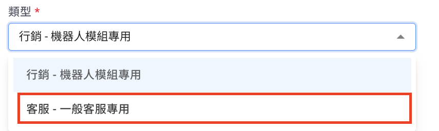
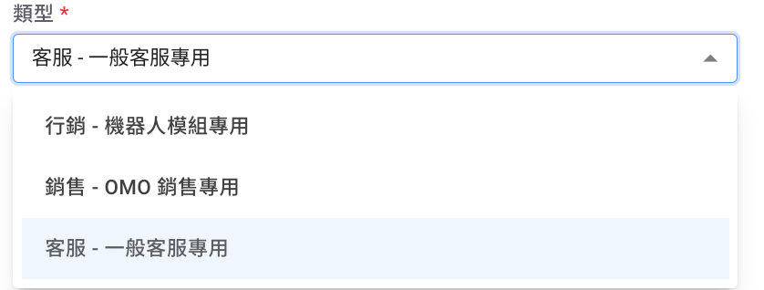
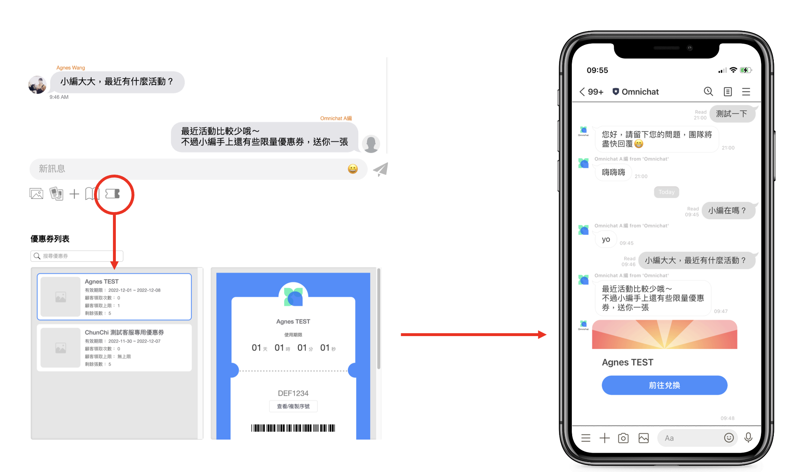
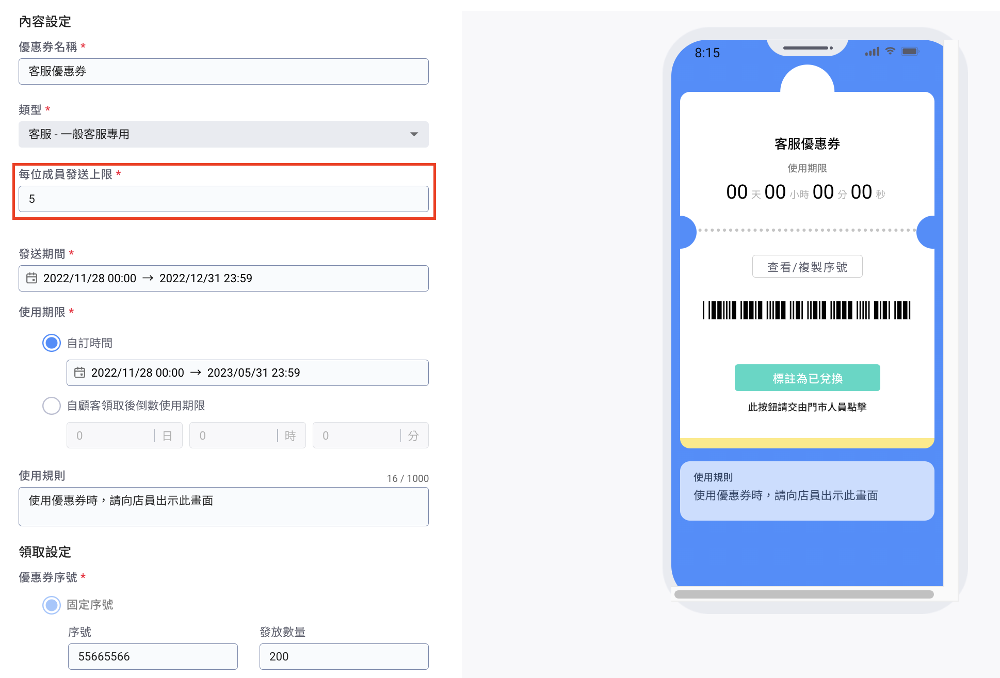
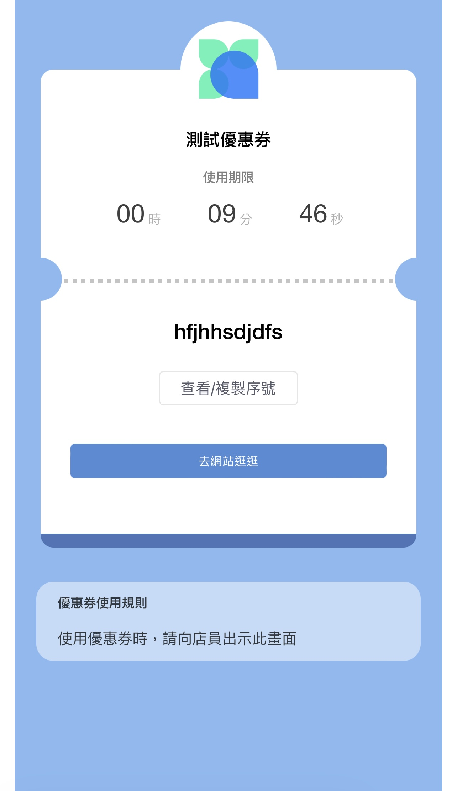
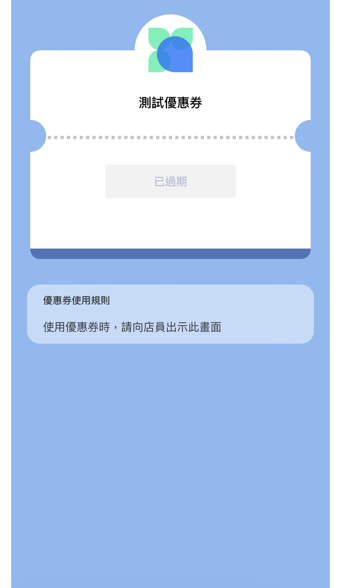
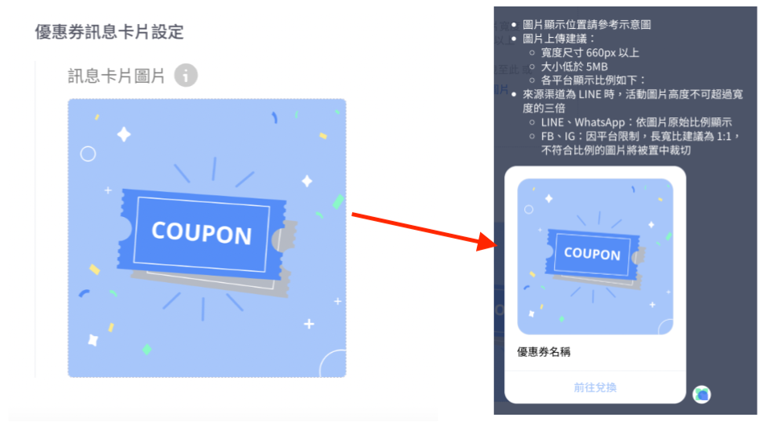
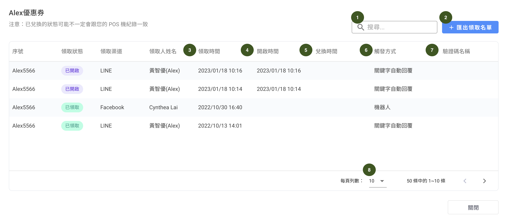

# 優惠券管理（加購功能）


已過期目前可使用的通訊渠道： LINE、Facebook、Instagram 和 WhatsApp 。


接下來就按照步驟先設計好優惠券的樣式。

## 設定優惠券樣式

### 步驟一：新增優惠券

<figure><figcaption></figcaption></figure>

### 步驟二

<figure><figcaption></figcaption></figure>

<figure><figcaption></figcaption></figure>

#### 1. 優惠券名稱：會直接顯示前台

#### 2. 優惠券類型新增 「 客服類型 」，如有購買 OMO 功能，則優惠券有三種類型可以進行發送：銷售、行銷、客服。

<figure><figcaption>
一般方案畫面
</figcaption></figure>

<figure><figcaption>
OMO 方案畫面
</figcaption></figure>

* 「 管理員 」、「 主管 」、「 客服經理 」、「 客服 」 可以在對話頁面發送 「 客服類型優惠券 」
* 「 客服類型優惠券 」可以設定每位成員發送數量。

<figure><figcaption></figcaption></figure>

<figure><figcaption></figcaption></figure>

1. 銷售類型的優惠券可以選擇適用分店
2. 每人發送上限為 _**每位銷售人員**_ 所能發送的個數


#### 1. 當選擇「客服」類型的優惠券，可以在「對話」頁面來進行發送優惠券給消費者

#### 2. 透過「對話」頁面發送優惠券成員角色需&#x70BA;_&#x7BA1;理員、主管、客服經理、客服人員_


<figure><figcaption></figcaption></figure>

<figure><figcaption></figcaption></figure>

* 若此優惠券的總數為 0 或不允許重複發送給同一個人則會顯示為灰底&#x20;
* 剩餘張數代表這個銷售人員還能發送此優惠券的數量 ( 設定頁面的每人發送上限 )

#### 3. 發送期間：可以選擇優惠券發送出去的時間

#### 4. 使用期限

* 「自訂時間」：收到優惠券後可以使用該優惠券的時間。倒數時間為「發送時間的開始 -> 使用期限的結束」
* 「自領取後倒數使用期限」：自顧客收到優惠券時，即開始計算使用期間\
  範例：於下午 13 點發送 1 張倒數 3 小時的優惠券，當客人下午 16 點開查看時，就會顯示已過期的狀態
* 「自開封後倒數使用期限」：顧客點擊開啟優惠券後，即開始計算使用期間。

<figure><figcaption></figcaption></figure>


使用期限<mark style="color:red;">**未到、過期**</mark>時：不會顯示優惠券序號；僅顯示使用規則


<figure><figcaption>
使用期限倒數中優惠券
</figcaption></figure> <figure><figcaption>
已過期優惠券
</figcaption></figure>

#### 5. 使用規則：您可以將使用該優惠券的限制或注意事項放在此處，總字元不能超過 1000&#x20;

#### 6. 優惠券序號：目前支援固定序號或採用序號包的方式

* 選擇固定序號
* 可以直接設定自訂設定序號和發放的序號數量

如選擇上傳序號包

1. 一般序號：當使用的優惠券是由開店平台商生成的，可以直接點擊『下載序號包範例範例』的檔案後將優惠碼序號放入後，按下『上傳序號包』的按鈕將檔案上傳。 \
   → _序號由幾組組數因應您的 POS 系統會需要刷幾組 Barcode 而定_
2. 支援 LINE POINTS 序號：請透過序號包上傳 LINE Points 序號；若使用該選項，會在好友實際執行兌換動作時，直接切換到 LINE Points 官方兌換 LINE Points 畫面。
3. 點擊該按鈕，可以下載序號包範例檔案（如上圖所示）
4. 上傳序號包：請將製作完畢的檔案在步驟 4 進行上傳

### 步驟三 導流連結顯示與否

可設定按鈕文字以及放入按鈕連結 URL 導回網站


一旦消費者點擊這裡的按鈕回到官網，即可完成社群身份綁定（達到機器人按鈕綁定效果）

P.S 網址要是原始網址，不能轉網址、縮網址、短網址；且網址頁面要有 Omnichat 官網對話插件


<figure><figcaption></figcaption></figure>

### 步驟四 條碼顯示與否

#### 如顯示條碼，目前支援 QR code、CODE\_39、CODE\_128 和 EAN\_13，共四種規格

#### 如開啟顯示條碼，可另外設定是否顯示「兌換按鈕」，按鈕文字可由品牌自訂

<figure><figcaption></figcaption></figure>


消費者收到優惠券時開畫面直接點擊『Copy』，該優惠券代碼會彈出視窗且同時複製


### 步驟五 設定顧客重複領取上限

<figure><figcaption></figcaption></figure>

1. 當您選擇「不限次數」時，表示每個客人有機會重複領取該優惠券
2. 當您設定每個客人可領取次數時，當客人領取次數已達上限時，會發出派發完畢的提示訊息給客人
3. 可設定「聯絡人姓名參數」

#### 優惠券發送完畢提醒訊息

當發放優惠券總數量已經沒有時，當消費者仍想拿到該優惠券時，會觸發出該訊息

<figure><figcaption>
行銷類型的優惠券
</figcaption></figure>

#### 銷售類型（OMO 功能）

<figure><figcaption></figcaption></figure>

### 步驟六

<figure><figcaption></figcaption></figure>

* 顧客領取優惠券時貼上標籤：當系統發送優惠券給客人時，客人即會被貼上標籤
* 顧客開封優惠券時貼上標籤：當客人點選優惠券並開啟內頁畫面點時，即會被貼上標籤
* 顧客兌換優惠券時貼上標籤：當門市人員兌換優惠券時，客人即會被貼上標籤


需開啟「顯示條碼」功能，才能使用「顧客兌換優惠券時貼上標籤功能」


### 步驟七

#### **優惠券**外觀設定

<figure><figcaption></figcaption></figure>

1. 頁面背景顏色
2. 優惠券邊框顏色
3. 按鈕背景顏色
4. 按鈕文字顏色
5. 品牌圖片：尺寸建議為 1:1，預設圖片為團隊大頭。上傳後如需重新上傳或是刪除該圖片，可將滑鼠游標移至圖片上方（如 hover 狀態）
6. 活動圖片（非必須）：沒有限制檔案大小但建議圖片寬度至少 660 pixel，上傳後如需重新上傳或是刪除該圖片，可將滑鼠游標移至圖片上方（如下圖）

### 步驟八

**優惠券訊息卡片設定**

<figure><figcaption></figcaption></figure>

1. 品牌設定了 「 優惠券訊息卡片圖片 」 後，當客戶收到優惠券時，就會在訊息介面上看到所設定的圖片。

### 步驟九

設定完畢可至右上角按鈕按下『儲存優惠券設定』，接著按下『OK』，此時優惠券會進入到『草稿』階段，草稿階段可進行測試。測試完畢後，若要正式啟用優惠券，請按下『發布優惠券』


1. 當優惠券進到『草稿階段』時，無法更改優惠券序號
2. 在『草稿階段』可進行測試，但測試紀錄會在正式發佈後被清除，所以當準備正式開始發送優惠券時，請『發布』



如果發佈優惠券後需要進行加碼，可點擊編輯回到該優惠券畫面


## 設定自助機器人—優惠券卡片


1. 優惠券正式發送期間未到、發送期間已過或所有優惠券已送出，此優惠券卡片將不會發送。
2. 如果該模組內有其他卡片，則模組內的其他卡片會照樣發送出去，但優惠券卡片不會發送，請確保有足夠的優惠券數量及設定好派送期間。
3. 機器人模組要有優惠券卡片，該機器人模組需為僅使用在單一渠道上的機器人


路徑：『進階自動化功能』→『自助設計機器人』→點選 『優惠券卡片』&#x20;

在『優惠券卡片』中的『選擇優惠券』可以選擇是要使用哪一個優惠券。

.png>)

## 優惠券列表以及領取紀錄

<figure><figcaption></figcaption></figure>

1. 搜尋：可以直接搜尋優惠券
2. 領取數：可以查看目前**系統已發送**多少優惠券
3. 開啟數：可以查看目前有多少**客人已開啟**優惠券
4. 列表數可以依照需求做不同筆數顯示，有 5、10、15 及「全部」可以選擇
5. 您可以在每列優惠券活動後面點擊『領取紀錄』

<figure><figcaption></figcaption></figure>

1. 搜尋：可以依照客人姓名進行搜尋
2. 匯出領取名單：可以以 CSV 檔案方式匯出名單，並且到 「 [**推播訊息**](../tui-bo/) 」 中導入貼上標籤或是直接對這一群消費者進行推播
3. 領取時間：為**系統發送**給消費者優惠券的時間
4. 開啟時間：為**消費者開啟**優惠券的時間
5. 兌換時間：如您是有選擇掃描 Barcode，則為按下「兌換按鈕」的時間為主，此為參考時間，請依照您 POS 機實際兌換時間為主
6. 觸發方式：該優惠券是使用什麼 Omnichat 什麼功能進行觸發
7. 驗證碼名稱：如您有設定消費者兌換優惠券時，門市人員點擊「兌換按鈕」，需要輸入此「驗證碼」
8. 每頁列數： 可選擇 5、10、15\
