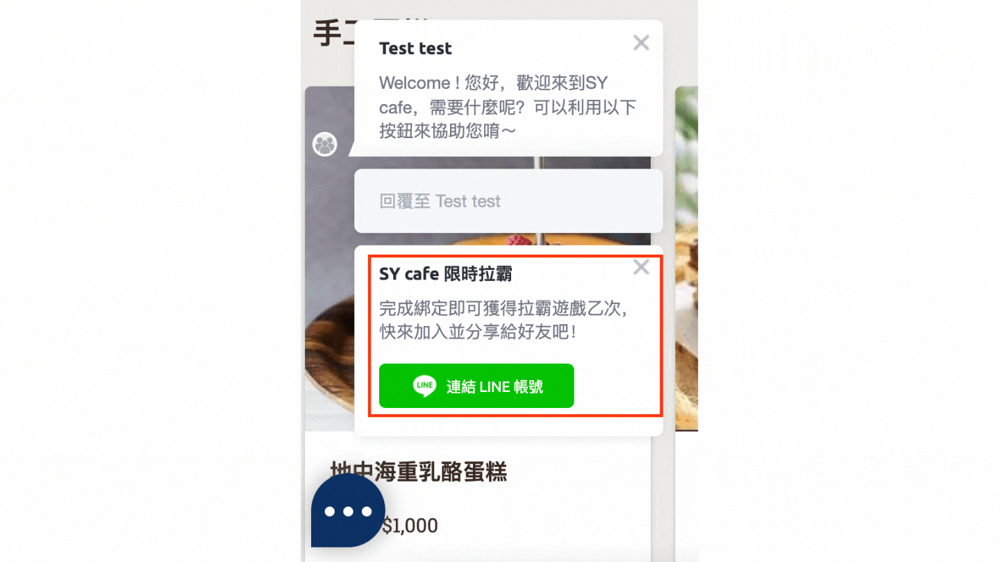
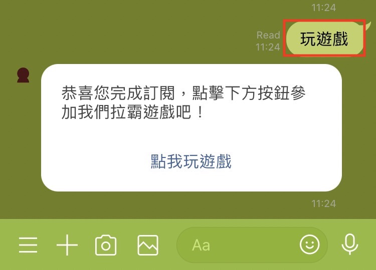
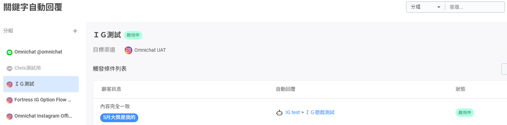
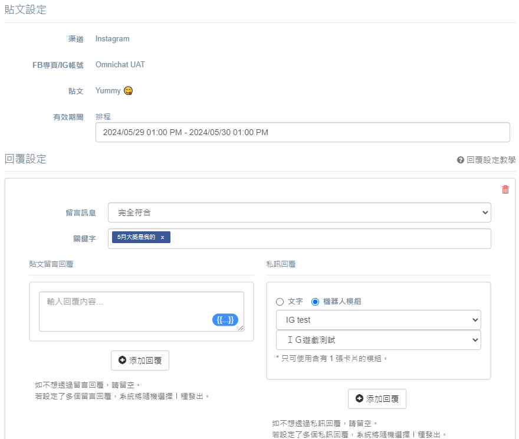

# 遊戲模組應用

1. 透過 QR Code 在你的宣傳文案中放入遊戲模組 URL，直接分享給你的粉絲們
2. 透過 LINE 圖文選單引導客人開始玩遊戲
3. 透過機器人設定引導客人玩遊戲
4. 讓門市消費者簡單一掃加入LINE 好友，立即玩遊戲
5. 讓 Instagram 好友跟您的官方帳號透過遊戲來互動

## 秘笈一：在宣傳文案中放入遊戲模組 URL，直接分享給你的粉絲們

設計文案及複製每個遊戲專屬 URL，透過 EDM, 簡訊等方式直接提供給客人進行遊戲

## 秘笈二：透過 LINE 圖文選單引導客人開始玩遊戲

在『進階自動化功能』中的 『[LINE 圖文選單](../marketing/line-tu-wen-xuan-dan/)』內可以直接將遊戲的 URL 設定在該圖片區塊的動作，當客人進到 LINE 官方帳號，就可以直接點擊圖文選單玩遊戲囉！

## 秘笈三：透過機器人設定引導客人玩遊戲

機器人模組可以應用在 Omnichat 後台系統的各個功能上。關於機器人設定請參考[這裡](../marketing/chatbot-builder/)

首先，請先設定一個機器人模組，將**遊戲連結 URL** 放進已設計過機器人模組中的卡片按鈕內，按下『儲存』！

接著，這裡將舉例介紹三種機器人模組在 Omnichat 功能的應用，分別是透過『綁定』、『關鍵字自動回覆』跟『推播訊息』來依序說明。

### 1. 將遊戲模組變成『綁定』誘因，當客人透過點擊社群身份綁定按鈕完成綁定後，即提供遊戲進行遊玩

#### 步驟ㄧ：『社群身份綁定』頁面，將訂閱成功訊息選用『機器人模組』

#### 步驟二： 讓完成『綁定』的客人可以被訂閱成功訊息引導去玩遊戲。

### 2. 關鍵字自動回覆設定，引導客人輸入關鍵字後觸發機器人模組直接玩遊戲

透過客人輸入關鍵字，進而觸發機器人模組來玩遊戲。

#### 步驟一：先到『[關鍵字自動回覆](../marketing/keyword-autoreply.md)』中設定關鍵字

#### 步驟二：當客人輸入『玩遊戲』這組關鍵字後，就會觸發機器人模組。當客人點擊機器人按鈕，即可以玩遊戲！

### 3. 使用推播訊息將遊戲資訊推播給消費者，讓消費者直接點擊玩遊戲

#### 步驟一：進到『聯絡人及推播訊息』頁面，勾選你想要推播的客人，並按下『推播訊息』的按鈕

#### 步驟二：輸入主題及點擊『添加機器人模組』選擇要推播的『機器人模組』，並按下『下一步』跟『確認』後就可以推送訊息給客人

## 秘笈四：**讓門市消費者簡單一掃加入 LINE 好友，立即玩遊戲**

可將 QR code 的圖檔下載並列印出來放在實體門市、通路或是產品包裝上提供客人掃描直接玩遊戲

## 秘笈五：**讓 Instagram 好友也能參與遊戲活動體驗**

### IG **快速掃碼立即玩遊戲**範例：

<figure><figcaption>
透過 QR Code 讓消費者直接掃碼，取得遊戲入口進行抽獎活動體驗
</figcaption></figure>

### IG 客人透過私訊輸入通關密語(關鍵字)，獲得遊戲入口**玩遊戲**範例：

<figure><figcaption>
設定 IG 關鍵字，自動回覆遊戲入口訊息
</figcaption></figure>

<figure><figcaption>
客人於品牌 IG 私訊觸發關鍵字後，自動接收品牌方發送的遊戲入口訊息
</figcaption></figure>

### IG 貼文，粉絲留言自動獲得遊戲入口，**立即玩遊戲**範例：

<figure><figcaption>
IG 留言設立自動私訊回覆，提供客人遊戲入口訊息
</figcaption></figure>

<figure><figcaption>
客人於品牌 IG 貼文留言後，自動接收品牌方發送的遊戲入口訊息
</figcaption></figure>
