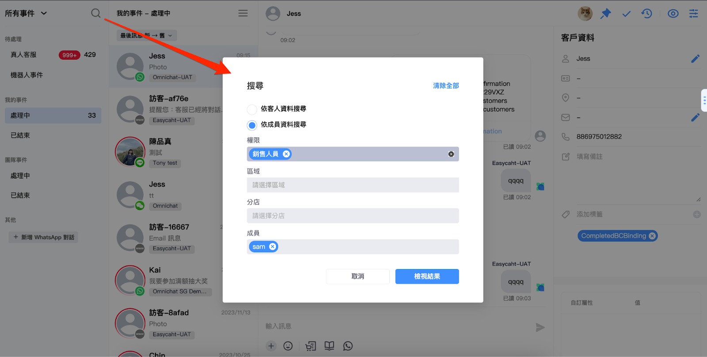
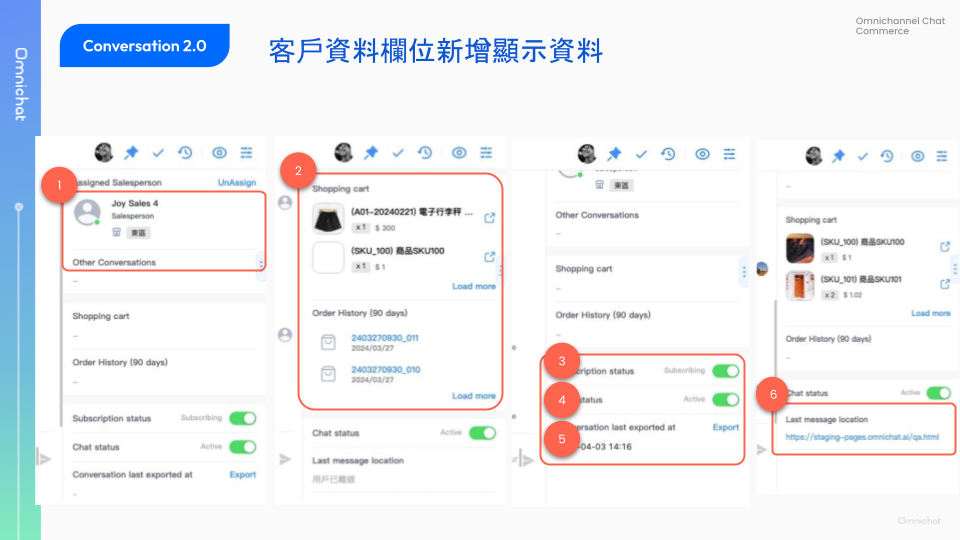
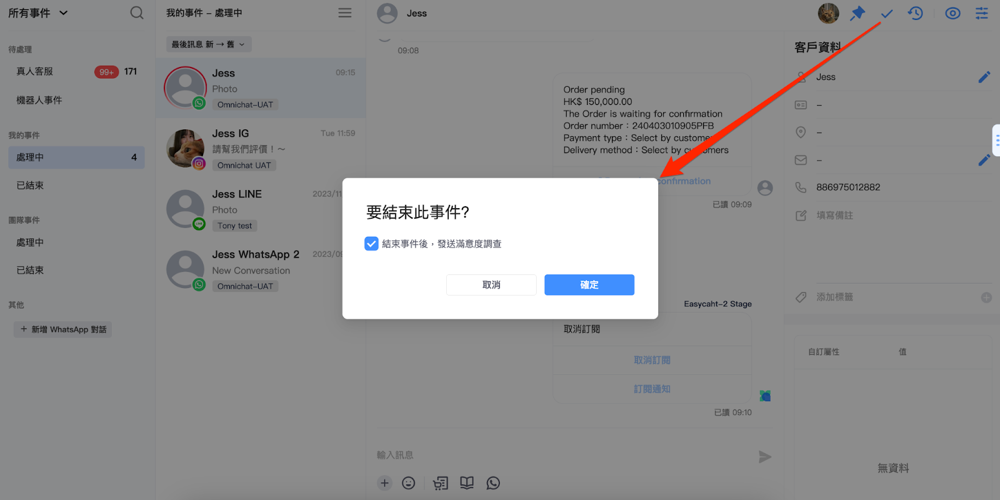

# Apr 10, 2024

哈囉，親愛的 Omnichat 用戶！

以下是我們為您帶來的功能更新：

1. [LINE 通知快捷](apr-10-2024.md#line-tong-zhi-kuai-jie-xin-zeng-hao-you-shu-shu-ju-tong-ji-shang-xian)
   1. 新增好友數：透過 LINE 通知型訊息加入好友的數據，可在通知快捷統計、全渠道顧客分析新聯絡人來源查看
   2. LINE 推送訊息：「查詢訂單詳情」按鈕支援社群身份綁定
2. [顧客管理](apr-10-2024.md#gu-ke-guan-li-zhi-yuan-fei-cdp-fang-an-guan-li-guan-wang-lian-lao-ren)：支援非 CDP 方案管理官網聯絡人
3. [匯入顧客資料支援](apr-10-2024.md#hui-ru-gu-ke-zi-liao-zhi-yuan-fei-cdp-fang-an-yi-hui-yuan-bian-hao-hui-ru-gu-ke)：非 CDP 版本支援依會員編號匯入顧客
4. [WhatsApp Catalog](apr-10-2024.md#whatsapp-catalog-zhi-yuan-shang-pin-ye-chuan-song-xun-xi-gei-shang-jia-fa-xun-an-niu)：支援商品頁「傳送訊息給商家」發訊按鈕
5. [對話 2.0 相關更新](apr-10-2024.md#dui-hua-2.0-zhi-yuan-fa-song-ji-qi-ren-ji-dang-an-lei-xing-de-yu-cun-hui-fu-new)：
   1. [支援發送機器人及檔案類型的預存回覆](apr-10-2024.md#dui-hua-2.0-zhi-yuan-fa-song-ji-qi-ren-ji-dang-an-lei-xing-de-yu-cun-hui-fu-new) (New)
   2. 以店員資料搜尋對話
   3. WhatsApp 回覆指定訊息、訊息發送失敗警示
   4. 右側客戶資料，新增顯示欄位
   5. 滿意度調查可於結束事件後自動發送
6. [其他功能優化](apr-10-2024.md#qi-ta-gong-neng-you-hua)

## LINE 通知快捷：「新增好友數」數據統計上線！

🙌🏻 適用對象：加購 LINE 通知快捷

當商家要發送 LINE 通知型訊息給顧客，即使尚未成為官方帳號好友依然可以收到訊息。

許多顧客也會在收到通知型訊息時加入好友，也能為 LINE 通知型訊息的一大優勢。

透過 Omnichat 通知快捷來發送 LINE 通知型訊息，當發送對象原先並非品牌 LINE 好友，Omnichat 會追蹤有多少顧客因此加入好友，幫助品牌評估效益。

### LINE 通知型訊息「新增好友數」

* LINE 通知快捷：統計不同通知情境，因收到通知型訊息而加入好友的數據
* 全渠道顧客分析（此頁僅 Social CDP 方案支援）：新聯絡人來源新增「LINE 通知型訊息」

<figure><figcaption></figcaption></figure>

### LINE 推送訊息：「查詢訂單詳情」按鈕支援社群身份綁定

使用 Omnichat LINE 通知快捷，若要通知的手機號碼在 Omnichat 系統中可查詢到 LINE 聯絡人，可有先以較節費的 LINE 推送進行通知。

LINE 推送通知的「查詢訂單詳情」按鈕，現在可以支援顧客進行社群身份綁定囉！

<figure><figcaption></figcaption></figure>

## 顧客管理：支援非 CDP 方案管理官網聯絡人

🙌🏻 適用對象：所有方案

後台位置：社群顧客資料平台 > 顧客管理

顧客管理頁面分為 Social CDP 方案版本與其他版本。

* Social CDP 方案：先前已上線，顧客列表包含**官網顧客**與**所有社群渠道顧客**
* 非 Social CDP 方案：本次新上線，顧客列表僅包含**官網顧客**（含有會員編號、Email、電話任一資訊的顧客）

<figure><figcaption></figcaption></figure>

<figure><figcaption></figcaption></figure>

### 匯入顧客資料：支援非 CDP 方案依「會員編號」匯入顧客

🙌🏻 適用對象：包含行銷功能的所有方案

本功能 Social CDP 方案先前已支援，本次更新新增支援其他方案使用。

在匯入顧客資料頁面，有兩種匯入方式：

* 匯入顧客：以**會員編號**為唯一識別值進行匯入（本次新增支援所有方案使用）
* 匯入社群聯絡人：以社群 User ID 為唯一識別值進行匯入

<figure><figcaption></figcaption></figure>

## WhatsApp Catalog：支援商品頁「傳送訊息給商家」發訊按鈕

🙌🏻 適用對象：WhatsApp Commerce

在 WhatsApp 商品目錄中的產品頁面，新增支援「傳訊訊息給商家」按鈕，方便顧客針對指定商品詢問更多細節，僅限輸入文字訊息。

<figure><figcaption></figcaption></figure>

## 對話 2.0：支援發送機器人及檔案類型的預存回覆 (New)

🙌🏻 適用對象：包含客服的所有方案

發送機器人與檔案訊息的預存回覆，先前在手機 APP 上已支援，本次更新新增支援網頁版「對話 2.0」操作。

### 預存回覆：包含機器人模組

* 機器人類型的預存回覆只支援在以下平台使用：
  * WhatsApp
  * LINE
  * Facebook
  * Instagram
* 使用含 **機器人** 的預存回覆發送
  * 只能選到該對話所適用的機器人預存回覆，不適用的將顯示「**目標渠道不支援發送此類型的機器人模組」**
  * Wechat、Webchat 不可發送機器人模組
  * 如果該機器人模組已被刪除，將顯&#x793A;**「此預存回覆的機器人模組已被刪除」**
  * 發送含有機器人的預存回覆時，會直接發送，不可編輯模組內容

<figure><figcaption></figcaption></figure>

### 預存回覆：包含檔案的自訂訊息

* 檔案類型的預存回覆只支援在以下平台使用：
  * WhatsApp
  * Facebook
*   使用含 **檔案** 的預存回覆發送

    * 只能在 Whatsapp、Facebook 對話中選到含有檔案的預存回覆
    * 當所選的預存回覆包含正在回覆的渠道不支援的檔案類型時，無法選擇該預存回覆，並會顯示提示訊息

    | 檔案類型 | WhatsApp | Facebook | LINE | IG  | 官網 Webchat | Wechat |
    | ---- | -------- | -------- | ---- | --- | ---------- | ------ |
    | 圖片   | ☑️       | ☑️       | ☑️   | ☑️  | ☑️         | 不支援    |
    | 影片   | ☑️       | ☑️       | ☑️   | ☑️  | 不支援        | 不支援    |
    | 檔案   | ☑️       | ☑️       | 不支援  | 不支援 | 不支援        | 不支援    |

<figure><figcaption></figcaption></figure>

### 不同角色的預存回覆管理權限

不同角色可進行不同程度的預存回覆管理，見下表：

| 角色   | 訊息類型      | 權限類型                                                | 動作     |
| ---- | --------- | --------------------------------------------------- | ------ |
| 管理員  | 自訂訊息, 機器人 | 全部                                                  | 編輯, 刪除 |
| 主管   | 自訂訊息, 機器人 | 所有成員, 只有自己, 指定權限 (主管, 客服經理, 客服人員, 銷售經理, 銷售人員, 行銷人員) | 編輯, 刪除 |
| 客服經理 | 自訂訊息, 機器人 | 只有自己, 指定權限 (客服經理, 客服人員)                             | 編輯, 刪除 |
| 客服人員 | 自訂訊息      | 只有自己, 指定權限 (客服人員)                                   | 編輯, 刪除 |
| 銷售經理 | 自訂訊息      | 只有自己, 指定分店 (綁定的分店)                                  | 編輯, 刪除 |
| 銷售人員 | 自訂訊息      | 只有自己, 指定分店 (綁定的分店)                                  | 編輯, 刪除 |
| 行銷人員 | 自訂訊息, 機器人 | 所有成員, 指定權限 (管理員, 主管, 客服經理, 客服人員, 銷售經理, 銷售人員, 行銷人員)  | 編輯     |
| 行銷客服 | 自訂訊息, 機器人 | 全部                                                  | 編輯, 刪除 |

* 發送的團隊角色如果不適用該預存回覆時，直接「不顯示」該則預存回覆

## 對話 2.0：其他更新

以下更新項目為原先舊版對話已支援功能，本次更新後在對話 2.0 版本上支援。

### 可「依成員資料」搜尋對話

* 依成員資料搜尋可使用以下條件：
  * 權限：
    * 管理員
    * 主管
    * 客服經理
    * 客服人員
    * 銷售經理 (OMO)
    * 銷售人員 (OMO)
  * 區域 (OMO)：分店管理所設定的區域
  * 分店 (OMO)：分店管理所設定的分店
  * 成員：以團隊成員名稱搜尋

<figure><figcaption></figcaption></figure>

### WhatsApp 支援回覆指定訊息、訊息發送失敗警示

* 可針對指定訊息回覆
* 當後台訊息收到發送失敗通知，會警示該訊息發送失敗
  * 訊息發送失敗情境：當超過該客戶最後發送訊息 24 小時後，系統觸發自動發送訊息機制，則該訊息發送失敗，e.g. 結束事件後發送滿意度調查

<figure><figcaption></figcaption></figure>

### 右側客戶資料，新增顯示欄位

對話 2.0 右側顧客資料欄位新增：

1. OMO 綁定資訊（限 OMO 方案）：
   * 限 **LINE、WhatsAPP 渠道** 會顯示
   * 限 **管理員 / 主管 / 銷售人員 / 銷售經理** 可以解除綁定
2. 官網行為紀錄（需埋設 Omnichat Pixel）：顯示購物車商品、最近 90 天訂單
3. 訂閱狀態：取消訂閱後，推播清單會過濾該客戶
   * **WebChat、IG**：不顯示
   * **LINE**：會依照客人封鎖狀態更新，也可以由理員、客服人員操作取消訂閱
   * **FB、WhatsApp**：客人端封鎖與否不會連動，只有管理員、客服人員可以單向操作訂閱與否
4. 對話狀態
   * 封鎖後，不會收到該客戶發送之訊息
5. 最後對話導出時間
   * **WebChat 渠道** 不顯示
   * 顯示最後一次導出對話資料的時間
6. 最後傳送訊息頁面
   * 僅 **WebChat 渠道** 會顯示
   * 當客戶離線後，會顯示「用戶已離線」

<figure><figcaption></figcaption></figure>

### 滿意度調查可於結束事件後自動發送

🙌🏻 適用對象：滿意度調查模組

在滿意度調查設定，可選擇發送方式：

* 不發送：關閉滿意度調查設定
* 自動發送：選擇「事件結束後，自動發送」
* 手動選擇是否發送：選擇「事件結束後，手動決定發送」

現在，在對話 2.0 結束事件時，也可以支援「手動決定發送」滿意度調查囉！

<figure><figcaption></figcaption></figure>

## 其他功能優化

* 滿意度調查頁 logo 改用團隊大頭貼顯示
