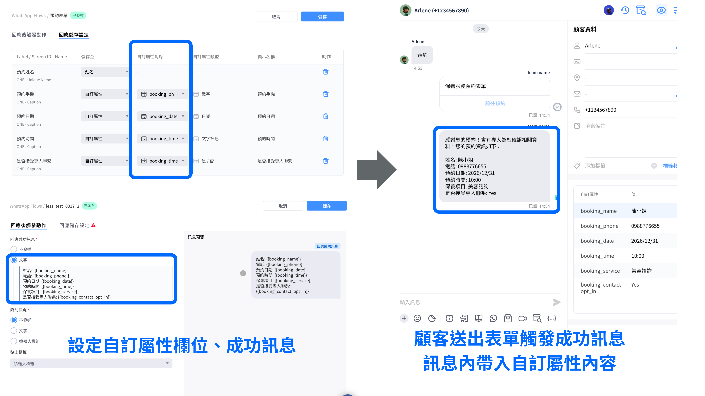

# Apr 22, 2026

哈囉，親愛的 Omnichat 用戶！

以下是我們為您帶來的功能更新：

1. LINE/Facebook 推播名單匯出新增「備註」欄位
2. Messenger 開啟網址時新增中繼導轉頁面
3. WhatsApp Flow 升級：表單回覆自動同步自訂屬性

### LINE/Facebook 推播名單匯出新增「備註欄位」

<mark style="color:$info;">**☑️**</mark>**&#x20;**<mark style="color:$primary;">**適用方案/模組：推播模組**</mark>

在進行大規模推播後，了解失敗原因對於優化下一波活動長重要！過往需在後台詳情頁面逐一確認備註欄位，且受限於分頁顯示，在處理大量名單時較為耗時。

* **更新內容：**

現在起，匯出 LINE/Facebook 的推播名單已支援「備註欄位」，未來只要在推播詳情頁面匯出名單，就能透過 Google 表單或 Excel 更快速高效的確認推播失敗原因。

### Messenger  機器人連結開啟網址時新增中繼導轉頁面

☑️ <mark style="color:$primary;">**適用方案/模組：聊天機器人模組**</mark>

您是否遇過客戶點擊 Facebook 推播，卻因為 Messenger 內建瀏覽器的限制，導致 LINE LIFF 或其他 App 連結打不開？現在，Omnichat 為您的跨平台跳轉加了一道「導航防護」，透過穩定的中繼導轉頁機制，能完美改善過往跨 App 連結容易失敗的狀況，確保每一位從 Facebook 出發的客戶，都能順暢無阻地抵達 LINE 或目標 App。

* **更新內容：**

若您的機器人推播渠道為 Facebook，且點擊觸發動作的 URL 是 LINE LIFF 或導到其他 App，可以開&#x555F;**「以轉導頁開啟連結」**，勾選這功能後，用戶點擊連結會先進入導轉頁，這能夠改善過往在 Messenger 上開啟LINE LIFF 等跨App 連結容易失敗的狀況，提升客戶在跨 App 的體驗、降低跳轉流失率。

<figure><figcaption></figcaption></figure>

### WhatsApp Flow 升級：表單回覆自動同步自訂屬性

為了讓您更輕鬆地收集並管理客戶資料，我們優化了 WhatsApp Flows 的串接功能！未來表單回覆的內容能夠自動同步回自訂屬性欄位，如果您時常運用表單搜集預約報名、顧客資訊，絕對不能錯過這個能讓 WhatsApp 表單的每一項資訊發揮更大商業價值的新功能💡

* **更新內容**

1. **資料自動同步**： 客戶填寫表單後，回答內容將即時存入 「自定義屬性欄位」，無需手動操作。
2. **動態成功訊息**： 支援在表單送出後的成功訊息中，自動帶入客戶填寫的內容（如：姓名、預約時間），提供最即時、個人化的確認回饋。
3. **後續行銷更精準**： 存入的屬性可直接用於後續的自動化流程或分眾群發，實現真正的自動化行銷！

<figure><figcaption></figcaption></figure>

【 點擊以下教學手冊，了解更多 WhatsApp Flow 功能細節】



