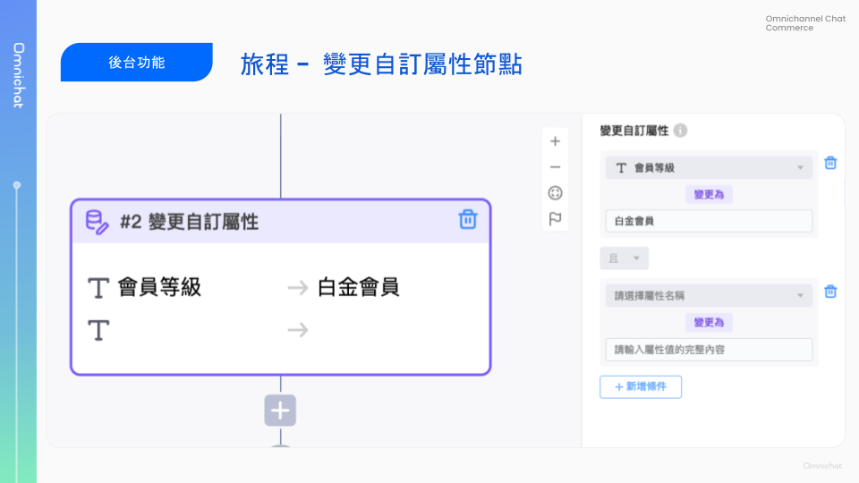
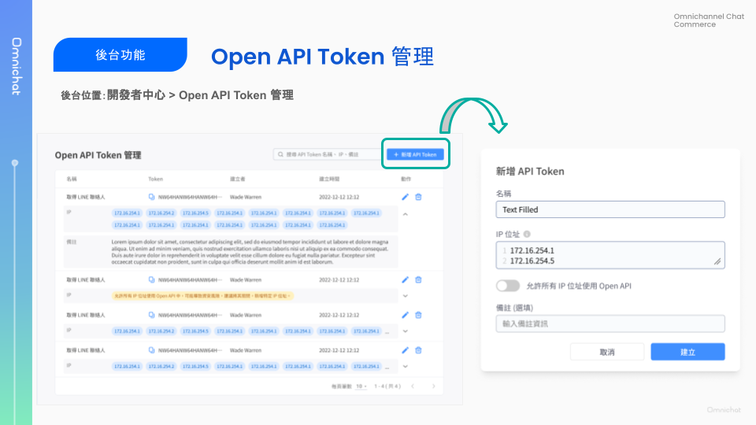
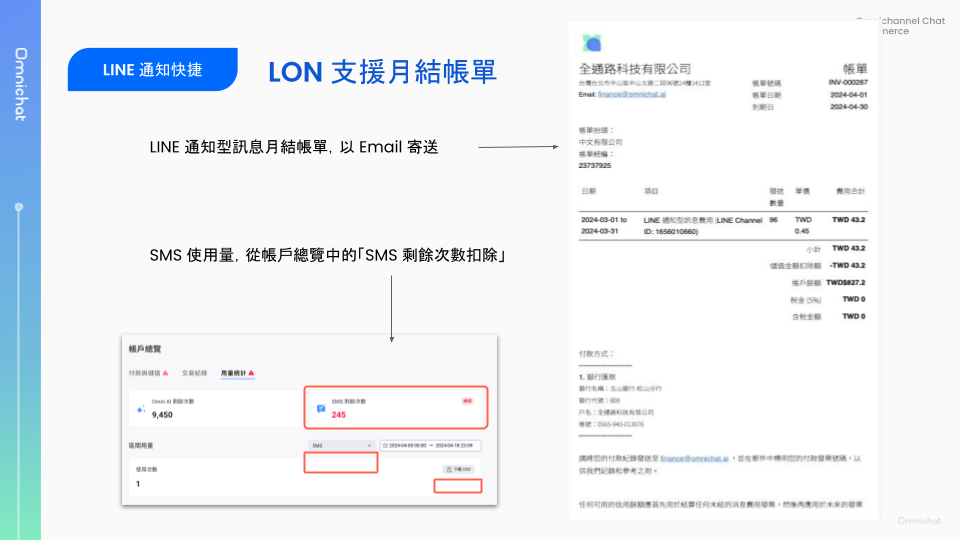
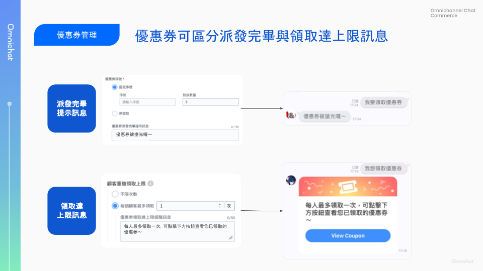
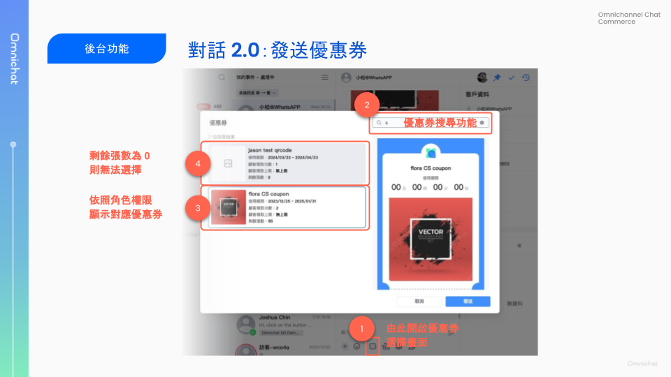

# Apr 24, 2024

哈囉，親愛的 Omnichat 用戶！

以下是我們為您帶來的功能更新：

1. [顧客旅程](apr-24-2024.md#gu-ke-lv-cheng-xin-zeng-bian-geng-zi-ding-shu-xing-dong-zuo-jie-dian)：新增「變更自訂屬性」動作節點
2. [Open API Token 管理上線](apr-24-2024.md#open-api-token-guan-li)：方便管理 API Token 與 IP 白名單
3. [LINE 通知快捷](apr-24-2024.md#line-tong-zhi-kuai-jie-line-tong-zhi-xing-xun-xi-yue-jie-zhang-chan)：LINE 通知型訊息月結帳單，每月 3 號以 Email 發送前月帳單
4. [優惠券管理](apr-24-2024.md#you-hui-quan-guan-li-ke-ou-fen-pai-fa-wan-bi-yu-ling-qu-da-shang-xian-xun-xi)：優惠券派發完畢、領取達上限之提示訊息可個別設定
5. [對話 2.0](apr-24-2024.md#dui-hua-2.0-zhi-yuan-ke-fu-xiao-shou-ren-yuan-fa-song-you-hui-quan)：支援於對話中發送優惠券
6. [APP 影片上傳優化](apr-24-2024.md#app-zhi-yuan-ying-pian-ya-su)：超過平台限制影片仍可上傳，上傳後自動進行檔案壓縮

## 顧客旅程：新增「變更自訂屬性」動作節點

🙌🏻 適用方案：Social CDP 或另外開通顧客旅程＆自訂屬性

顧客旅程新增一個動作節點「變更自訂屬性」，當顧客經過這個旅程節點時，將會自動改變他的自訂屬性資料為指定的值。

* 僅支援變更「文字」型態的自訂屬性資料
* 自訂屬性變更可透過 Webhook 同步至其他系統（需串接 Contact 相關 Webhook）

<figure><figcaption></figcaption></figure>

## Open API Token 管理

🙌🏻 適用方案：加購 Omnichat Open API (CRM / Messaging / Marketing)

開發者中心新增了「Open API 管理」頁面，方便團隊自行管理 Open API Token 和 IP 白名單。

要串接 Open API 時，請先在 Open API 管理頁面「**新增 API Token」**，並設定此 API Token 可使用的 **IP 白名單**。隨後，即可參照 [開發文件](https://documenter.getpostman.com/view/2s9YsMBC4o#intro) 進行開發與測試。

每個團隊預設可新增 Token 數量為一組，如需新增多組 Token 請另外加購。

<figure><figcaption></figcaption></figure>

## LINE 通知快捷：LINE 通知型訊息月結帳單

🙌🏻 適用方案：加購 LINE 通知快捷（LINE 通知型訊息）

LINE 通知型訊息的使用量帳單會在「每月 3 號」以 Email 發送前月的帳單。

* LINE 通知型訊息費用會自動從**帳戶總覽 > 帳戶餘額**扣款，若帳戶餘額不足則需補款。
* 若團隊以多個 LINE 官方帳號發送通知型訊息，每個 LINE 官方帳號的月結帳單會分開寄送。
* 其他補充說明：
  * LINE 通知型訊息月結帳單會寄送至「接收帳單通知 Email」，可於「設定 > 團隊資料」中設定
  * 查看 LON 即時用量：可至**通訊渠道 > LINE 通知快捷**頁面查看
  * 查看 SMS 使用量：可至後台**帳戶總覽 > 剩餘用量**頁面查看，可支援匯出 SMS 區間用量。SMS 用量目前不會寄送月結帳單，僅會即時從事先儲值的使用量中扣除額度。

<figure><figcaption></figcaption></figure>

## 優惠券管理：可區分派發完畢與領取達上限訊息

🙌🏻 適用方案：加購優惠券管理

當優惠券發送完畢，或是該顧客領取數量達上限時，過去會發送同一則提示訊息。

這次改版後，發送完畢與領取達上限的提示訊息可以分別設定，讓您可以做到更細緻的活動規劃、顧客互動。

其中，顧客領取達上限的訊息，會附帶按鈕讓顧客可以查看先前已領取到的優惠券。

<figure><figcaption></figcaption></figure>

## 對話 2.0：支援客服、銷售人員發送優惠券

🙌🏻 適用方案：客服功能＋優惠券模組

對話 2.0 版本中，可以支援優惠券發送功能囉！

1. 適用渠道：FB、IG、LINE、WhatsApp（Wechat 和 Webchat 不適用）
2. 優惠券搜尋：可針對「優惠券名稱」搜尋，快速查找要發送的優惠券
3. 依照方案與帳號角色權限，顯示可發送優惠券：
   * 客服優惠券：僅對客服人員/經理、管理員、主管顯示，**銷售人員/經理** 不會顯示
   * 銷售優惠券：需為 **OMO 方案**才可建立銷售類型優惠券，銷售優惠券僅對 **銷售人員/經理** 顯示，其他角色不會顯示。
4. 當優惠券發送完畢，或者「該分店/人員發送數量」用盡，優惠券仍會顯示但無法被選擇

<figure><figcaption></figcaption></figure>

## APP 支援影片壓縮

過去，影片大小超過平台限制時即無法上傳；此次更新後，超過平台檔案大小限制的影片仍可上傳，上傳後會依平台限制進行壓縮。

* 管理預存回覆、處理中群發、顧客名單群發上傳影片時：
  * 可一次同時上傳 5 則影片，會分別進行壓縮，壓縮完成後會自動上傳。
  * 沒有限定的影片的大小、影片長度，壓縮時主要看檔案位元速率 (bitrate)、檔案大小 (MB)，系統會自動計算安全公式，如符合數值的影片則會自動壓縮並上傳。
  * 如遇到影片無法壓縮時，會出現提示訊息\*\*「無法傳送影片，可能是影片時長超過或影片檔案過大，無法壓縮」\*\*。
* 1:1 對話發送影片、1:1 對話中使用預存回覆並上傳影片：
  * 當上傳的影片檔案小於平台限制時，則傳送原檔
  * 平台限制：
    * WhatsApp：16MB
    * Facebook：25MB
    * LINE：50MB
    * Instagram：尚未支援影片傳送
    * Webchat：不支援影片傳送
    * Wechat：不支援影片傳送
  * 當上傳的影片 > 平台限制時，將會壓縮檔案，壓縮邏輯同上述規則。
