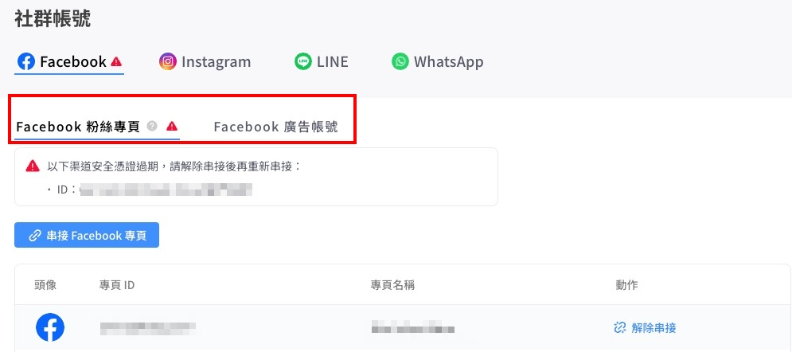
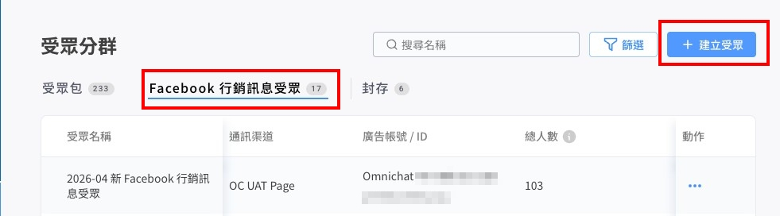

# Apr 8, 2026

哈囉，親愛的 Omnichat 用戶！

以下是我們為您帶來的功能更新：

1. 推播功能支援儲存草稿
2. 全新 Facebook Marketing Messages 行銷訊息
3. 以訊息內容搜尋對話時，支援新增「時間篩選」條件
4. OMO 對話觸發 AI 客服流程優化

### 推播功能支援儲存草稿

<mark style="color:$info;">**☑️**</mark>**&#x20;**<mark style="color:$primary;">**適用方案/模組：推播模組**</mark>

目前在推播編輯頁面的右上角**新增了「儲存」的選項**，編輯人員能預先將草稿儲存好，待推播素材都齊全後再排程推播，不必再擔心跳出頁面後會造成內容流失、要重頭編輯，有效提升推播的作業效率！

### &#x20;Facebook Marketing Messages 行銷訊息

☑️ <mark style="color:$primary;">**適用方案/模組：推播模組、受眾管理模組**</mark>

<mark style="color:$primary;">\*擁有「推播模組」即可於 Omnichat 後台發送 Facebook 行銷訊息，但</mark><mark style="color:$primary;">**必須同時擁有「受眾管理模組」才能選擇到 「Facebook 行銷受眾、受眾包」兩個選項**</mark><mark style="color:$primary;">，若您需要加購受眾管理模組，歡迎隨時向顧問聯繫！</mark>

Facebook Recurring Notifications(定期通知)於 2026 年 1 月正式退場，Meta 推出了取代定期通知的的全新功能 - **Marketing Messages 行銷訊息。**&#x800C; Omnichat 也在 4 月完成功能串接，**4/15 起您就可以在 Omnichat 後台推播 Facebook 行銷訊息，向用戶宣傳品牌最新活動了！**

* **更新內容**

1. **新增收費機制**：行銷訊息採收費制，由 Meta 收取推播訊息的費用。
2. **必須串接 Facebook 廣告帳號**：承上，由於會跟 Meta 廣告一樣收取費用，因此使用功能前必須在 Omnichat 後台重新串接 Facebook 粉絲專頁與廣告帳號。

<figure><figcaption></figcaption></figure>

1. **新增 3 種獲取用戶 Opt-in（接受通知） 的方式**：

* 當顧客點擊 Click-to-message 廣告時即 Opt-in

<figure><figcaption></figcaption></figure>

* 對話超過 48 小時無互動，Meta 自動觸發訊息邀請用戶 Opt-in（如下圖）
* 用戶在粉專公開貼文留下高意圖留言，內容屬於 Meta 判定的六大興趣意圖類型之一（購買、價格、付款、產品詢問、服務詢問、預約），Meta 自動觸發訊息邀請用戶 Opt-in （如下圖）

<em><mark style="color:$info;">系統觸發之訊息內容為 Meta 預設，無法更改</mark></em>

<figure><figcaption></figcaption></figure>

4. **受眾分群新增 「Facebook 行銷受眾」**：除了既有的受眾包、自訂條件、使用 CSV，行銷訊息也支援「Facebook 行銷受眾」的選項，**只要上傳用戶的電話/Email，Meta  即可比對相對的 Facebook 帳號，比對成功就能對其發送行銷訊息**

<figure><figcaption></figcaption></figure>

4. **發送頻率：**&#x6BCF;位用戶 **12 小時內**限制接受一則行銷訊息

* **功能亮點**
  1. 突破 24 小時限制 X 發送頻率更彈性，利於客戶依據檔期調整推播，提升再行銷效率
  2. 推出全新「Facebook 行銷受眾」，只要有 Email / 手機就能自動比對並發送推播，最大化行銷觸及！
  3. 化被動為主動！新增 4 種用戶訂閱的方式，輕鬆將新流量納入品牌資產（=訂閱用戶）

### 以訊息內容搜尋對話時，支援新增「時間篩選」條件

想搜尋過往跟顧客相關對話內容時，不僅能透過關鍵字搜尋，還有「時間篩選」的條件，讓您更快速又精準找到想要的訊息內容。

*   **更新內容**：時間篩選條件包含

    1. 最近 7 天
    2. 最近 30 天 (預設)
    3. 最近 90 天
    4. 最近 180 天
    5. 自訂區間（最長不可設定超過 365 天）

    

### OMO 對話觸發 AI 客服流程優化

☑️ <mark style="color:$primary;">**適用方案/模組：**</mark><mark style="color:$primary;">**Omni AI Agent 模組、OMO 模組**</mark>

過往在 LINE & WhatsApp 的對話，若有綁定銷售人員，AI 客服就沒辦法支援。此優化上線後，**如果對話狀態轉為「已結束」， 仍可正常觸發 AI 客服來服務顧客。**&#x5373;便是銷售人員的下班時間，也能透過 AI 客服全天候回答顧客問題！提高顧客的消費體驗

