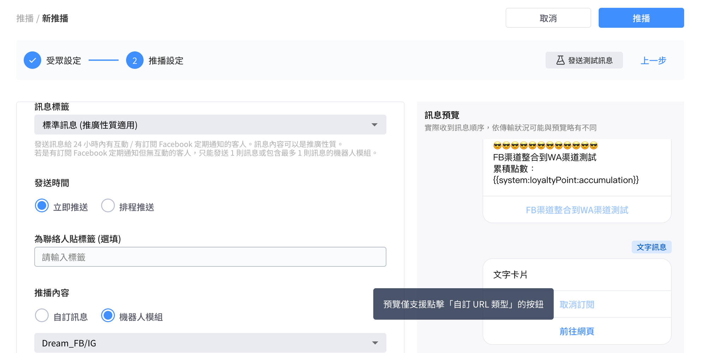
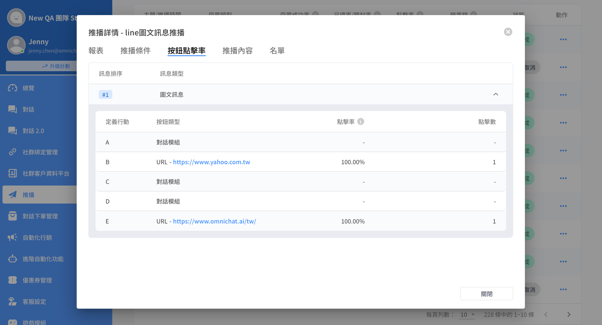

# Aug 21, 2024

哈囉，親愛的 Omnichat 用戶！

以下是我們為您帶來的 2 點功能更新：

1. [優惠券](aug-21-2024.md#you-hui-quan-zhi-yuan-dui-hua-zhong-you-hui-quan-tu-pian)：支援自訂優惠券訊息圖片
2. [推播 2.0](aug-21-2024.md#tui-bo-2.0-yu-lan-xiang-qing-zhi-yuan-dian-ji-url-an-niu)：預覽、詳情支援點擊 URL 按鈕

## 優惠券：支援對話中優惠券圖片

🙌🏻 **適用方案**：需開通優惠券模組

📍 **功能路徑：**[優惠券管理](https://console.omnichat.ai/coupon-management)

優惠券管理支援自訂對話訊息中的顯示圖片囉！

讓你在發送優惠券時，可以更快將活動重點、品牌特色傳達給顧客！

<figure><figcaption></figcaption></figure>

## 推播 2.0：預覽、詳情支援點擊 URL 按鈕

支援在推播中預覽畫面、推播詳情中可以點擊 URL 按鈕，確認設定是否正確、後續報表確認當初設定的連結。

* **可支援按鈕類型：動作是「開啟 URL」的按鈕**
* **可點擊、顯示連結位置**
  * 推播設定頁面中的預覽畫面
  * 推播詳情 / 推播內容 / 訊息預覽區塊
  * 推播詳情 / 按鈕點擊率 / 按鈕類型為 URL 時

<figure><figcaption></figcaption></figure>

<figure><figcaption></figcaption></figure>
