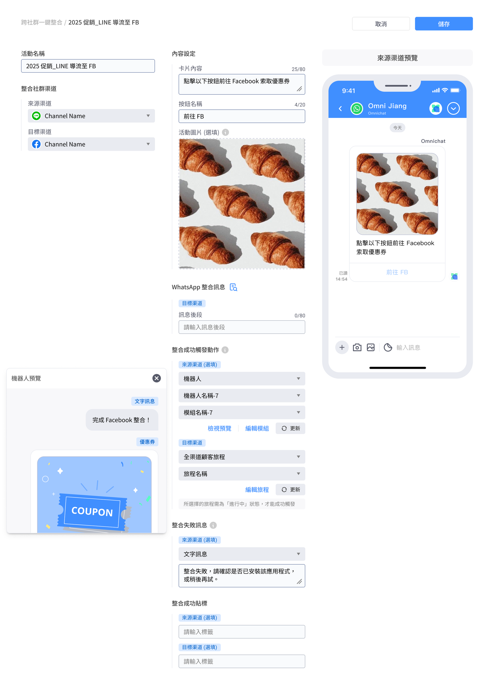
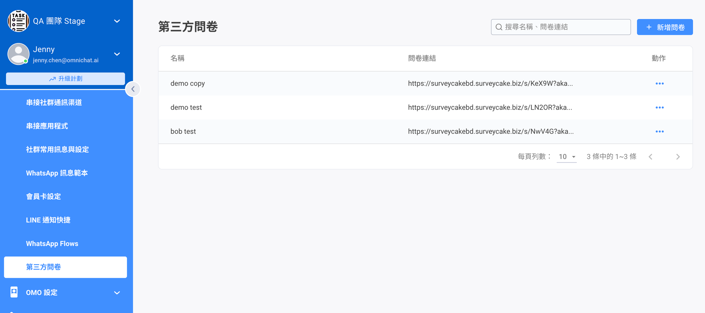
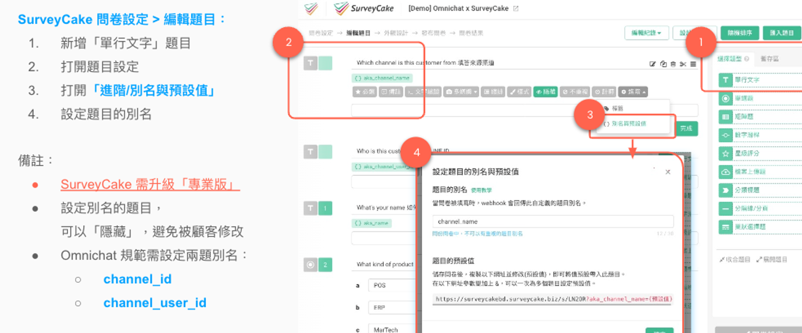
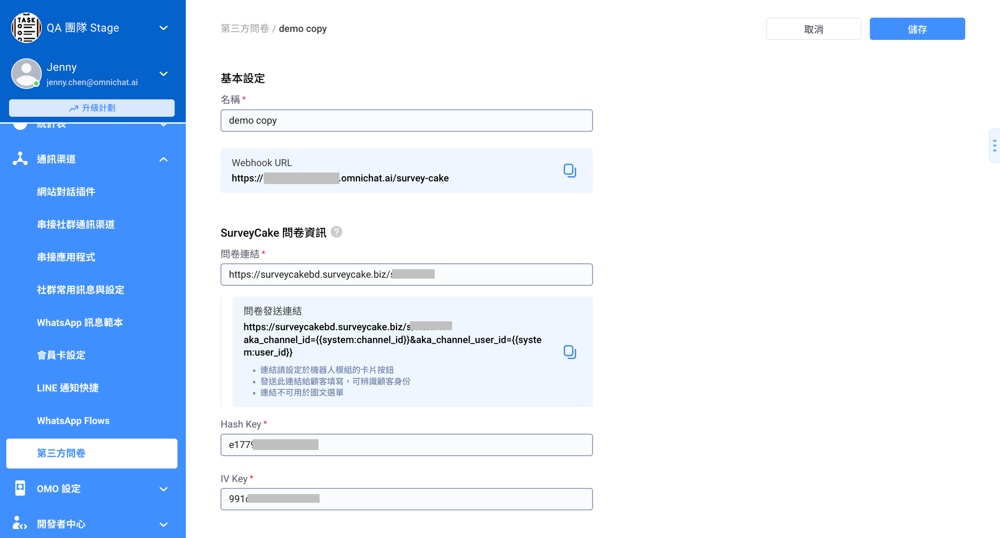
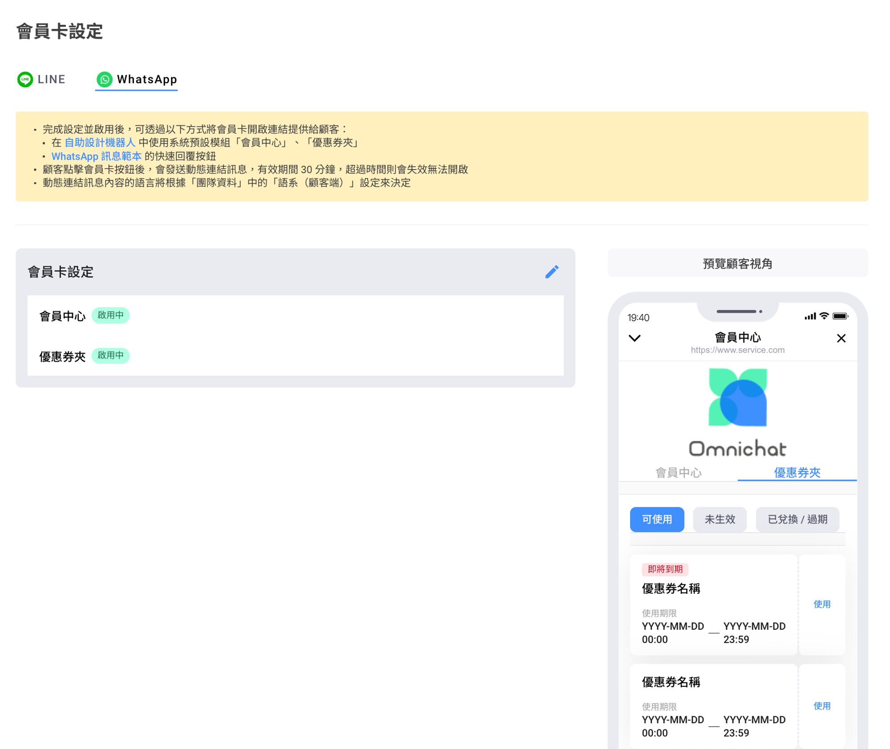

# Aug 8, 2024

哈囉，親愛的 Omnichat 用戶！

以下是我們為您帶來的功能更新：

1. [OmniLink ](aug-8-2024.md#omnilink-kua-she-qun-yi-jian-zheng-he-shang-xian-luo)跨社群一鍵整合上線囉！
2. [SurveyCake ](aug-8-2024.md#surveycake-zheng-he-gong-neng-geng-xin-zhi-yuan-biao-qian-tong-bu-zhi-omnichat)串接支援標籤同步
3. [WhatsApp Flow](aug-8-2024.md#whatsapp-flow-zheng-he-gong-neng-zhi-yuan-di-san-fang-zi-liao-ku-chuan-jie-webhook-zi-dong-tong-bu-z)：支援串接 Webhook 自動同步客戶填寫資料
4. [WhatsApp 會員卡](aug-8-2024.md#whatsapp-hui-yuan-ka-zhi-yuan-you-hui-quan-jia)支援優惠券夾
5. 其他功能優化：[WhatsApp 對話下單](aug-8-2024.md#whatsapp-dui-hua-xia-dan)

## OmniLink 跨社群一鍵整合上線囉！

🙌🏻 **適用方案**：Social CDP

📍 **功能路徑**：社群綁定管理 > [跨社群一鍵整合](https://console.omnichat.ai/omni-link)

OmniLink 讓你跨社群導流顧客，並完成身份綁定，將顧客在不同社群的數據、標籤、數據、標籤、顧客資料都收攏至同一份顧客檔案。

開通 OmniLink 跨社群一鍵整合功能後，你可以在「跨社群一鍵整合」完成整合活動的設定，再前往「自助設計機器人」將整合卡片新增至 Chatbot 對話模組中。

顧客點擊「跨社群一鍵整合」卡片按鈕，會從「來源渠道」被引導到「目標渠道」，完成身份綁定並且觸發完成完成綁定訊息。

### OmniLink 跨社群一鍵整合總覽

總覽頁面呈現已設定的所有整合活動。

呈現資料包含：

* 活動名稱
* 狀態：啟用中、停用中
* 來源渠道：傳送「跨社群一鍵整合」卡片的渠道
* 目標渠道：顧客點擊「跨社群一鍵整合」卡片按鈕後會前往的渠道
* 目標渠道 - 新聯絡人：整合成功且從未存在於該團隊中的 Channel User
* 成功人數：點擊後完成跨渠道身份整合次數（若同一位聯絡人重複點擊，則會產生重複人數）

<figure><figcaption></figcaption></figure>

### OmniLink 整合活動設定

在此頁設定以下項目：

* 整合社群渠道：
  * 來源渠道：支援 Facebook / LINE / WhatsApp / IG
  * 目標渠道：支援 WhatsApp（LINE、Facebook 即將推出。IG 因平台限制無法支援）
* 內容設定：
  * 卡片內容
  * 按鈕名稱
  * 活動圖片（選填）
* 整合成功觸發動作
  * 來源渠道（選填）
    * 文字訊息
    * 機器人模組：僅能選擇與來源渠道平台相符的機器人
  * 目標渠道（必填）
    * 文字訊息
    * 機器人模組：僅能選擇與來源渠道平台相符的機器人
* 整合失敗訊息
  * 來源渠道（選填）
    * 文字訊息
    * 機器人模組：僅能選擇與來源渠道平台相符的機器人
* 整合成功貼標
  * 來源渠道（選填）
  * 目標渠道（選填）&#x20;
  * 貼標後連動影響：觸發旅程、LINE 圖文選單切換

<figure><figcaption></figcaption></figure>

整合失敗可能原因：

* 渠道權限失效、渠道解串
* 系統未預期錯誤
* 整合活動被停用
* 無法找到來源或目標渠道聯絡人
* 欲整合的目標與來源渠道聯絡人為不同會員編號
* LINE、Meta、WhatsApp API 回傳錯誤

### OmniLink 設定權限

以下權限角色可以進行 OmniLink 設定：

* 管理員
* 行銷人員
* 主管
* 行銷客服

## SurveyCake 整合功能更新：支援標籤同步至 Omnichat

🙌🏻 **適用方案**：需加購 SurveyCake 整合

📍 **功能路徑**：串接通訊渠道 > [第三方問卷](https://console.omnichat.ai/third-party-survey)

Omnichat 串接 SurveyCake 功能升級，目前可支援功能：

* 顧客資料自動帶入 SurveyCake
* 顧客填寫表單後，自動同步 SurveyCake 標籤到 Omnichat

在「第三方問卷」頁面，你可以進行 SurveyCake 串接設定。

### 第三方問卷：問卷列表

在此頁面你可以查看已串接的問卷，進行以下動作：

* 新增問卷：串接已在 SurveyCake 建立的問卷到 Omnichat
* 動作：複製 URL、編輯
* 搜尋問卷

<figure><figcaption></figcaption></figure>

### 第三方問卷：問卷設定頁

### SurveyCake 前置設定

* SurveyCake 方案：需要是「專業版」以上
* SurveyCake 題目：需設定可帶入聯絡人資料（社群渠道、社群 ID）的題目，此題目可以設定為隱藏避免顧客誤改

<figure><figcaption></figcaption></figure>

### 整合問卷

點擊「新增問卷」或「編輯」，你會進入設定頁。

* 問卷活動名稱：無字數限制，僅作為後台識別用，不會顯示給顧客
* Webhook URL：複製並貼至 SurveyCake 後台
  * SurveyCake 貼上 Webhook URL 路徑：我的問卷 >「…」> 進階設定 > 設定 Webhook 網址區塊
* SurveyCake 問卷資訊：
  * 問卷連結：貼上 SurveyCake 問卷連結，此連結請勿帶入其他參數
    * SurveyCake 取得連結路徑：我的問卷 > 「…」> 問卷連結
  * 問卷發送連結：此連結將用於設定在機器人模組中使用的按鈕（會自動帶入設定好的參數）
* Hash Key：從 SurveyCake 後台取得資訊後貼上
  * SurveyCake 操作路徑：我的問卷 > 「…」> 進階設定 > Webhook 解碼區塊複製後貼回
* IV Key：從 SurveyCake 後台取得資訊後貼上
  * SurveyCake 操作路徑： 我的問卷 > 「…」> 進階設定 > Webhook 解碼區塊複製後貼回

設定完成並儲存後，顧客提交表單後的標籤，就可以從 SurveyCake 同步回 Omnichat 囉！


目前同步從 SurveyCake 回來的標籤，尚不支援觸發旅程、LINE 圖文選單切換，預計於 10 月支援此功能。



<figure><figcaption></figcaption></figure>

### SurveyCake 整合設定權限

以下權限角色可以進行 SurveyCake 問卷整合設定：

* 管理員
* 行銷人員
* 主管
* 行銷客服

## WhatsApp Flow 整合功能，支援第三方資料庫串接 Webhook，自動同步資料！

🙌🏻 **適用方案**：需購買 WhatsApp Flow 模組與 Omnichat Webhook

📍 **功能路徑**：開發者中心 > Webhook 設定

支援第三方廠商透過 Omnichat Webhook 接收客人從 WhatsApp 上完成的 Flow 資料，不需再另外手動從 Omnichat 後台下載資料。

### WhatsApp Flow Webhook 設定方式

* 可於開發者中心 > Webhook 設定頁面新增 Topic 為「whatsapp\_flow/flow\_create」的觸發事件。
* 觸發時機點：顧客填寫完 Flow 時，Omnichat 會收到資料並儲存，同時發送事件至你指定的 Endpoint URL。

<figure><figcaption></figcaption></figure>

* 資料格式：

```json
{
   "customer_name": "Ruby",
   "customer_phone": "886900000000",
   "customer_response_time": "2024-07-31T12:00:37.206+08:00",
   "flow_response": {
      "姓名": "王菲菲",
      "公司名稱": "Omnichat科技公司",
      "職位": "業務人員",
      "公司網址": "台北市大安區忠孝東路四段123456號",
      "手提電話": "0900000000",
      "公司電郵": "Omnichat@mail.com",
      "選擇計畫": [
         "預約服務",
         "意見調查",
         "登記促銷",
      ],
      "選擇分數": "★★★★ 有興趣",
      "預約日期": "1732204800000",
      "預約時段": "09:00-12:00",
   },
}
```

## WhatsApp 會員卡支援優惠券夾

🙌🏻 **適用方案**：需購買優惠券模組

📍 **功能路徑**：串接通訊渠道 > [會員卡設定](https://console.omnichat.ai/member-card-setting/)

### 優惠券夾呈現內容與設定

開啟優惠券夾功能後，即可在會員卡中查看「透過 Omnichat 發送的優惠券」清單。

* 此優惠券夾僅顯示由 Omnichat 後台發出的優惠券，區分為 3 種狀態：
  * 已生效
  * 未生效
  * 已兌換/過期
* 若是優惠券到時期間設定為「自領取後倒數」、「自開封後倒數」且尚未開始倒數，則在清單中不會顯示使用期限
* 此優惠券夾清單顯示的順序會依照領取優惠券時間由近到遠排序，到期前三天（4320 分鐘）起，會顯示「即將到期」的標示

<figure><figcaption></figcaption></figure>

### 如何將優惠券夾連結提供給顧客

會員卡完成設定並啟用後，可透過以下方式將會員卡優惠券連結提供給顧客：

#### 在 WhatsApp 機器人文字訊息卡片按鈕中使用系統預設模組「優惠券夾」：

在 **自助設計機器人** 中 > 新增 WhatsApp 機器人 > 新增「文字訊息」卡片 > 點擊按鈕名稱 > 回覆對話模組下拉選擇系統預設模組「優惠券夾」

<figure><figcaption></figcaption></figure>

#### 在 WhatsApp 訊息範本的快速回覆按鈕選取「優惠券夾」

在 **推播、旅程、對話** 發送 WhatsApp 訊息範本時， 可於編輯內容 > 按鈕（類型 - 快速回覆）> 按鈕動作選取「優惠券夾」

<figure><figcaption></figcaption></figure>


如果優惠券是設定其它連結做兌換，如官網兌換或是領取 LINE Points，目前我們系統無法得知，故即使使用後仍會維持在已生效的分類匣不會移動至 已兌換 / 過期 的分類匣


## 其他功能優化

### WhatsApp 對話下單

* 訂單通知範本在審核中、被刪除時，會顯示提示 icon
* WhatsApp 訂單通知語言判斷方式：
  * 待處理訂單 - 依後台設定的語系為主
  * 其他狀態訂單 - 依顧客裝置語系為主
