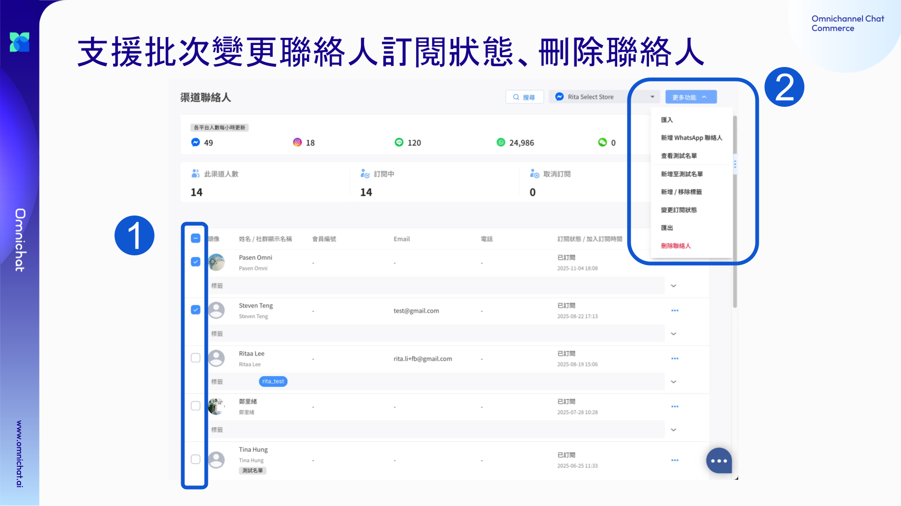
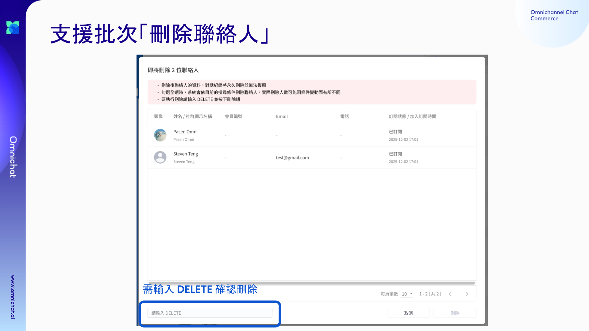

# Dec 10, 2026

## 渠道聯絡人管理升級：支援批次變更訂閱狀態、批次刪除聯絡人

管理大量聯絡人更有效率了！

現在你可以在**渠道聯絡人**中，一次完成訂閱狀態調整、聯絡人刪除，大幅減少重複操作時間。

### 批次變更訂閱狀態

* 可將選取的聯絡人 **一次設為「訂閱中」或「取消訂閱」**
* 支援全選操作，實際更新名單會以**執行當下的最新結果**為準
* 若有設定 Omnichat Webhook，變更時會同步發送
  * `customer/channel_subscribe`
  * `customer/channel_unsubscribe`
* 批次處理期間仍可同時進行「刪除聯絡人」或「匯出」


重新訂閱時，系統不會再檢查顧客是否曾封鎖，仍會訂閱成功。


<figure><figcaption></figcaption></figure>

### 批次刪除聯絡人（管理員限定）

* 可一次刪除多筆已選取的聯絡人
* 僅限 **管理員** 操作，並需輸入 **DELETE（全大寫）** 確認
* 刪除後將：
  * 移除渠道聯絡人資料
  * 同步刪除相關對話紀錄


刪除為永久行為，無法復原，請執行前再次確認。&#x20;


<figure><figcaption></figcaption></figure>
