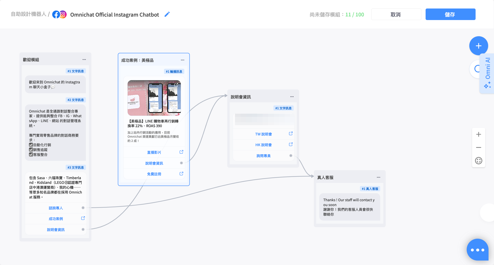

# Dec 24, 2024

哈囉，親愛的 Omnichat 用戶！

以下是我們為您帶來的功能更新：

1. [Open API](dec-24-2024.md#open-api-fa-song-ji-lu-bao-biao-ti-gong-geng-duo-gu-ke-hu-dong-zi-liao-zhi-yuan-shai-xuan-yu-hui-chu)：發送紀錄報表提供更多顧客互動資料、支援篩選與匯出
2. [Chatbot 2.0](dec-24-2024.md#zi-zhu-she-ji-ji-qi-ren-2.0-zhi-yuan-facebook-instagram)：拖曳式機器人編輯器，支援 Facebook / Instagram 渠道囉！

## Open API ：發送紀錄報表提供更多顧客互動資料、支援篩選與匯出

🙌🏻 **適用方案**：需開通 Open API 相關模組

📍 **功能路徑**：統計表 > [Open API 發送紀錄](https://console.omnichat.ai/openapi-log) > 動作 > 名單

透過 Omnichat 的 Message API 對顧客直接發送訊息後，在 Open API 發送紀錄頁面，你可以看到發送的成效統計與名單。

這次更新之後，我們在名單部分支援了更詳細的互動資料、匯出名單功能、搜尋與篩選功能！

### 發送名單支援更多互動資料

發送名單新增資料欄位：

* 名稱
* 送達
* 已讀
* 點擊
* 回應
* 退訂封鎖

### 支援名單搜尋、篩選、匯出

* 支援匯出功能：會依據下拉篩選條件匯出對應名單，依據 UI 語系決定匯出的 header 語系
* 支援篩選功能：可以透過社群渠道篩選，也可以在選擇渠道後進一步搜尋社群 User ID

<figure><figcaption></figcaption></figure>

## 自助設計機器人 2.0：支援 Facebook / Instagram

📍 **功能路徑**：自助設計機器人 2.0

自助設計機器人 2.0，提供拖曳式的編輯器，並且讓你的 Chatbot 腳本以清楚的流程圖呈現。

<figure><figcaption></figcaption></figure>


自助設計機器人 2.0 正在逐步支援所有渠道，目前已支援官網、FB、IG 機器人，如欲搶先體驗，請洽服務窗口開通。


### 支援 Facebook / Instagram

選擇機器人的適用渠道時，會呈現此渠道有支援的卡片類型：

### .png>)

### 支援搜尋、篩選功能

自助設計機器人 2.0 支援搜尋與篩選功能，讓你在長期使用、建立眾多機器人後，依然可以快速前往你要編輯的機器人、模組。

* 支援搜尋機器人或模組名稱
* 支援篩選適用平台

<figure><figcaption></figcaption></figure>

### 訊息編輯支援插入替換變數（聯絡人資料、自訂屬性）及 Emoji

支援插入顧客資料變數，讓你的訊息更個人化！

可以插入的資料包含：

* 系統預設欄位：聯絡人名稱、會員編號、Email、電話等
* 自訂屬性

以下欄位不支援替換變數

* 輪播訊息的標題
* Facebook 訂閱定期通知的通知主題

<figure><figcaption></figcaption></figure>
