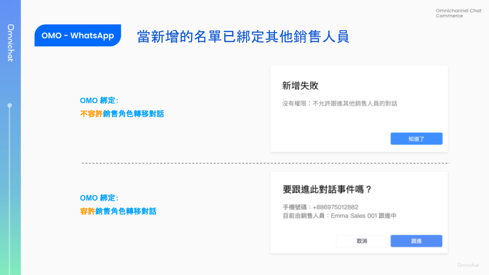

# Feb 21, 2024

哈囉，親愛的 Omnichat 用戶！

以下是我們為您帶來的功能更新：

1. [**LINE 通知快捷上線**](feb-21-2024.md#line-tong-zhi-kuai-jie-jie-he-line-tui-bo-tong-zhi-xing-xun-xi-yu-jian-xun-wan-mei-tong-zhi-you-jie)，支援以 LINE 通知型訊息、簡訊進行顧客通知！非好友也不怕漏訊息！
2. [**WhatsApp Template**](feb-21-2024.md#whatsapp-template-ti-gao-an-niu-she-ji-dan-xing-yu-xin-zeng-dui-hua-xia-chan-xi-tong-tong-zhi-she-di)：**提高按鈕設計彈性**與新增**對話下單系統通知**設定
3. [**對話 beta 支援「新增 WhatsApp 對話」**](feb-21-2024.md#dui-hua-beta-zhi-yuan-xin-zeng-whatsapp-dui-hua)，客服人員可主動在 WhatsApp 上開啟新對話
4. [**對話 beta 支援 OMO 方案銷售人員在網頁查看「綁定顧客名單」**](feb-21-2024.md#dui-hua-beta-zhi-yuan-cha-kan-bang-ding-gu-ke-ming-chan)

我們將一一為您介紹這些更新內容！

## 新推出「LINE 通知快捷」，支援 LINE 通知型訊息、簡訊自動發送顧客通知

🙌🏻 適用對象：需開通 Open API - Notification API，請洽業務、客服窗口

顧客下單、訂單出貨、訂單到貨時，你會用簡訊或 Email 通知顧客嗎？

現在你多了 LINE 通知型訊息這個選擇！

* 節省費用：通知型訊息費用只要簡訊一半
* 好友成長：非好友也可以接受通知，高機會加入 LINE 好友

<figure><figcaption></figcaption></figure>

### LINE 通知快捷：結合 LINE 推播、通知型訊息與簡訊，完美通知又節費！

Omnichat 設計「LINE 通知快捷」功能，按照以下優先順序發送通知：

1. **LINE 推送訊息**：訊息費用同推播，最便宜。
2. **LINE 通知型訊息**：費用約為簡訊一半，非好友也可以收到的 LINE 通知。
3. **簡訊**：通知型訊息發送失敗時，補發簡訊確保顧客收到通知。

通知型訊息轉簡訊可設定等待時間：5 分鐘 \~ 24 小時

### LINE 通知型訊息目前支援的通知情境

<figure><figcaption></figcaption></figure>

目前支援：

* **購買完成通知**
* **出貨通知**
* **到貨通知 - 宅配**
* **到貨通知 - 店到店**

有其他通知情境的需求，歡迎向業務、客服窗口詢問。

## WhatsApp Template: 提高按鈕設計彈性與新增對話下單系統通知設定

🙌🏻 適用對象：所有方案（需串接 WhatsApp）

### WhatsApp Template：提高按鈕設計彈性

過去同一則 Template 只能選擇快速回覆或 Call to Action 單一種類的按鈕，這次更新後你可以：

* **在同一則 Template 中彈性配置不同種類的按鈕**
* **按鈕數量上後提升為 10 組**
* 可自由調整 Call to action 與快速回覆按鈕順序

各類按鈕動作可設定的數量上限：

* 快速回覆：最多 10 組
* Call to Action - 前往網站：最多 2 組
* Call to Action - 撥打電話：最多 1 組
* Call to Action - 前往訂單（對話下單）：最多 1 組

請注意，當你設定的按鈕數量為 4 組以上，第三個到最後一個按鈕會被合併為「查看所有項目」，需進一步點開才能選擇其他選項喔！

<figure><figcaption></figcaption></figure>

### WhatsApp Template：新增對話下單相關設定

🙌🏻 適用對象：WhatsApp Commerce Module

以下設定僅供「對話下單通知」使用：

* 適用對象：新增「系統通知」選項
  * 設定為系統通知的 Template，在 1:1 對話、推播、旅程無法選取使用
* Call to Action 按鈕：新增「前往訂單（對話下單）」選項
  * 適用對象需選擇「系統通知」，Call to Action 才會出現「前往訂單」選項
  * 單一 Template 最多可設定一組「前往訂單」按鈕，可再新增其他 Call to Action、快速回覆按鈕

<figure><figcaption></figcaption></figure>

<figure><figcaption></figcaption></figure>

相關教學文件：

📖 [如何創建 WhatsApp 範本訊息？](../features/tong-xun-qu-dao/integrations/whatsapp-business-api-zheng-he-dao-omnichat/chuang-jian-whatsapp-fan-ben-xun-xi.md)

## 對話 Beta：支援「新增 WhatsApp 對話」

🙌🏻 適用對象：包含客服功能的所有方案

👤 適用角色：**客服角色** (管理員、主管、客服經理、客服人員)

過去在對話頁面僅支援回覆已存在的對話，現在對話 Beta 頁面左側欄的其他部分支援「新增 WhatsApp 對話」囉！

就算是過去沒有在 WhatsApp 上對話過的顧客，你也可以直接輸入他的 WhatsApp 電話號碼與他開始對話。

* 顧客姓名：選填，未填姓名時則自動帶入手機號碼
* 手機號碼：必填，國碼區碼預設為香港

<figure><figcaption></figcaption></figure>

新增 WhatsApp 手機號碼之後，會依據對話狀態決定直接跟進或確認後跟進：

* 全新對話、已結束的對話：直接跟進該對話
* 其他成員跟進中的對話：出現「要跟進對話事件嗎？」訊息，點擊跟進後會直接接手該對話

<figure><figcaption></figcaption></figure>

## 對話 Beta：支援查看綁定顧客名單

🙌🏻 適用對象：OMO 方案

👤 適用角色：銷售角色 (銷售經理、銷售人員)

銷售角色也可以在網頁版「對話 Beta」查看與自己綁定的顧客名單囉！

如果是銷售經理的話，則可以看到「我的名單」與「團隊名單」

### 綁定顧客名單 - 我的名單

👤 適用角色：銷售角色 (銷售經理、銷售人員)

銷售角色在對話 Beta 左側其他部分，可以看到新上線「綁定顧客名單」區塊。

支援功能：

* 篩選渠道（含 LINE、WhatsApp 渠道）
* 搜尋顧客姓名、手機
* 查看綁定顧客名單總數
* 查看顧客資料與開啟對話：
  * 顧客大頭照
  * 顧客姓名
  * 顧客手機號碼
  * 顧客綁定分店
  * 聊天 (開啟對話)
* 「新增名單」：並輸入 WhatsApp 手機號碼來新增顧客

<figure><figcaption></figcaption></figure>

暫未支援從「顧客名單」中群發 (開發中)。

### 新增的 WhatsApp 名單「已綁定其他銷售人員」狀況

當新增的 WhatsApp 手機號碼**已綁定其他銷售人員**，依據團隊設定會產生不同結果：

|              | 不容許銷售角色可以自由轉移對話 | 容許銷售角色可以自由轉移對話 |
| ------------ | --------------- | -------------- |
| OMO 綁定模式「固定」 | 新增失敗            | 確認後進行綁定與跟進對話   |
| OMO 綁定模式「自由」 | 新增失敗            | 確認後進行綁定與跟進對話   |

<figure><figcaption></figcaption></figure>

💡什麼是OMO 綁定**固定模式**、**自由模式**？

OMO 方案可設定固定模式與自由模式，來決定顧客綁定一位銷售人員後，是否能選擇重新綁定其他銷售人員。

當顧客已綁定銷售人員 A 後，又掃描的銷售人員 B 的綁定 QRcode：

* 固定模式：告知顧客已綁定銷售人員 A，請銷售人員 A 提供服務
* 自由模式：解除與銷售人員 A 的綁定，並綁定銷售人員 B

### 綁定顧客名單 - 團隊名單

👤 適用角色：銷售經理

銷售經理除了可以查看與自己綁定的名單，也可以在「團隊名單」查看同分店銷售人員綁定顧客名單。

支援功能：

* 渠道篩選（含 LINE、WhatsApp 渠道）、搜尋顧客姓名、手機
* 查看同分店銷售人員綁定顧客名單總數
* 查看同分店銷售角色所有的綁定顧客名單資料
  * 顧客大頭照
  * 顧客姓名
  * 顧客手機號碼
  * 顧客綁定分店
  * 顧客綁定店員 (角色名稱 - 團隊成員名稱)
* 點擊「更多資訊」：
  * 查看對話
  * 查看綁定店員資料
* 團隊名單不支援群發功能

<figure><figcaption></figcaption></figure>
