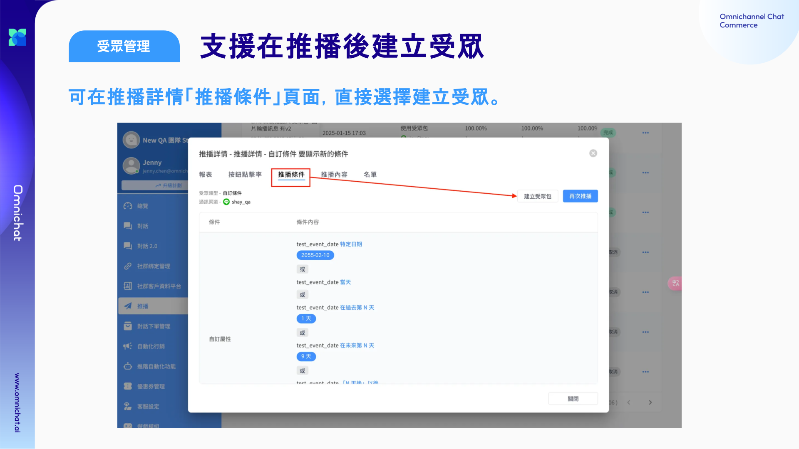
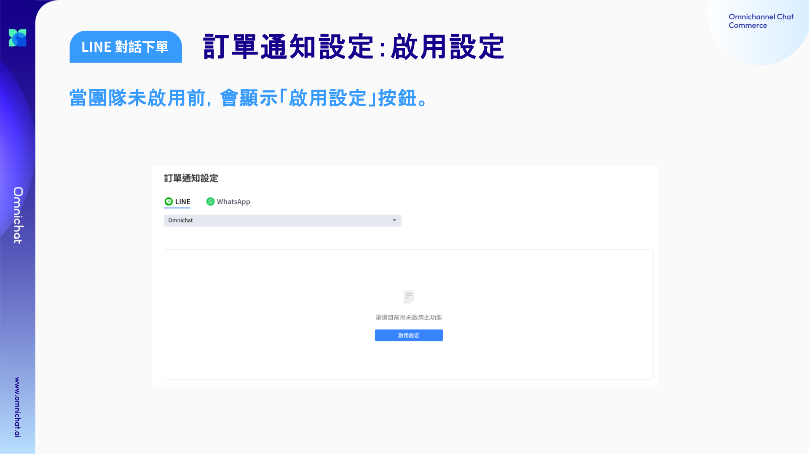
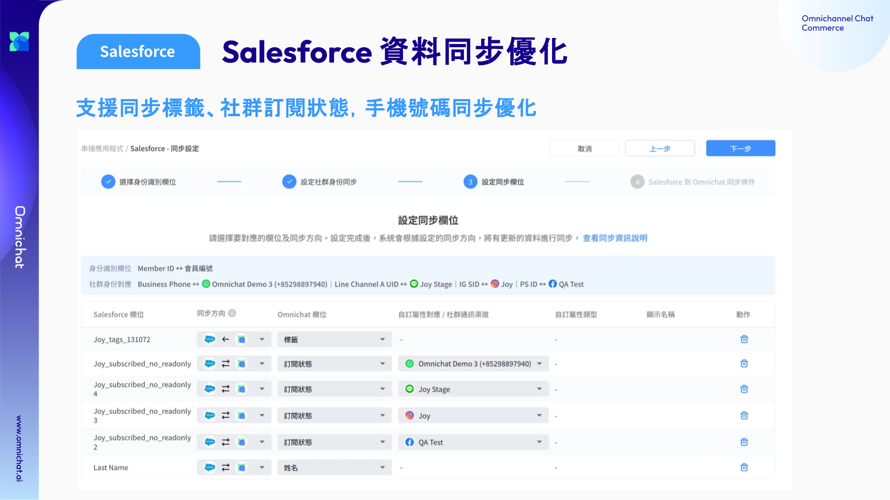

# Feb 5, 2025

哈囉，親愛的 Omnichat 用戶！

以下是我們為您帶來的功能更新：

1. [自動化排程](feb-5-2025.md#zi-dong-hua-pai-cheng-zhi-yuan-dui-shou-zhong-zhou-qi-xing-chu-falcheng)：新功能上線！支援對受眾週期性觸發旅程
2. [受眾管理](feb-5-2025.md#shou-zhong-guan-li-zhi-yuan-zai-tui-bo-xiang-qing-jian-li-shou-zhong)：支援在推播詳情建立受眾包
3. [對話 2.0 優化](feb-5-2025.md#dui-hua-2.0-jie-mian-you-hua-xie-zuo-dui-hua-zhi-yuan-webchat)：
   1. 左側「事件狀態列表」可收合，增加對話框寬度
   2. 顧客資料欄顯示社群名稱
   3. 協作對話支援 Webchat
4. [LINE 對話下單](feb-5-2025.md#line-dui-hua-xia-dan-ding-dan-tong-zhi-she-ding-shang-xian-luo)：訂單通知設定上線囉！
5. [Salesforce 整合](feb-5-2025.md#salesforce-zheng-he-sheng-ji-zhi-yuan-tong-bu-biao-qian-she-qun-ding-yue-zhuang-tai-shou-ji-hao-ma-t)升級：
   1. 支援標籤同步
   2. 支援同步社群渠道訂閱狀態
   3. 手機號碼同步優化
6. [支援新受眾篩選條件](feb-5-2025.md#shou-zhong-shai-xuan-tiao-jian-zai-kuo-chong)
7. [自助設計機器人](feb-5-2025.md#zi-zhu-she-ji-ji-qi-ren-2.0-zhi-yuan-xin-bian-shu-zhi-yuan-line)：
   1. Chatbot 2.0：支援 LINE
   2. 支援新變數：分店代碼、業務員代碼
8. 重要通知：[單一帳號單一使用者政策落實](feb-5-2025.md#dan-yi-zhang-hao-dan-yi-shi-yong-zhe-zheng-ce-luo-shi-2025-nian-3-yue-19-ri-sheng-xiao)（2025/3/19 起生效）

## 自動化排程：支援對受眾週期性觸發旅程

🙌🏻 **適用方案**：需同時開通「受眾管理」與「顧客旅程」，才可使用此功能

📍 **功能路徑**：進階自動化功能 > [自動化排程](https://www.notion.so/Conversation-2-0-Video-Script-19aae8904ccc800bb0b7e8ffec8b5709?pvs=21)

新推出的自動化排程功能，讓你可以針對指定受眾（透過受眾管理建立），週期性或一次性觸發「顧客旅程」。

### 自動化排程：列表頁

在此頁面可以查看排程任務、搜尋、新增排程。

<figure><figcaption></figcaption></figure>

### 自動化排程：排程設定

需設定以下項目：

* 排程名稱
* 執行受眾：需選擇在受眾管理建立的受眾
* 觸發旅程：旅程觸發條件需為「系統功能觸發」
* 執行任務頻率：可以週期性觸發，或一次性觸發
  * 週期頻率：支援每 N 個月、每 N 週、每 N 天
  * 一次性：指定的日期與時間

<figure><figcaption></figcaption></figure>

### 自動化排程：查看所有任務

設定完排程後，可以在查看所有任務的頁面，查看接下來每次執行任務的時間，也可以對指定的任務進行取消。

<figure><figcaption></figcaption></figure>

## 受眾管理：支援在推播詳情建立受眾

🙌🏻 **適用方案**：包含受眾管理的所有方案

📍 **功能路徑**：[推播](https://console.omnichat.ai/broadcast)

使用自訂條件推播後，支援在推播詳情的推播條件頁面，直接將條件建立為受眾包。

點擊後會直接將條件帶入受眾包設定頁面，可在進行條件調整。

<figure><figcaption></figcaption></figure>

## 對話 2.0：介面優化、協作對話支援 Webchat

🙌🏻 **適用方案**：包含客服功能的所有方案

📍 **功能路徑**：[對話 2.0](https://console.omnichat.ai/conversation)

### 介面優化：「事件狀態列表」可收合，增加對話框寬度

對話頁面左側欄位「事件狀態列表」可透過收合、展開，來調整右側對話區塊的寬度。

<figure><figcaption></figcaption></figure>

### 介面優化：顧客資料欄位，新增顯示顧客社群名稱

Omnichat 系統讓客服人員可以將顧客名稱改為方便工作識別的其他名稱，為加強和原始社群資料的對照方便，此次更新新增了原始社群名稱的欄位（不可編輯），即使修改過顧客名稱，依然可以快速對照識別！

<figure><figcaption></figcaption></figure>

### 對話 2.0：協作對話支援 Webchat

目前支援渠道包含：WhatsApp、LINE、Facebook、Instagram、Wechat、Webchat。

📖 [協作對話功能簡介與使用教學](https://docs.google.com/presentation/d/1kRItbmKgKUTFw-GnD_yxM6CmxR1_XZJHmNEvLRQhp-I/edit?usp=sharing)

## LINE 對話下單：訂單通知設定上線囉！

🙌🏻 **適用方案**：需開通 LINE 對話下單模組

📍 **功能路徑**：[對話 2.0](https://console.omnichat.ai/conversation)

訂單通知方便在訂單成立和狀態變更時，自動通知顧客。

### LINE 對話下單：訂單通知啟用前

當團隊未啟用前，會顯示「啟用設定」按鈕。

<figure><figcaption></figcaption></figure>

### LINE 對話下單：啟用後自動建立 8 種情境通知範本

啟用通知後會依團隊語系，建立以下八種通知情境的通知範本。

* 待確認（不可停用）
* 已成立
* 已出貨
* 待取貨
* 已完成
* 已取消
* 已退貨

待確認通知需保持啟用不可停用，其他通知可依據需求啟用或停用。

<figure><figcaption></figcaption></figure>

## Salesforce 整合升級：支援同步標籤、社群訂閱狀態，手機號碼同步優化

🙌🏻 **適用方案**：需開通 Salesforce CRM Connector 模組

📍 **功能路徑**：[串接應用程式](https://console.omnichat.ai/app-integration)

此次更新新增支援標籤與社群訂閱狀態同步，並針對手機號碼同步優化。

* 支援同步標籤
  * 僅支援單向 Omnichat → Salesforce 同步
  * 每個標籤使用逗號分隔
  * Salesforce 欄位請選擇 Text Area (Long) 長文字來儲存標籤，最長可支援到 131072 字元
* 支援社群渠道訂閱狀態
  * 支援雙向同步
  * Salesforce 欄位請選擇 checkbox 來進行同步
* 支援同步 "+" 的手機號碼
  * 若 Salesforce 電話帶有 “+” 也可同步進 Omnicaht

<figure><figcaption></figcaption></figure>

## 受眾篩選條件再擴充

<figure><figcaption></figcaption></figure>

### 受眾篩選條件

篩選條件適用於：顧客管理、聯絡人聯絡人、推播、受眾管理頁面

* 搜尋條件當選擇自訂屬性的日期、日期與時間型別，新增以下條件
  * 特定日期
    * 之前日期已支援，此次將「日期與時間」型別也做支援
    * 日期與時間型別：若選擇 2023-01-05，表示 2023-01-05 00:00:00 \~ 2023-01-05 23:59:59
  * 當天
    * 假如執行時為 2023-01-05 18:00:00，當天 表示：2023-01-05 00:00:00 \~ 2023-01-05 23:59:59
  * 在過去第 N 天
    * 假如執行時為 2023-01-05 18:00:00，過去第 1 天 表示：2023-01-04 00:00:00 \~ 2023-01-04 23:59:59
  * 在未來第 N 天
    * 假如執行時為 2023-01-05 18:00:00，未來第 1 天 表示：2023-01-06 00:00:00 \~ 2023-01-06 23:59:59
  * 未來 N 天以內
    * 日期
      * 假如執行時為 2023-01-05，未來 3 天以內 表示：2023-01-05 \~ 2023-01-08
    * 日期與時間
      * 假如執行時為 2023-01-05 18:00:00，未來 3 天以內 表示：2023-01-05 18:00:00 \~ 2023-01-08 18:00:00
  * 「N 天後」以後
    * 日期
      * 假如執行時為 2023-01-05，3 天後以後 表示：2023-01-09 \~ 未來
    * 日期與時間
      * 假如執行時為 2023-01-05 18:00:00，3 天後以後 表示：2023-01-08 18:00:01 \~ 未來
  * **特定月份 (不限年份)**
    * 包含以下選項，為不限年份的月份搜尋
      * 當月、上個月、下個月、1 月、2 月、3 月、4 月、5 月、6 月、7 月、8 月、9 月、10 月、11 月、 12 月
    * 在篩選時，實際上會去看年份區間為當下前 100 年到後 30 年的月份

### 旅程觸發與分眾條件

* 觸發條件、分眾條件當選擇自訂屬性的日期、日期與時間型別，新增以下條件
  * 特定日期
    * 之前日期已支援，此次將「日期與時間」型別也做支援
    * 日期與時間型別：若選擇 2023-01-05，表示 2023-01-05 00:00:00 \~ 2023-01-05 23:59:59
  * 當天
    * 假如執行時為 2023-01-05 18:00:00，當天 表示：2023-01-05 00:00:00 \~ 2023-01-05 23:59:59
  * 在過去第 N 天
    * 假如執行時為 2023-01-05 18:00:00，過去第 1 天 表示：2023-01-04 00:00:00 \~ 2023-01-04 23:59:59
  * 在未來第 N 天
    * 假如執行時為 2023-01-05 18:00:00，未來第 1 天 表示：2023-01-06 00:00:00 \~ 2023-01-06 23:59:59
  * 未來 N 天以內
    * 日期
      * 假如執行時為 2023-01-05，未來 3 天以內 表示：2023-01-05 \~ 2023-01-08
    * 日期與時間
      * 假如執行時為 2023-01-05 18:00:00，未來 3 天以內 表示：2023-01-05 18:00:00 \~ 2023-01-08 18:00:00
  * 「N 天後」以後
    * 日期
      * 假如執行時為 2023-01-05，3 天後以後 表示：2023-01-09 \~ 未來
    * 日期與時間
      * 假如執行時為 2023-01-05 18:00:00，3 天後以後 表示：2023-01-08 18:00:01 \~ 未來

## 自助設計機器人 2.0：支援新變數、支援 LINE

ℹ️ 自助設計機器人 2.0 正在逐步支援所有渠道，目前已支援官網、FB、IG、LINE 機器人，如欲搶先體驗，請洽服務窗口開通。

### 自助設計機器人 2.0：支援 LINE

* 支援新增、編輯 LINE 平台機器人
* 編輯卡片優化以下部分
  * 訊息框右下角支援插入替換變數及 Emoji
  * URL 按鈕支援插入替換變數
  * 圖文訊息、發票模組卡片優化：
    * 支援前往新增按鈕
    * 支援搜尋名稱
    * 支援顯示設定內容
      * 圖文訊息：每個區塊的行動設定內容
      * 發票模組：活動時間

<figure><figcaption></figcaption></figure>

## **單一帳號單一使用者政策落實（2025 年 3 月 19 日生效）**

為維護平台安全並確保帳號使用的正確性，每個 Omnichat 使用者帳號一直以來都應該僅供**一位使用者**使用。然而，我們發現部分使用者在多個地點共用登入。為落實此政策，自 **2025 年 3 月 19 日**起：

* **每個帳號只允許一位活躍使用者連線**
* **仍允許一個瀏覽器 + 一個應用程式**同時登入（iOS/iPadOS/Android）
* 若在其他地方登入，系統將提示您確認登出先前的連線

此調整確保所有使用者都能公平使用並享有更順暢的體驗。

如有任何問題，歡迎隨時聯繫我們！
