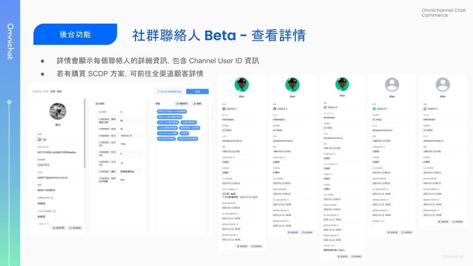

# Jan 03, 2024

哈囉，親愛的 Omnichat 用戶！

過去一年，Omnichat 在資料儲存的多元性、分眾的細緻度和顧客身份媒合的技術上進行許多革新。

隨著聯絡人資料和推播篩選的條件都越來越豐富，過去合併在一起的「聯絡人及推播訊息」會逐步退場，以獨立的「社群聯絡人管理」和「推播訊息」兩個獨立的頁面呈現。

⚡️ 這次主要替您帶來以下 3 項功能更新：

1. [**推出社群聯絡人 Beta** \
   ](jan-03-2024.md#she-qun-lian-lao-ren-guan-li-beta)更美觀易用的介面與更細緻的名單篩選維度
2. [**推播訊息 Beta 支援 CSV 推播** \
   ](jan-03-2024.md#tui-bo-xun-xi-beta-zhi-yuan-csv-tui-bo)更容易使用多元名單來源進行推播
3. [**WhatsApp 遊戲支援按鈕** \
   ](jan-03-2024.md#whatsapp-you-hu-mo-zu-zhi-yuan-dian-ji-an-niu-kai-shi-you-hu)邀請顧客開始遊戲的訊息更加簡潔有吸引力

***

## 社群聯絡人管理（Beta）

🙌🏻  適用對象：所有方案

從網頁後台左側「社群客戶資料平台 > 社群聯絡人管理」可進入此頁面。

在聯絡人管理介面主要分為以下區塊：

1. 名單配額使用量與各社群聯絡人分佈（Social CDP 方案不顯示配額使用量）
2. 選擇社群渠道（點擊右上方下拉式選單），會顯示渠道聯絡人總數、訂閱數、取消訂閱數
3. 搜尋：搜尋社群聯絡人姓名或依條件篩選
4. 聯絡人列表：快速查看聯絡人資料，點擊動作欄位的「⋯」可進一步查看詳情、前往對話、取消訂閱、刪除聯絡人
5. 更多功能：匯入、匯出、新增 WhatsApp 聯絡人

<figure><figcaption></figcaption></figure>

<figure><figcaption></figcaption></figure>

### 社群聯絡人搜尋篩選新增條件：會員編號、手機綁定、自訂屬性

在社群聯絡人管理（Beta）中，點擊上方的「搜尋」，就會從右側展開搜尋條件設定版面。

聯絡人與推播管理中的所有篩選維度（標籤、互動時間、OMO 綁定條件等），在新版聯絡人中都一樣可以使用。

除此之外，還新增了以下重要的篩選維度：

* 會員編號
* 自訂屬性
* 手機綁定（僅支援 LINE）
* 91APP 會員綁定（僅支援 LINE）

<figure><figcaption></figcaption></figure>

#### 💡 **什麼是手機綁定？**

需開啟 CRM 模組，才可使用手機綁定功能。

手機綁定功能，讓顧客進行手機號碼驗證，確保顧客社群身份和會員資料正確比對。

* SHOPLINE、CYBERBIZ 會員資訊同步：在顧客完成手機綁定後，會自動將會員編號、姓名、Email、會員等級、購物金等資訊同步至 Omnichat。顧客也可在 LINE 開啟品牌會員卡，查看自身的會員資訊。
* 使用其他電商會員系統：在顧客完成手機綁定後，將顧客手機儲存於 Omnichat 系統，需搭配其他 API 或模組進行會員資料同步。

#### 💡 **如何取得顧客的會員編號？**

可以透過以下方式取得顧客會員編號：

* 顧客在電商網站使用 LINE 登入（適用於開啟 CRM 模組並整合 SHOPLINE、CYBERBIZ 的客戶）
* 顧客完成手機綁定（適用於開啟 CRM 模組並整合 SHOPLINE、CYBERBIZ 的客戶）
* 顧客完成社群身份綁定，且於電商官網登入過會員（適用於進階行銷以上方案）
* 透過 Contact API 從其他系統同步（適用於有開通 Contact API 的客戶）
* 手動匯入

### 社群聯絡人列表：呈現更多重要資訊

現在你可以在聯絡人列表直接查看更多的顧客資訊囉！

除了原有的頭像、姓名、訂閱狀態以外，還新增了：

* 會員編號
* Email
* 電話

<figure><figcaption></figcaption></figure>

可以對各別聯絡人檔案執行的動作包含：

* **查看詳情**
* 前往對話
* 取消訂閱
* 刪除聯絡人

### 社群聯絡人管理新增查看詳情

點擊聯絡人並查看詳情，就會開啟關於此社群聯絡人的完整檔案。

完整查看：

* 社群 User ID
* 會員編號
* Email
* 電話
* 社群身份綁定狀態
* 會員綁定狀態
* 手機綁定狀態
* 訂閱狀態
* 加入訂閱時間
* 自訂屬性
* 標籤：可查看標籤頻次、編輯標籤

<figure><figcaption></figcaption></figure>

### 社群聯絡人詳情 - 標籤頻次

標籤頻次呈現出一位聯絡人在過去指定的一段時間內，被貼上的標籤與次數，藉此洞察顧客對於商品、活動的興趣程度，或者某一分眾類別的關聯程度。

<figure><figcaption></figcaption></figure>

## 推播訊息 Beta 支援 CSV 推播

🙌🏻  適用對象：2023 後除客服以外的所有方案（欲體驗推播訊息 Beta，請聯絡您的服務窗口或線上客服進行開通）

推播訊息 Beta 比起舊版，同樣多了手機綁定、會員編號、自訂屬性這三個篩選維度。

### 使用 CSV 推播

此外，現在在推播訊息 Beta，除了可以自訂條件篩選推播，也可以「使用 CSV 推播」囉！


建議單次推播名單數至多 5 萬筆


使用 CSV 推播於 WhatsApp 時，可以上傳以下資料進行推播名單圈選：

* 會員編號：僅針對比對成功的聯絡人進行推播
* Email：僅針對比對成功的聯絡人進行推播
* 電話：系統內不存在的電話，將自動新增為新聯絡人

使用 CSV 推播於 LINE、FB Messenger 時，可以上傳以下資料進行推播名單圈選：

* 社群編號(LINE UID、FB PSID)：系統內不存在的社群編號，將自動新增為新聯絡人
* 會員編號：僅針對比對成功的聯絡人進行推播
* Email：僅針對比對成功的聯絡人進行推播
* 電話：僅針對比對成功的聯絡人進行推播

<figure><figcaption></figcaption></figure>

<figure><figcaption></figcaption></figure>

這樣一來，您要使用從其他系統匯出的資料進行推播時將更加方便，例如：

* 從訂單系統會出聯絡人電話進行 WhatsApp 推播
* 從電商會員分群系統匯出高轉換潛力客戶名單進行 LINE 推播

## WhatsApp 遊戲模組：支援點擊按鈕開始遊戲

🙌🏻  適用對象：遊戲模組

* 按鈕文字限 20 位元
  * 中文支援至 6 個字
  * 英文支援至 20 個字母
* 若是已設定的遊戲模組，須再重新進入設定頁新增按鈕文字，才可發送按鈕訊息格式

相關說明文件：

📖 [遊戲模組](../features/you-xi-mo-zu-jia-gou-gong-neng/)

## Other Improvement

* \[Web] Pixel purchase event 支援追蹤總金額為 0 的訂單
