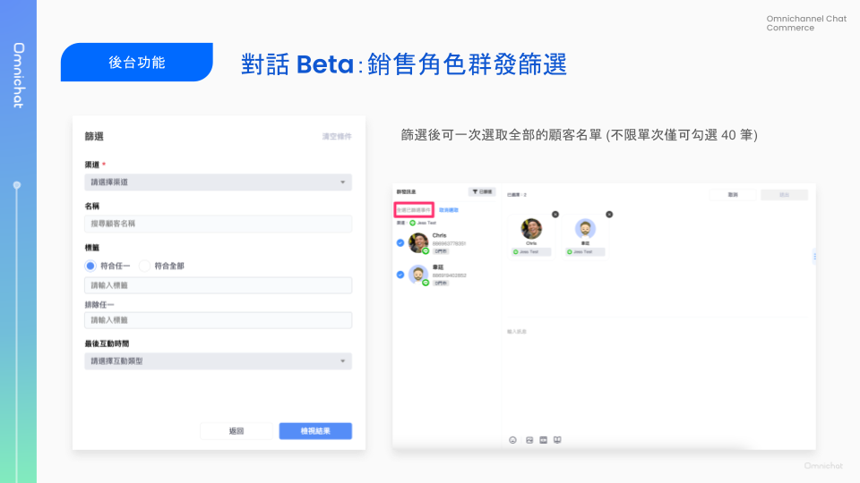

# Jan 10, 2024

哈囉，親愛的 Omnichat 用戶！

本次功能更新主要在對話銷售功能的強化：

1. [**對話 Beta：網頁版後台支援銷售角色群發訊息**](jan-10-2024.md#dui-hua-beta-wang-ye-ban-hou-tai-zhi-yuan-xiao-shou-jiao-se-qun-fa-xun-xi)
2. [**對話下單 Chat to Order ：訂單匯出資料格式調整**](jan-10-2024.md#dui-hua-xia-chan-chat-to-order-ding-chan-hui-chu-zi-liao-ge-shi-diao-zheng)

## 對話 Beta：網頁版後台**支援銷售角色群發訊息**

🙌🏻 適用方案：OMO（欲體驗對話 Beta，請聯絡您的服務窗口或線上客服進行開通）

👤 適用角色：銷售經理、銷售人員

Omnichat 的 OMO 方案，支援「銷售角色」可以自己負責的顧客群發訊息。

過去銷售人員群發功能只有在 Omnichat APP（iOS / Android）上支援，現在在網頁版也可以做到囉！

### 銷售角色群發入口

* 我的事件處理中 > 批量動作 > 群發訊息 / 群發訊息範本
* 從顧客名單群發，在 Web 版暫不支援

<figure><figcaption></figcaption></figure>

### 銷售角色群發流程

1. 選擇群發對象(可跨渠道)
2. 確認群發名單
   * 未設定篩選條件：單次可選擇 40 筆名單
   * 篩選條件：可一次全選所有名單（不受 40 筆限制）
3. 輸入群發訊息
   * 單次最多輸入五種訊息
   * 支援上傳多張圖片
   * 支援影片 (限 mp4 格式)
   * 支援使用預存回覆

<figure><figcaption></figcaption></figure>

### 銷售角色群發篩選

* 群發篩選
  * 渠道：只能選擇一種渠道（必填）
  * 顧客名稱
  * 標籤
    * 符合任一
    * 符合全部
    * 排除任一
  * 最後互動時間 (詳情可參考 [簡報](https://docs.google.com/presentation/d/1csIJB0ybKWPdr7wFWRjKbelnhog6Hl6bbD0UAlLuAXA/edit#slide=id.g28287d27773_0_10))
    * 客人最後互動時間
    * 團隊最後互動時間
    * 團隊最後行銷時間
* 篩選後可一次選取全部的顧客名單 (不限單次僅可勾選 40 筆)

<figure><figcaption></figcaption></figure>

📖 相關說明文件

* 舊版對話群發說明：[對話 - 群發訊息（OMO 限定）](../features/omnichannel-messenger-1/qun-fa-xun-xi-omo-xian-ding.md)

## 對話下單 Chat to Order ：訂單匯出資料格式調整

🙌🏻 適用對象：加購 Chat To Order 對話下單模組的用戶

* 訂單匯出時，預設匯出所有資料，如有進行訂單篩選，則會匯出篩選後的訂單資料
* 匯出檔案語言，與操作者當下 Omnichat 系統使用語言同步（繁中、簡中、英文）

#### 對話下單訂單匯出資料欄位

以下為所有欄位，粗體字為此次新增：

| 訂單編號 Order ID          | 貨幣 Currency              | 收件者 Recipient Name          | 商品編號 Product Id            |
| ---------------------- | ------------------------ | --------------------------- | -------------------------- |
| 成立時間 Creation Date     | 訂單小計 Subtotal            | 收件者手機號碼Receiver Phone       | 商品名稱 Title                 |
| 訂單狀態 Status            | 優惠折扣 Discount            | 郵政編號 Postcode               | 商品單價 Unit Price            |
| 付款狀態 Payment State     | 運費 Delivery Fee          | 國家/地區 Country/District      | 數量 Quantity                |
| 付款方式 Payment Method    | 訂單總計 Total               | 區域/州 Region/State           | 商品總計金額 Total Items Amount  |
| 付款日期 Payment Date      | 訂單來源 Source              | 地區/城市/城鎮 District/City/Town | **渠道 Channel**             |
| 交易編號 Transaction ID    | 建立訂單者 Creator Name       | 地址1 Address1                | **帳號名稱 Channel User**      |
| 訂購者 Buyer Name         | **分店名稱 Location Name**   | 地址2 Address2                | **更新時間 Modification Date** |
| 訂購者手機號碼 Buyer Phone    | **分店編號 Location Code**   | 完整地址 Full Address           |                            |
| Email                  | **店員編號 Employee Code**   | 物流資訊 Logistics Remark       |                            |
| 取貨方式 Method Name       | 訂單備註 Remark              |                             |                            |
| 取貨分店 Pickup Store Name | 取消原因 Cancellation Reason |                             |                            |

## Other Improvements

\[Web] 匯入顧客資料新增行銷及客服經理角色權限

\[Web] 推播點擊追蹤，新增支援優惠券卡片按鈕點擊
