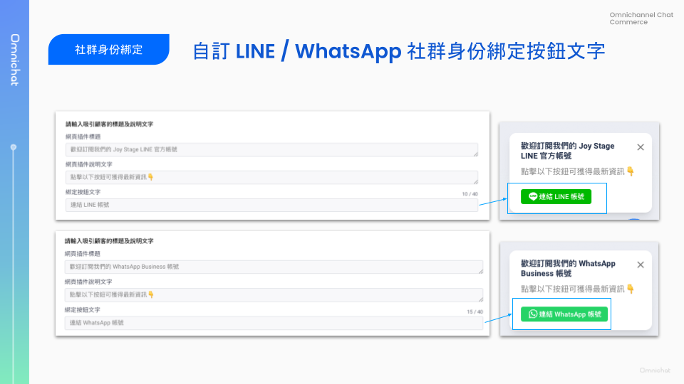

# Jul 10, 2024

哈囉，親愛的 Omnichat 用戶！

以下是我們為您帶來的功能更新：

1. [支援 Shopify 串接與會員資料同步](jul-10-2024.md#zhi-yuan-shopify-chuan-jie-yu-hui-yuan-zi-liao-tong-bu)
2. [支援自訂 LINE / WhatsApp 社群身份綁定按鈕文字](jul-10-2024.md#zi-ding-line-whatsapp-she-qun-shen-fen-bang-ding-an-niu-wen-zi)
3. [WhatsApp 範本支援複製 JSON 格式](jul-10-2024.md#whatsapp-fan-ben-zhi-yuan-fu-zhi-json-ge-shi)
4. [OMO 綁定支援用 LIFF 發送](jul-10-2024.md#line-omo-bang-ding-zhi-yuan-yong-liff-fa-song)
5. [LINE 通知快捷支援新情境](jul-10-2024.md#line-tong-zhi-kuai-jie-zhi-yuan-xin-qing-jing-zhu-ce-wan-cheng-tong-zhi-yu-yue-wan-cheng-tong-zhi-yu)：註冊完成通知、預約完成通知、預約提醒通知
6. [其他功能優化](jul-10-2024.md#qi-ta-gong-neng-you-hua)
   1. 團隊資料支援後台成效報表貨幣符號設定
   2. FB/IG 輪播訊息卡片的標題、副標文字長度支援 80 字
   3. 對話 2.0 - 發送官網 URL，加上追蹤參數

## 支援 Shopify 串接與會員資料同步

🙌🏻 **適用方案**：需加購 Shopify 串接，請洽業務窗口開通此功能

📍 **功能路徑**：通訊渠道 > [串接應用程式](https://console.omnichat.ai/app-integration)

串接應用程式支援串接 Shopify 囉！

<figure><figcaption></figcaption></figure>

完成串接之後可支援：

* 同步 Shopify 顧客名單與顧客資料進入 Omnichat「顧客管理」，同步的顧客資料包含：
  * 顧客名稱
  * 會員編號
  * Email
  * 電話
  * 標籤
  * 備註
  * 累積訂單數
  * 累積消費金額
  * Email 行銷同意
  * SMS 行銷同意
* 自動將顧客新增為 WhatsApp 聯絡人（可開啟或關閉此功能）

## 自訂 LINE / WhatsApp 社群身份綁定按鈕文字

🙌🏻 **適用方案**：包含行銷的所有方案

📍 **功能路徑**：社群綁定管理 > [社群身份綁定](https://console.omnichat.ai/subscription-tool)

* 支援的綁定平台：LINE、WhatsApp（FB 不支援）
* 社群身份綁定按鈕文字設定，最長可輸入 40 個字

<figure><figcaption></figcaption></figure>

## WhatsApp 範本支援複製 JSON 格式

📍 **功能路徑**：通訊渠道 > [WhatsApp 訊息範本](https://console.omnichat.ai/whatsapp-template)

WhatsApp 訊息範本支援複製 JSON 格式功能，方便用於 Open API 發送訊息與 Salesforce Marketing Cloud 整合。

* Open API 格式：開啟 Open API (Marketing / Messaging) 功能，才會出現此選項。
* Salesforce Marketing Cloud：開啟 Salesforce Marketing Cloud Journey Builder 功能，才會出現此選項。

<figure><figcaption></figcaption></figure>

## LINE 通知快捷支援新情境：註冊完成通知、預約完成通知、預約提醒通知

🙌🏻 **適用方案**：需加購 LINE 通知快捷

什麼是 LINE 通知快捷？結合 LINE 推送、LINE 通知型訊息、簡訊，幫你做到通知節費、獲取精準好友、完整通知、顧客資料整合！[查看官網說明](https://www.omnichat.ai/tw/line-official-notifications-notipress/)

新增支援以下新情境：

* 註冊完成通知
* 預約完成通知
  * 基本 (有按鈕)
  * 基本 (無按鈕)
  * 指定對象 (有按鈕)
  * 指定對象 (無按鈕)
  * 訂房
* 預約提醒通知
  * 基本 (有按鈕)
  * 基本 (無按鈕)
  * 指定對象 (有按鈕)
  * 指定對象 (無按鈕)
  * 訂房

## LINE OMO 綁定支援用 LIFF 發送

🙌🏻 **適用方案**：OMO


91APP 用戶預計於 8 月支援此功能。


過去門市人員將綁定 QRcode 或連結提供給顧客後，部分情況會發生顧客沒送出訊息或誤改訊息內容的狀況。

這次改版後「OMO 綁定」支援透過 LINE Liff 完成，不再需要顧客主動送出訊息、也不會有誤改訊息內容的狀況，使綁定流程更加順暢！

若需將 OMO 綁定調整成此 Liff 綁定模式，請與服務窗口聯絡。

## 其他功能優化

1. [團隊資料](https://console.omnichat.ai/team-profile)支援後台成效報表貨幣符號設定
2. FB/IG 輪播訊息卡片的標題、副標文字長度支援 80 字
3. 對話 2.0 - 發送官網 URL，加上追蹤參數
