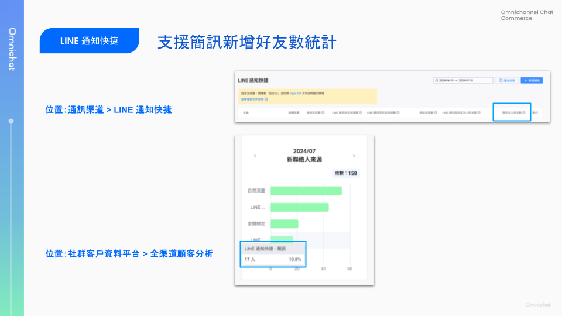
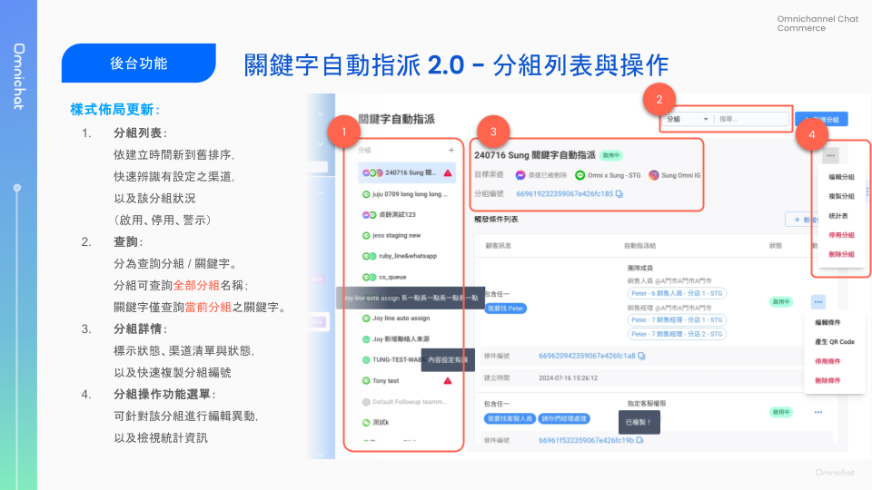
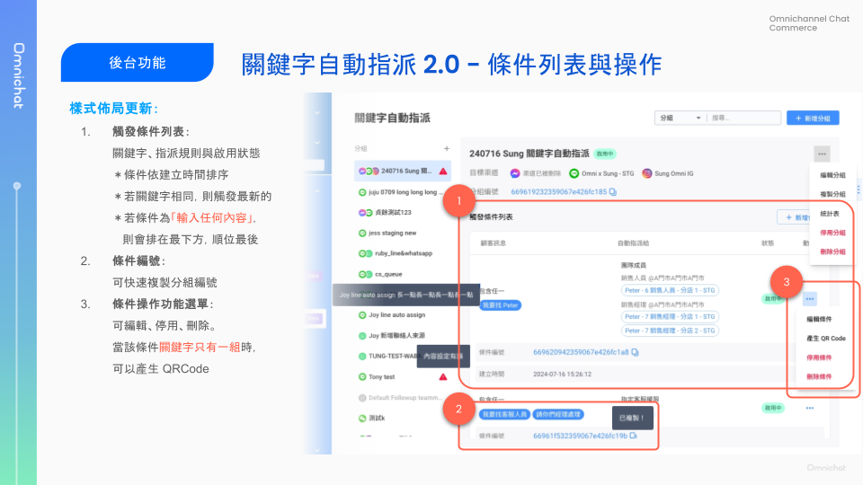
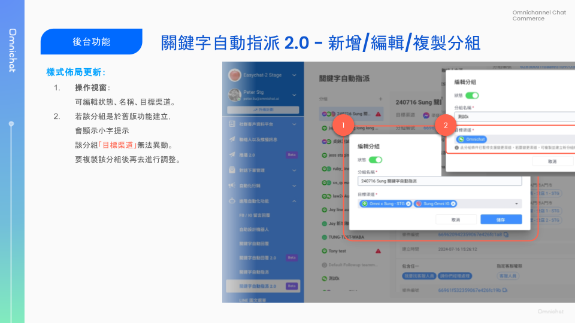
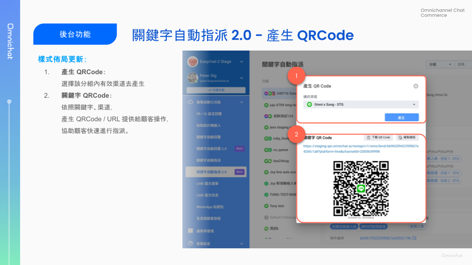
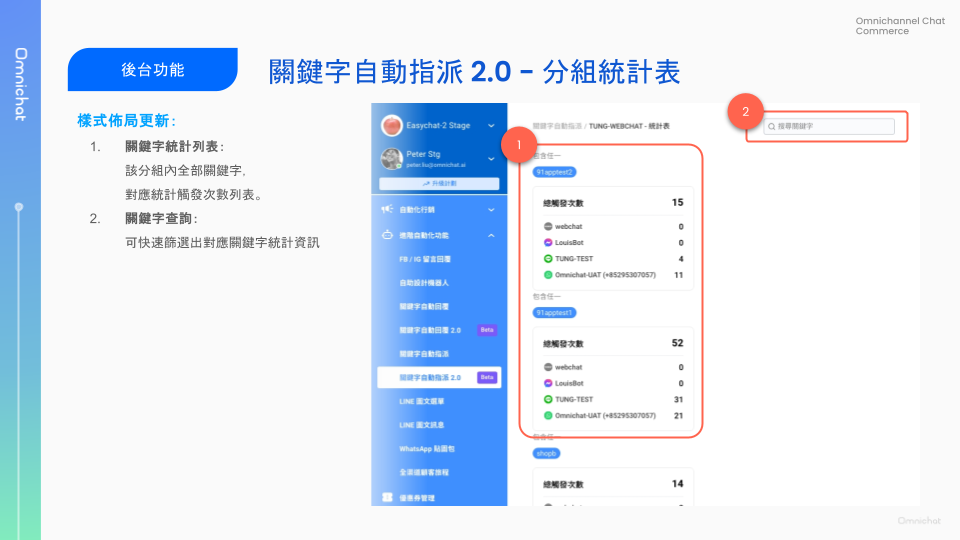
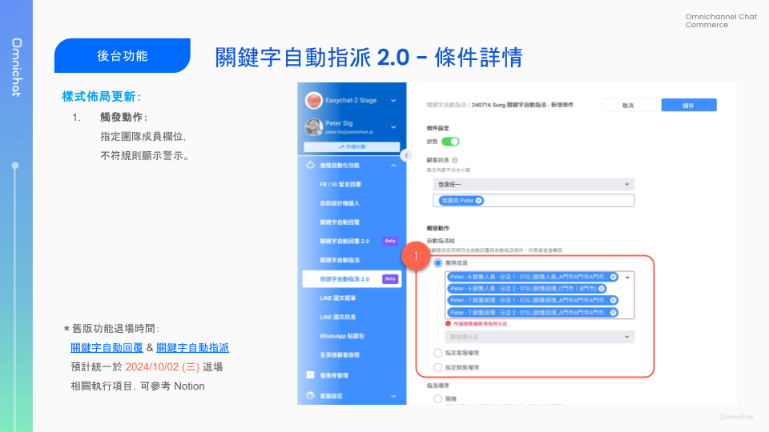

# Jul 24, 2024

哈囉，親愛的 Omnichat 用戶！

以下是我們為您帶來的功能更新：

1. [LINE 通知快捷](jul-24-2024.md#line-tong-zhi-kuai-jie-zhi-yuan-jian-xun-she-ding-line-jia-ru-hao-you-lian-jie-bing-zhui-zong-jian-x)：支援簡訊設定「LINE 加入好友連結」並追蹤簡訊新增好友數
2. [LINE 對話下單](jul-24-2024.md#line-dui-hua-xia-dan-ding-dan-zhi-yuan-zhai-pei-xuan-xiang)：訂單支援宅配選項
3. [全渠道顧客旅程](jul-24-2024.md#quan-qu-dao-gu-kelcheng-xin-zeng-dian-shu-fen-liu-tiao-jian)：新增點數分流條件
4. [關鍵字自動指派 2.0](jul-24-2024.md#guan-jian-zi-zi-dong-zhi-pai-2.0-shang-xian-luo) 上線
5. 其他功能優化
   1. 社群聯絡人：聯絡人列表右側「⋯」更多動作，新增支援查看標籤頻次、將此聯絡人新增至測試名單
   2. 對話 2.0 : 群發全選已篩選事件支援選取超過 40 筆名單

## LINE 通知快捷：支援簡訊設定「LINE 加入好友連結」並追蹤簡訊新增好友數

🙌🏻 **適用方案**：需加購 LINE 通知快捷，請洽業務窗口開通此功能

📍 **功能路徑**：通訊渠道 > LINE 通知快捷

### 支援在簡訊內容中設定「LINE 加入好友連結」

在新增通知時，若需發送簡訊，**可在簡訊內容中設定「LINE 加入好友連結」，透過此連結所成功加入的 LINE 聯絡人，將會更新手機號碼到此 LINE 聯絡人**。

<figure><figcaption></figcaption></figure>

使用「LINE 加入好友連結」時，請務必先至[串接社群通訊渠道](https://console.omnichat.ai/social-channels-integration#line)設定 LINE Channel 的「綁定 Liff ID」。


目前簡訊 LINE 加入好友連結，僅支援新好友的手機號碼資訊蒐集，下次更新會再支援既有好友的手機號碼蒐集。


### 新增統計數據：簡訊加入好友數

Omnichat 會追蹤透過 LINE 通知快捷簡訊中的「LINE 加入好友連結」所加入的 LINE 聯絡人數，此數據會呈現在 2 處：

1. LINE 通知快捷列表：新增統計欄位「簡訊加入好友數」
2. 全渠道顧客分析中的新聯絡人來源：新增統計項目「LINE 通知快捷 - 簡訊」

<figure><figcaption></figcaption></figure>

另外，LINE 通知快捷總覽報表上，也更新欄位名稱，將總發送數改為總觸發數、總送達數改為通知完成數。

## **LINE 對話下單：訂單支援宅配選項**

🙌🏻 **適用方案**：需加購對話下單模組，請洽業務窗口開通此功能

📍 **功能路徑**：對話下單管理 > [基本設定](https://console.omnichat.ai/chat-to-order-general-setting/)

* 取貨設定新增宅配適用國家/地區：
  * 當第一次啟用設定時，會預設帶入團隊地區。
  * 支援的國家 / 地區資料 (可多選)：
    * 香港
    * 台灣
    * 新加坡
    * 馬來西亞

<figure><figcaption></figcaption></figure>

### LINE 對話下單宅配：店員端操作

使用前，須先至基本設定新增宅配規則（運費、免運門檻）

* 在 LINE 下單時，店員可以選擇「宅配到府」選項，完成下單。
* 下單完成後顧客將收到訂單通知訊息。
* 目前宅配僅支援線下付款方式。

### LINE 對話下單宅配：顧客端操作

客人收到宅配訂單時，需完成宅配資料填寫，訂單方可成立。

* 欄位說明：
  * 基本訂購資料
    * 名字：自動帶入顧客姓名
    * 姓氏：必填
    * 手機號碼：必填，如果顧客手機本身有手機會自動帶入
  * 收件資料
    * 名字：自動帶入顧客資料
    * 姓氏：必填
    * 手機號碼：必填，由顧客自行填寫
    * 國家/地區：依照客戶後台設定
    * 郵遞區號：必填，由顧客自行填寫
    * 縣市：必填，由顧客自行填寫
    * 區域：必填，由顧客自行填寫
    * 地址1：必填，由顧客自行填寫
    * 地址2：非必填，由顧客自行填寫

<figure><figcaption></figcaption></figure>

## **全渠道顧客旅程：新增點數分流條件**

🙌🏻 **適用方案**：需開通「全渠道顧客旅程」與「社群點數」模組

📍 **功能路徑**：進階自動化功能 > [全渠道顧客旅程](https://console.omnichat.ai/customer-journey)

想要在顧客旅程，對於不同點數條件的顧客做分眾互動嗎？

現在在「分眾節點」中，你可以使用點數來作分流囉！

* 點數餘額：顧客目前可使用的點數
* 累積點數：顧客取得過的所有點數加總

<figure><figcaption></figcaption></figure>

## 關鍵字自動指派 2.0 上線囉！

🙌🏻 **適用方案**：包含客服的所有方案

📍 **功能路徑**：進階自動化功能 > [關鍵字自動指派 2.0](https://console.omnichat.ai/keyword-auto-assign/)

關鍵字自動指派功能，改版囉！

除了整體設計風格提升以外，還有以下重點優化：

1. 新增搜尋功能：可搜尋分組、關鍵字，方便你快速找到關鍵字設定
2. 統計表獨立頁面：從關鍵字自動回覆分組的「⋯」更多動作可進入統計表，統計表同樣支援搜尋功能
3. 呈現分組編號、條件編號：方便使用於 WhatsApp Chatbot 的關鍵字自動指派卡片


「關鍵字自動回覆」與「關鍵字自動指派」舊版功能預計統一於 2024/10/02 (三) 退場


&#x20;

<figure><figcaption></figcaption></figure>

<figure><figcaption></figcaption></figure>

<figure><figcaption></figcaption></figure>

<figure><figcaption></figcaption></figure>

<figure><figcaption></figcaption></figure>

<figure><figcaption></figcaption></figure>

## 其他功能優化

1. 社群聯絡人：列表動作支援查看個別聯絡人的標籤頻次、將此聯絡人新增至測試名單
2. 對話 2.0 : 群發全選已篩選事件支援選取超過 40 筆名單
