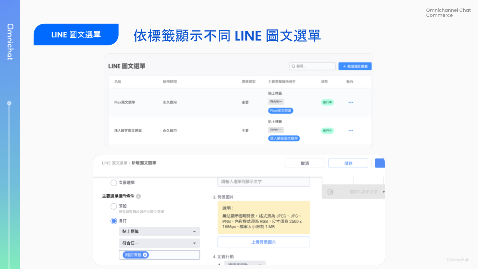
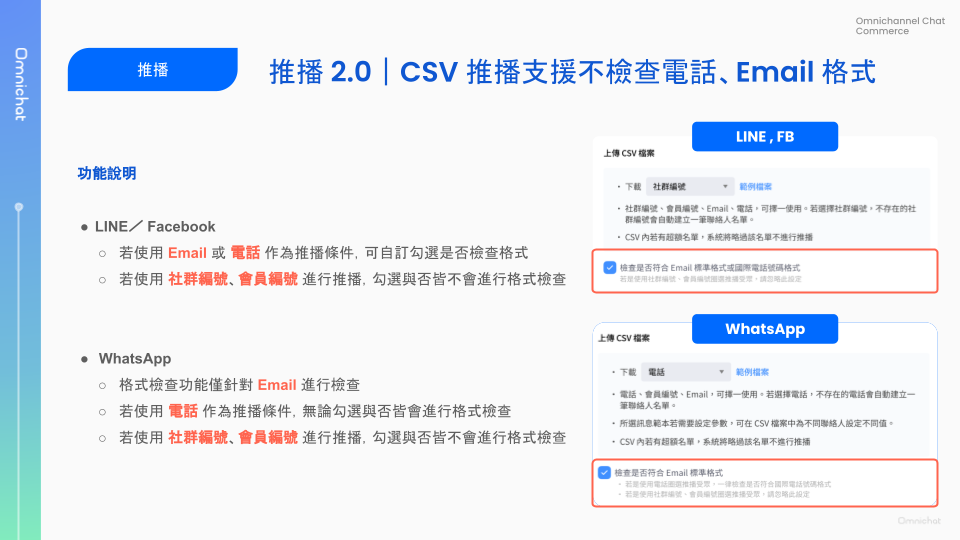

# Jun 12, 2024

哈囉，親愛的 Omnichat 用戶！

以下是我們為您帶來的功能更新：

1. [LINE 圖文選單](jun-12-2024.md#line-tu-wen-xuan-chan-zhi-yuan-yi-biao-qian-xian-shi-bu-tong-tu-wen-xuan-chan)：支援依標籤顯示不同圖文選單
2. [WhatsApp Commerce](jun-12-2024.md#whatsapp-commerce-ding-chan-tong-zhi-she-ding-shang-xian)：訂單通知設定上線！
3. [團隊時區設定](jun-12-2024.md#tuan-dui-shi-ou-she-ding-duo-xiang-gong-neng-chu-fa-shi-jian-yi-tuan-dui-she-ding-shi-ou-diao-zheng)：多項功能觸發時間依團隊設定時區調整
4. [對話 2.0](jun-12-2024.md#dui-hua-2.0-gong-neng-you-hua)：
   1. 事件可批量跟進、結束、重啟
   2. 瀏覽器頁籤顯示未讀訊息數
   3. 訊息可帶入系統變數
   4. 訊息發送失敗時顯示失敗原因與指示
5. [其他優化項目](jun-12-2024.md#qi-ta-you-hua-xiang-mu)
   1. 推播 2.0：CSV 推播支援檢查電話、Email 格式是否正確
   2. LINE 通知型訊息改為每小時更新儲值餘額，若儲值餘額不足將阻擋使用

## LINE 圖文選單：支援依標籤顯示不同圖文選單

🙌🏻 **適用方案**：包含行銷的所有方案

📍 **功能路徑**：進階自動化功能 > [LINE 圖文選單](https://console.omnichat.ai/richmenu)

LINE 圖文選單是官方帳號經營最重要的環節之一。

依據顧客行為、分眾顯示不同圖文選單，是提高互動率、轉換率的有效方法。

除了已支援的依據「社群身份綁定」、「OMO 綁定」狀態顯示不同圖文選單外，Omnichat 新增一種圖文選單顯示條件——依照顧客身上的「標籤」顯示圖文選單！

目前依標籤顯示圖文選單：

* 切換選單時機：發布條件後，顧客被貼上指定標籤時切換（不會依顧客身上既有標籤來做顯示）
* 僅支援設定「符合任一標籤」，你可設定多個標籤，只要顧客被貼上設定的任一標籤時，就會切換為指定圖文選單。
* 同一個標籤不得設定為多個圖文選單的顯示條件

如果顧客同時符合多個圖文選單的顯示條件時，哪個條件的選單會優先顯示？

優先順序如下：

* 有 OMO 方案：標籤 > OMO 綁定 > 預設
* 無 OMO 方案：標籤 > 社群身份綁定 > 預設


&#x20;目前，旅程貼標尚未支援觸發圖文選單切換。未來將會支援。


<figure><figcaption></figcaption></figure>

## WhatsApp Commerce：訂單通知設定上線！

🙌🏻 **適用方案**：加購 WhatsApp Commerce

📍 **功能路徑**：對話下單管理 > [訂單通知設定](https://console.omnichat.ai/chat-to-order-notification-setting)

Omnichat 的 WhatsApp Commerce 對話下單功能，會在訂單成立、狀態變更時，通知顧客，過去通知內容為 Omnichat 預設的固定內容。

此次更新，推出的「訂單通知設定」，讓你可以更彈性設定通知內容，符合各種商業情境，並且可以透過一般訊息、WhatsApp Template 兩種方式通知，提高通知到達率。

<figure><figcaption>
支援各種情境自動發送通知
</figcaption></figure>

<figure><figcaption>
在編輯範本訊息時可加入訂單參數，通知內容可設定多個語言、主要語言
</figcaption></figure>

[📃 查看完整介紹與設定教學](https://docs.google.com/presentation/d/1_5rrCROCc8wwN_4YcgxULJXT1F45EJDq1y2cmmGUd70/edit?usp=sharing)

## 團隊時區設定：多項功能觸發時間依團隊設定時區調整

🙌🏻 **適用方案**：所有方案

📍 **功能路徑**：設定 > [團隊資料](https://console.omnichat.ai/team-profile)

您的主要市場不在 GMT+8 時區嗎？

現在你可以設定時區，後台時間顯示、排程設定、勿擾設定、時間篩選條件判斷、統計及匯出等，都將依你設定的時區為準。

目前時區連動功能頁面如下 ：

* 推播
* 對話
* 購物車再行銷
* FB/IG 留言回覆
* 優惠券管理
* 對話設定
* 社群常用訊息設定
* 網站對話插件

<figure><figcaption></figcaption></figure>

## 對話 2.0：功能優化

🙌🏻 **適用方案**：包含客服功能的所有方案

📍 **功能路徑**：[對話 2.0](https://console.omnichat.ai/conversation)

### 事件可批量跟進、結束、重啟

在已支援的批量跟進外，新增支援批量結束、批量重啟對話功能。

<figure><figcaption></figcaption></figure>

### 瀏覽器頁籤顯示未讀訊息數

<figure><figcaption></figcaption></figure>

### 訊息可帶入系統變數

<figure><figcaption></figcaption></figure>

### 訊息發送失敗時，顯示失敗原因與指示

<figure><figcaption></figcaption></figure>

## 其他優化項目

1. 推播 2.0：CSV 推播支援檢查電話、Email 格式是否正確
2. LINE 通知型訊息改為每小時更新儲值餘額，若儲值餘額不足將阻擋使用

<figure><figcaption></figcaption></figure>
