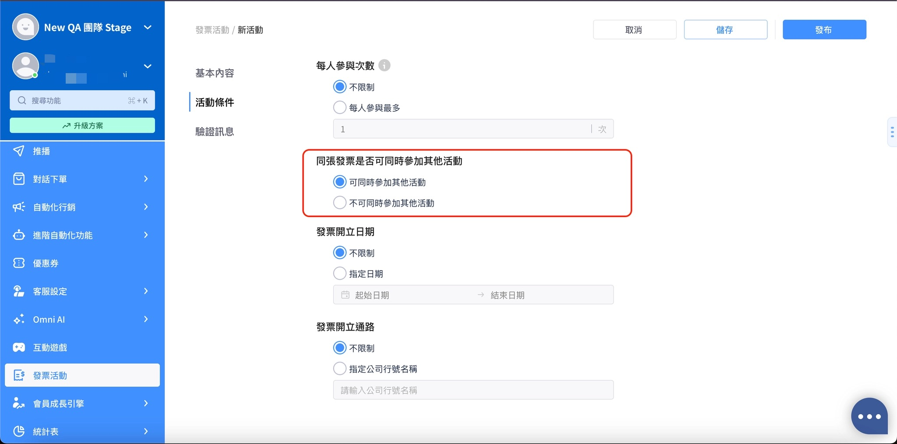

# Mar 11, 2026

哈囉，親愛的 Omnichat 用戶！

以下是我們為您帶來的功能更新：

1. Omnichat 系統信件網域更新
2. 取得聯絡人 API 新增支援欄位
3. 對話報表「遺漏訊息」計算邏輯更新
4. 變更分店編號時新增「QR Code 更新」提示文字

### Omnichat 系統信件發送網域更新

為確保各項系統通知信（如密碼重設、對話提醒等）能更順利送達您的電子郵件信箱，Omnichat 的官方發件網域已正式更換：

* 原網域： no-reply@omnichat.ai
* **新網域： no-reply@notify.omnichat.ai**

💡小撇步： 建議將新網域加入您的郵件白名單，避免重要訊息被誤判為垃圾信件。 

### 取得聯絡人 API 新增支援欄位

🙌🏻 **適用方案：CRM Contact API module**&#x20;

針對透過 API 串接第三方 CRM 系統的用戶，Omnichat 大幅提升了資料同步的彈性！原先僅支援透過「社群 User ID」或「特定時間區間」查詢，現在新增了以下三個查詢欄位：

* **會員編號 (Member ID)**
* **電話 (Phone Number)**
* **電子郵件 (Email)**

這項更新能讓您更輕鬆地在 Omnichat 與第三方系統之間進行資料同步！

### 對話報表「遺漏訊息」計算邏輯優化

為了讓報表指標能更準確地反映客服的狀況，此次我們調整了遺漏訊息的判定邏輯。

更新重點： 過去若客人的最後一則訊息未被回覆，即便客服已主動「結束對話」，系統仍會計入遺漏訊息。但部分對話是由客服判斷「不需回覆」而結束。 更新後，以下情境結案的對話將不再計入遺漏訊息：

* **單一對話手動結束**
* **批次結束對話**
* **系統自動結束對話**
* **解除對話綁定**
* **停用團隊成員**
* **從「團隊成員 > 編輯聯絡人」取消綁定**

此項更新能讓「遺漏訊息」指標更具參考價值！真實反映需處理而未處理的狀況

### 發票活動更新：支援單張發票參與多活動

🙌🏻 **適用方案：發票模組（僅限台灣）**

品牌現在可以自由在後台設&#x5B9A;**「同張發票是否可同時參加其他活動」**

使用場景： 若品牌同時舉辦多檔活動，開啟此功能可鼓勵消費者購買更多，提升單次消費的參與感與回饋率，活動設定更具彈性！

<figure><figcaption></figcaption></figure>
