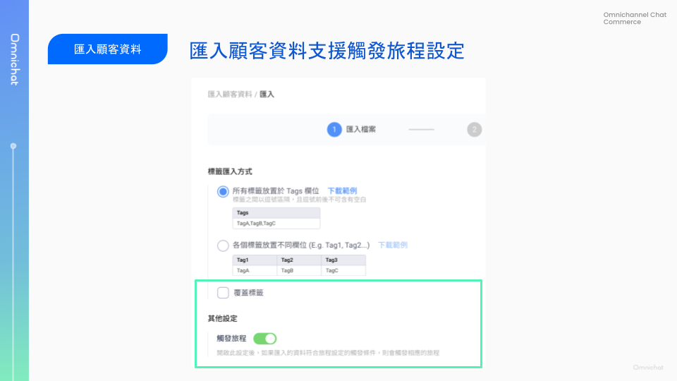
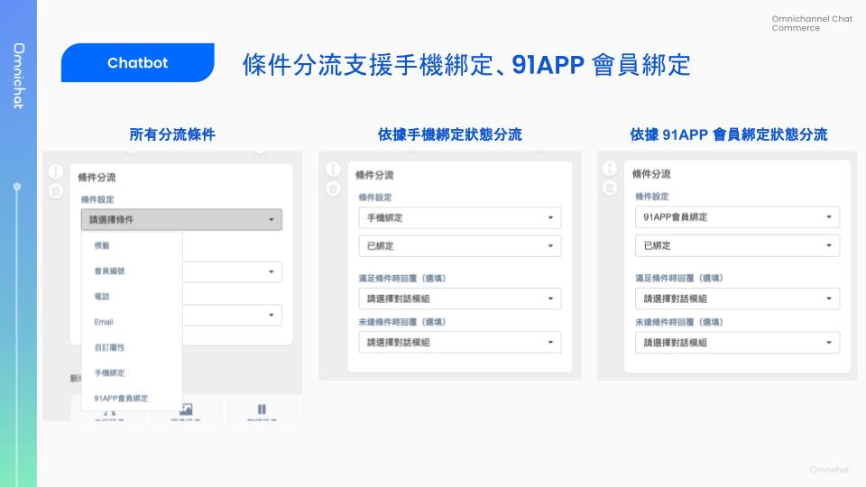
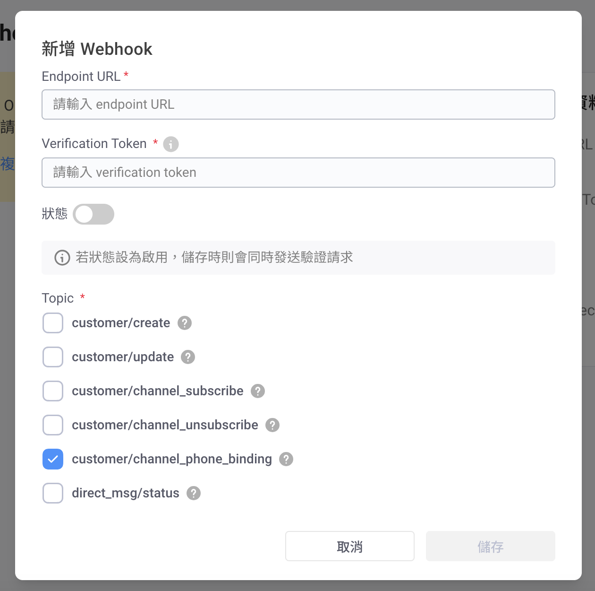
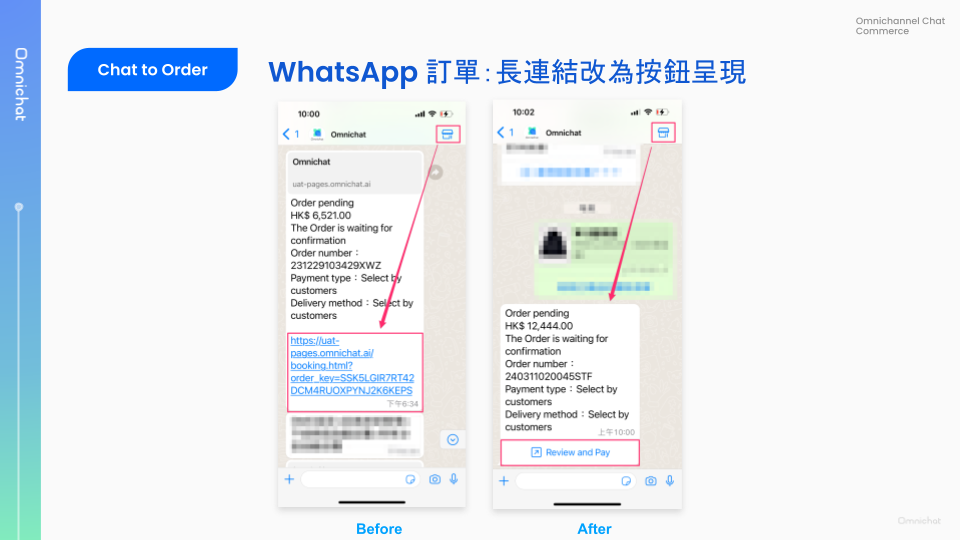
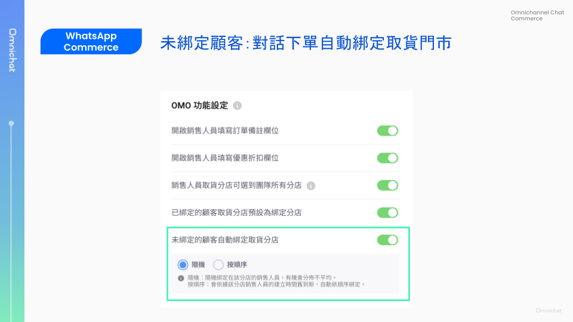
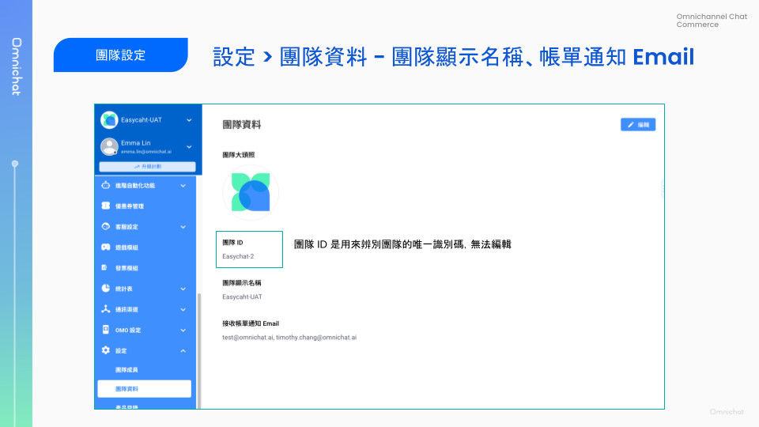

# Mar 13, 2024

哈囉，親愛的 Omnichat 用戶！

以下是我們為您帶來的功能更新：

1. [匯入顧客資料](mar-13-2024.md#hui-ru-gu-ke-zi-liao-zhi-yuan-chu-fa-lv-cheng)：可以選擇是否在符合條件時觸發旅程
2. [聊天機器人「分流卡片」](mar-13-2024.md#chatbot-fen-liu-ka-pian-xin-zeng-yi-ju-shou-ji-bang-ding-91app-bang-ding-zhuang-tai-fen-liu)：現在可以依據「手機綁定」、「91APP 綁定」作為分流的選項囉！
3. [Webhook 更新](mar-13-2024.md#webhook-tong-zhi-shi-jian-xin-zeng-zhi-yuan-line-shou-ji-bang-ding)：可即時同步「手機號碼與社群 ID」比對資料至其他系統
4. WhatsApp Commerce 相關調整
   1. [訊息樣式改版，將長連結改成按鈕樣式](mar-13-2024.md#whatsapp-commerce-ding-chan-fu-kuan-lian-jie-yi-an-niu-fang-shi-cheng-xian)，使用體驗再升級！
   2. [新增分店取貨綁定相關設定](mar-13-2024.md#whatsapp-commerce-xin-zeng-men-shi-qu-huo-omo-she-ding-xiang-mu)，可使未綁定顧客自動綁定取貨門市、已綁定顧客限定於綁定的門市取貨
5. [OMO 店員群發訊息紀錄優化](mar-13-2024.md#qun-fa-xun-xi-ji-lu-ui-gai-ban-yu-you-hua)：新增更多種類訊息預覽、新增機器人與檔案發送紀錄
6. [團隊資料設定頁面改版](mar-13-2024.md#tuan-dui-zi-liao-she-ding-ye-gai-ban-xin-zeng-tuan-dui-xian-shi-ming-chen-zhang-chan-tong-zhi-email)：可自行設置團隊顯示名稱、新增接收帳單通知 Email 設定
7. [其他優化項目](mar-13-2024.md#qi-ta-you-hua-xiang-mu)

## 匯入顧客資料支援觸發顧客旅程

🙌🏻 適用對象：包含顧客旅程的所有方案

匯入顧客資料時，可以選擇是否要讓匯入名單中「符合旅程觸發條件的顧客」觸發旅程。

<figure><figcaption></figcaption></figure>

### 匯入顧客

選擇「[匯入顧客](../features/she-qun-ke-hu-zi-liao-ping-tai/hui-ru-gu-ke-zi-liao/hui-ru-gu-ke-ming-dan-cdp-fang-an-xian-ding.md)」時，匯入資料必須包含 Member ID，可包含顧客名稱、Email、電話、標籤、自訂屬性⋯⋯等等。

若開啟「觸發旅程」設定，則匯入名單中的顧客可能會因滿足以下 2 類旅程觸發條件，而觸發相應旅程：

1. 貼上任一標籤
2. 自訂屬性異動

### 匯入社群聯絡人

選擇「[匯入社群聯絡人](../features/she-qun-ke-hu-zi-liao-ping-tai/hui-ru-gu-ke-zi-liao/hui-ru-she-qun-lian-luo-ren.md)」時，匯入資料必須包含社群 ID，可包含顧客名稱、Member ID、Email、電話、標籤、自訂屬性⋯⋯等等。。

若開啟「觸發旅程」設定，則匯入名單中的顧客可能會因滿足以下 3 類旅程觸發條件，而觸發對應旅程：

1. 新增聯絡人
2. 貼上任一標籤
3. 自訂屬性異動

相關教學文件：

📖 [全渠道顧客旅程設定教學](../features/marketing/quan-qu-dao-gu-kelcheng-jia-gou-gong-neng.md)

## Chatbot 分流卡片，新增依據手機綁定、91APP 綁定狀態分流

🙌🏻 適用對象：Social CDP 方案或加購 Chatbot 條件分流卡片

Omnichat 的 Chatbot 進階卡片之一「條件分流」，在使用這張機器人卡片時，可以依據顧客條件分流，來傳送不同的回應訊息。

新增支援「手機綁定」與「91APP 會員綁定」綁定兩項條件，目前可依據以下條件分流：

* 標籤
* 會員編號
* 電話流
* Email
* 自訂屬性
* **手機綁定**
* **91APP 會員綁定**

<figure><figcaption></figcaption></figure>

相關教學文件：

📖 [條件分流卡片介紹與設定教學](../features/marketing/chatbot-builder/ji-qi-ren-mo-zu-she-ding/#conditionalreplycard)

## Webhook 通知事件：新增支援 LINE 手機綁定

利用 Omnichat Webhook，可以將透過「手機綁定」取得的「手機號碼與 LINE UID」的比對資料，同步至其他系統。

適用方案：

* Omnicht Webhook 須加購 Contact API / Webhook 才可使用
* 手機綁定須加購 CRM 模組才可使用

**手機綁定 Webhook 事件通知內容：**

* platform：目前手機綁定僅支援 LINE 平台
* channelId
* userId
* phone

<figure><figcaption></figcaption></figure>

## WhatsApp Commerce 訂單付款連結以按鈕方式呈現

🙌🏻 適用對象：WhatsApp Commerce 模組

Omnichat 整合 WhatsApp Catalog 和付款功能，讓顧客可以在 WhatsApp 中完成選購、下單。過去，訂單確認與付款的連結，是以超連結方式呈現。現在，為了提升顧客體驗與點擊率，此連結已經改成透過按鈕來呈現囉！

目前，「Review and Pay」按鈕文字暫時不可作更改。

<figure><figcaption></figcaption></figure>

## WhatsApp Commerce 新增門市取貨 OMO 設定項目

🙌🏻 適用對象：OMO 方案

Omnichat 的 WhatsApp Commerce 模組，讓商家開啟了更多對話結單的機會。

不論是由顧客主動透過 WhatsApp Catalog 下單，或是由銷售人員使用 Omnichat App 替顧客打包訂單，雙向對話下單 Omnichat 皆能支援。

本次更新在「對話下單 > 基本設定」增加了 OMO 相關的 2 個設置項目，讓選擇門市取貨的顧客流程更順暢，更方便取得銷售人員的貼心服務。

以下 2 項新增的設定項目，皆可由商家設定是否要開啟：

* 未綁定顧客可直接綁定取貨門市
* 已綁定門市的顧客，取貨門市可限定綁定的門市

<figure><figcaption></figcaption></figure>

### 未綁定顧客可直接綁定取貨分店

若希望確保線上顧客在門市取貨可以獲得專業銷售人員的完整服務，可以開啟這項功能。

未曾綁定門市、銷售人員的顧客，透過 WhatsApp 下單完成後，若顧客選擇分店取貨，可直接讓顧客綁定取貨門市與該門市的銷售人員喔！

<figure><figcaption></figcaption></figure>

<figure><figcaption></figcaption></figure>

### 已綁定分店的顧客，取貨門市可限定綁定的分店

若希望確認已綁定門市銷售人員的顧客，在門市取貨的訂單可以獲得綁定店員的服務，則可以開啟這項設定。

針對已綁定門市銷售人員的顧客，當顧客於 WhatsApp Catalog 下訂單後，若選擇「分店取貨」則分店會預設為該顧客綁定的分店，且不可更改。下單後也會由該顧客綁定的店員接手處理訂單。

<figure><figcaption></figcaption></figure>

### 群發訊息紀錄 UI 改版與優化

🙌🏻 適用對象：OMO 方案

在 UI 改版以外，也新增支援更多訊息種類的紀錄資訊與預覽：

* 新增機器人模組預覽
* 新增群發 WhatsApp 訊息範本預覽
* 新增**機器人**及**檔案訊息**的紀錄

<figure><figcaption></figcaption></figure>

<figure><figcaption></figcaption></figure>

<figure><figcaption></figcaption></figure>

## 團隊資料設定頁改版：新增團隊顯示名稱、帳單通知 Email 設定

另外，我們也新增了一個「接收帳單通知 Email」的欄位，讓你填入團隊中專門接收此類的通知的 Email，確保通知不漏接。

**可設定多組接收帳單通知 Email，帳單通知事件包含：**

* **SMS 剩餘使用額度過低 (低於 500 次)**
* **每月 WhatsApp 訊息用量帳單**
* **每月 LINE 通知型訊息用量帳單**
* **帳戶餘額過低 (Coming Soon)**
* **帳戶餘額為 0 (Coming Soon)**

如需調整相關設定，請從側欄「設定 > 團隊資料」或點擊[此連結](https://console.omnichat.ai/team-profile)進入。

<figure><figcaption></figcaption></figure>

## 其他優化項目

* 遊戲模組支援 IG 渠道
* 旅程數據報表可匯出訂單
* 旅程訊息節點統計新增退訂封鎖率
* WhatsApp 優惠券訊息合併成一張卡片
