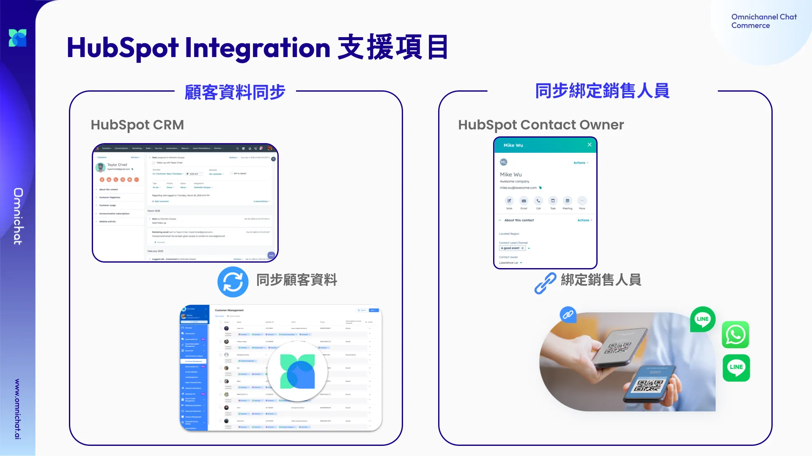

# Mar 19, 2025

哈囉，親愛的 Omnichat 用戶！

以下是我們為您帶來的功能更新：

1. [HubSpot 聯絡人資料整合](mar-19-2025.md#zhi-yuan-hubspot-crm-zheng-he)，上線囉！
2. [LINE 手機綁定](mar-19-2025.md#line-shou-ji-bang-ding-zhi-yuan-zi-ding-ping-tai-bi-dui-hui-yuan-shen-fen)：支援呼叫自訂平台比對會員身份
3. [官網會員綁定](mar-19-2025.md#guan-wang-hui-yuan-bang-ding-zhi-yuan-tou-guo-line-liff-lian-jie-bang-ding-guan-wang-hui-yuan-line-s)：支援透過 LINE LIFF 連結，綁定官網會員 LINE 身份
4. [聊天機器人](mar-19-2025.md#liao-tian-ji-qi-ren-yong-hu-shu-ru-ka-pian-zhi-yuan-jiang-tu-pian-lian-jie-cun-ru-zi-ding-shu-xing)：用戶輸入卡片支援將圖片連結存入自訂屬性
5. [其他功能優化](mar-19-2025.md#qi-ta-gong-neng-you-hua)：
   * 顧客旅程：自訂屬性支援「特定月份 (不限年份)」篩選條件
   * 銷售經理可更改同分店銷售人員上下線狀態

## 支援 HubSpot CRM 整合

🙌🏻 **適用方案**：需開通 HubSpot CRM Connector 模組

你有在使用 HubSpot CRM 系統嗎？

### 同步聯絡人資料

現在你可以將 HubSpot 和 Omnichat 整合，我們支援雙向同步 HubSpot 和 Omnichat 的聯絡人資料。

### 同步 Contact Owner，成為綁定的銷售人員

同時使用 Omnichat 的 OMO 方案，你還可以將 HubSpot 的 Contact Owner 和 Omnchat 的「綁定銷售人員」同步，讓 HubSpot 的 Contact Owner 可以直接在 LINE、WhatsApp 聯繫他的客戶。

反之，你也可以將已經先在 Omnichat 這邊綁定的銷售人員資料，同步到 HubSpot Contact Owner。

<figure><figcaption></figcaption></figure>

## LINE 手機綁定：支援自訂平台比對會員身份

🙌🏻 **適用方案**：需開通會員卡模組

📍 **功能路徑**：社群綁定管理 > [手機綁定](https://console.omnichat.ai/mobile-phone-binding)

顧客在進行手機綁定時，除了透過 OTP 驗證手機號碼的正確性，也支援和電商平台、Omnichat 聯絡人數據庫比對此會員是否存在，若不存在可再引導顧客前往註冊會員。

本次功能更新後，即支援手機綁定時，即時連線「自訂平台」（如：你的 CRM、數據中心）比對會員資料。

<figure><figcaption></figcaption></figure>

## 官網會員綁定：支援透過 LINE LIFF 連結，綁定官網會員 LINE 身份

顧客在你的網站完成登入、註冊，有辦法直接把會員編號和 LINE 好友身份整合起來嗎？

只要使用這個連結就可以：

```jsx
<https://liff.line.me/>{Binding Liff ID}?action=memberBind&teamId={Team ID}&memberId={Member ID}&channelId={Channel ID}
```

記得再觸發這個連結的時候 {Binding Liff ID}、{Team ID}、{Member ID}、{Channel ID} 都要帶入正確的資料喔！

這要只要有登入的官網顧客，點擊連結加入 LINE 好友，他的會員編號也會直接被儲存起來！

## 聊天機器人：用戶輸入卡片支援將圖片連結存入自訂屬性

只要搭配使用「用戶輸入卡片」和「自訂屬性」功能，就可以透過機器人問答自動儲存顧客回覆。

那如果你是要求顧客「上傳圖片」呢？

我們現在有支援在顧客上傳圖片、影音後，自動產生連結並存入「自訂屬性」囉！

這樣你後續要在線上確認資料，或是匯出顧客資料來整理，都會非常方便！


如欲開啟此功能，請與您的顧客窗口聯繫


## 其他功能優化

### 顧客旅程：自訂屬性支援「特定月份 (不限年份)」篩選條件

<figure><figcaption></figcaption></figure>

### OMO：銷售經理可更改同分店銷售人員上下線狀態

如果銷售人員休假時，沒有上傳班表或是改為離線狀態，銷售經理可以將銷售人員的狀態更改為離線，這樣對話就不會分配給離線人員。

<figure><figcaption></figcaption></figure>
