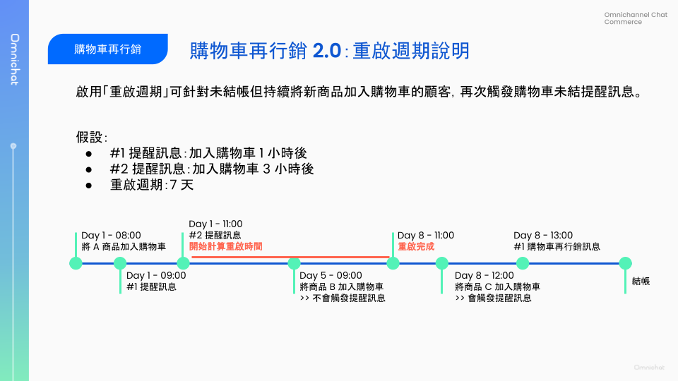
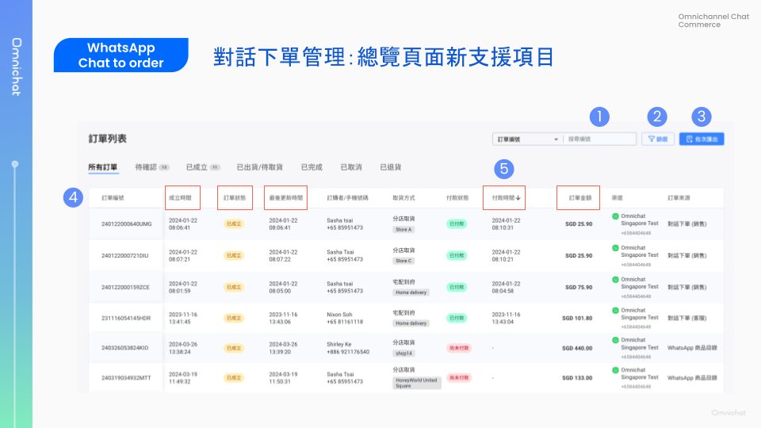
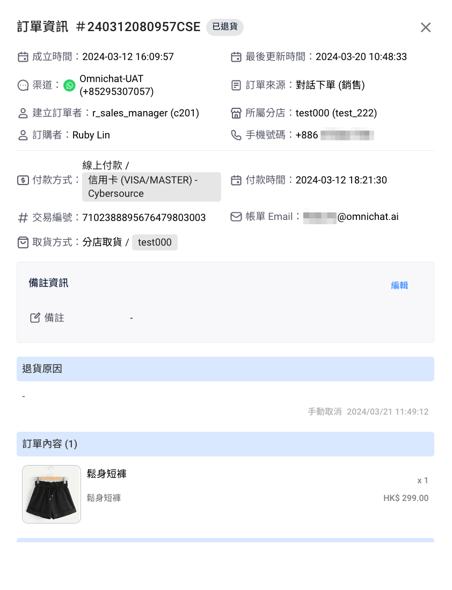
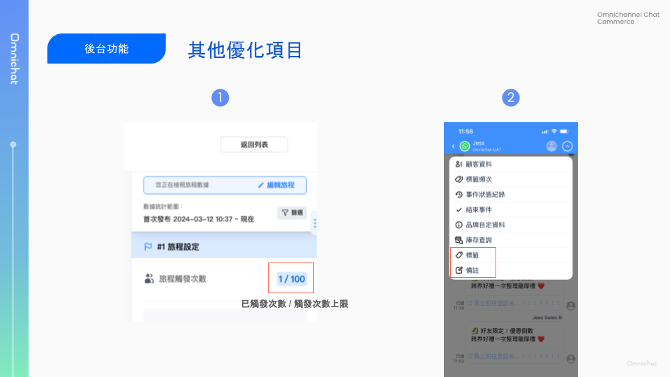

# Mar 27, 2024

哈囉，親愛的 Omnichat 用戶！

以下是我們為您帶來的功能更新：

1. [**購物車再行銷 2.0**](mar-27-2024.md#gou-wu-che-zai-hang-xiao-gai-ban-sheng-ji-xin-zhi-yuan-zhong-qi-zhou-qi)：新增**重啟週期**設定與介面改版
2. [**LINE 通知快捷（通知型訊息）**](mar-27-2024.md#line-tong-zhi-kuai-jie-zhi-yuan-you-xian-fa-song-line-tui-song-xun-xi-jiang-hua-gu-ke-shou-ji-hao-ma)：支援發送 LINE 推送訊息，強化 LINE 好友手機號碼收集機制
3. [**串接應用程式 - 支援 Insider 整合**](mar-27-2024.md#chuan-jie-ying-yong-cheng-shi-zhi-yuan-insider-zheng-he)：數據共享、跨系統發送訊息、訊息互動狀態同步
4. [**WhatsApp Chat To Order 優化**](mar-27-2024.md#whatsapp-chat-to-order-ding-chan-guan-li-gong-neng-you-hua)：
   1. 對話下單管理功能優化
   2. 支援店員查看顧客 WhatsApp Catalog 購買商品內容
5. [**對話 2.0 支援 OMO 銷售人員進行顧客名單群發**](mar-27-2024.md#omo-zhi-yuan-xiao-shou-ren-yuan-tou-guo-dui-hua-2.0-jin-hang-gu-ke-ming-chan-qun-fa)
6. [其他優化項目](mar-27-2024.md#qi-ta-you-hua-xiang-mu)

## 購物車再行銷改版升級，新支援「重啟週期」

🙌🏻 適用對象：進階行銷方案、旗艦方案、加購購物車再行銷

購物車再行銷頁面全新改版，並優惠功能升級成 2.0 版本！

除了畫面調整、新增訊息預覽功能，還新支援了「重啟週期」設定，增加提醒訊息發送率喔！


舊版頁面將於 2024-04-24 移除


### 購物車再行銷 2.0：總覽頁面

1. **再行銷平台**：請選擇要再行銷的渠道進行設定。同一時間只能在一個平台啟用購物車再行銷活動。若啟用了其中一個，系統會自動將其他停用。
2. **彈出式綁定訊息**：從舊版的「設定追蹤插件」更名為「彈出式綁定訊息」，此訊息促進顧客完成「社群身份綁定」，以增加購物車再行銷訊息發送量。點擊右側編輯按鈕可進一步進行內容、顯示頻率設定。
3. **購物車再行銷訊息**：統計各則再行銷訊息啟用後所有期間的成效數據。包含訊息數、點擊數、點擊率、訂單、營業額、轉換率。幫助評估此行銷方式的總體成效。
4. **日期區間分析**：透過右側日期區間設定，可查看不同時間段的成效數據，可用以觀察依訊息內容設定、提醒條件設定、產品活動策略⋯⋯多種因素影響與調整下的成效變化。

<figure><figcaption></figcaption></figure>

### 購物車再行銷 2.0：彈出式綁定訊息

此頁面為舊版購物車「設定追蹤插件」更名與畫面優化。

購物車再行銷訊息只能對已完成「社群身份綁定」的顧客發送，綁定率越高就能有更高的再行銷訊息發送量，才能創造更高的營收。

因此，彈出式綁定訊息是在顧客將商品加入購物車後，促使顧客完成社群身份綁定，若發生未結帳狀況，就能發送提醒訊息。此訊息僅會對未完成社群身份綁定的顧客顯示。若顧客已完成社群身份綁定，則不會顯示此彈出式訊息。

此頁面可以設定的內容包含：

* **內容設定**：彈出式訊息的文案設定
* **觸發條件**：一天最多顯示次數、加入購物車後幾次顯示
* **綁定成功訊息**：顧客綁定社群身份成功後，會在綁定的渠道收到此訊息。若是以優惠折扣吸引顧客綁定，則可以在此訊息中告知領取優惠的方式。

<figure><figcaption></figcaption></figure>

### 購物車再行銷 2.0：新支援重啟週期、訊息預覽

此頁面為升級程度最大的區塊，以下分別介紹：

* 訊息設定：**新支援訊息預覽功能**，且全渠道（FB、LINE、WhatsApp）皆支援以日、時、分設定提醒訊息發送時間。
* **重啟週期**：設置提醒訊息的重啟週期，一旦重啟完成，若顧客再次將商品加入購物車，將會再次觸發購物車再行銷訊息。

<figure><figcaption></figcaption></figure>

#### 重啟週期

在舊版購物車再行銷，當一輪再行銷訊息發送完畢後，若顧客依然未結帳，即使顧客持續將新商品加入購物車，依然不會發送提醒訊息，須等到顧客完成結帳後，下一次的加入購物車未結，才能再次發送提醒訊息。

然而，現在你可以自行設定「重啟週期」，重啟週期從最後一則購物車再行銷訊息發送完畢後開始計算，經過一定時間後，若顧客依然未結帳，但持續將商品加入購物車，就可以再次送出提醒訊息。

而此「重啟」僅用於再行銷訊息的重啟，並不會影響對話頁面顧客資料上的購物車商品內容。

<figure><figcaption></figcaption></figure>

## LINE 通知快捷：支援優先發送 LINE 推送訊息、強化顧客手機號碼整合

🙌🏻 適用對象：需開通 Open API - Notification API，請洽業務、客服窗口

Omnichat 整合 LINE 通知型訊息，推出「LINE 通知快捷機制」，支援以 LINE 推送、LINE 通知型訊息與簡訊的方式，於顧客下單、訂單出貨、訂單到貨時進行即時的顧客通知。透過 LINE 通知快捷機制，有助於增加 LINE 好友數、節省訊息費、整合顧客跨渠道數據。

想獲得更多 LINE 通知快捷的介紹，可以參考[官網頁面](https://www.omnichat.ai/tw/line-official-notifications-notipress/)或洽詢業務、客服窗口！

本次更新內容包含：

* 設定頁面上線
* 支援發送 LINE 推送訊息
* LINE 好友手機號碼收集新方式

### LINE 通知快捷總覽

在總覽頁面可以：

1. **新增通知**：點擊右上角的新增通知，則會進入新通知的設定頁
2. **匯出紀錄**：匯出通知發送紀錄，包含 LINE 推送、LINE 通知型訊息與簡訊的所有發送紀錄，包含聯絡人資料、發送與送達狀態等等資訊
3. **各項通知數據總覽**：呈現各項通知透過不同通知方式的發送與送達數據統計，未來也會增加「新增好友數」的統計項目

<figure><figcaption></figcaption></figure>

### LINE 通知快捷通知設定

在通知設定的頁面頁面，可以設定：

* 名稱
* 應用情境：目前支援購買完成通知、出貨通知、到貨通知（宅配、超取）
* 通知方式：
  * **LINE 推送訊息**：當要通知的手機號碼，可以在顧客資料中找到唯一的 LINE 聯絡人，可優先使用 LINE 推送通知。
  * **LINE 通知型訊息**：透過 LINE API 以手機號碼發送通知型訊息，不論是否 LINE 好友皆可發送通知。**若成功接收 LINE 通知型訊息的對象，是官方帳號既有的 LINE 好友，Omnichat 會立即替你將此聯絡人的手機號碼儲存於顧客資料中。**
  * **簡訊**：當通知型訊息經過一段時間，無法發送成功則會轉發簡訊。轉發簡訊的等待時間設定介於 5 分鐘 \~ 1440 分鐘（24 小時）。

<figure><figcaption></figcaption></figure>

## 串接應用程式：支援 Insider 整合

🙌🏻 適用對象：須加購 insider 整合功能

將 Omnichat 與 Insider 整合主要支援將 Omnichat 蒐集到的社群互動數據分享給 Insider；在 Insider 整合 Message API，可在 Insider 驅動 Omnichat 發送再行銷訊息，而訊息互動狀態的更新也會回傳至 Insider。

Insider 整合支援項目列表：

* 當 LINE 聯絡人標籤和自訂屬性資料有異動時會回傳給 Insider
* 當 LINE 聯絡人有訂閱、取消訂閱時會回傳給 Insider
* 發送 Direct Message API 後，當狀態有更新時會回傳給 Insider
* 將 LINE UID 資訊透過機器人按鈕連結提供給 Insider

<figure><figcaption></figcaption></figure>

## WhatsApp Chat To Order：訂單管理功能優化

🙌🏻 適用對象：須加購 WhatsApp Commerce

### 對話下單訂單管理總覽

1. **新增搜尋條件**：支援以建單者姓名、店員編號搜尋
2.  **新增篩選條件**：最後更新時間、付款時間、訂單業績所屬分店

    註：所屬分店 = 建單者所屬分店 = 顧客綁定分店 ≠ 取貨分店
3. **批次匯出新增支援權限**：支援「銷售人員」批次匯出訂單
4. **訂單列表新增欄位**：渠道名稱、付款時間、最後更新時間、建立訂單者、店員編號、所屬分店、所屬分店編號
   1. 最後更新時間：當訂單只要有做異動就會更新時間，包含：編輯訂單資訊、新增備註、更改訂單狀態、消費者完成付款⋯⋯等
5. **支援遞增、遞減排序，支援項目**：付款時間、更新時間、成立時間、訂單金額、訂單狀態

<figure><figcaption></figcaption></figure>

### 對話下單訂單詳細頁

新增欄位：渠道名稱、付款時間、最後更新時間、建立訂單者、店員編號、所屬分店、所屬分店編號

<figure><figcaption></figcaption></figure>

### 支援銷售人員查看顧客 WhatsApp Catalog 購買商品內容

支援銷售人員點擊顧客透過 WhatsApp Catalog 傳送訂單，查看購物清單商品內容。

* 網頁版（對話 2.0）與手機 APP 皆支援
* 商品價格有原價、特價 (選填)，如商品資料有含特價則兩者皆會顯示，如僅有原價則顯示一種價格
* 商品價格僅會呈現商品單價，總計金額以下方欄位為主

<figure><figcaption></figcaption></figure>

## OMO 支援銷售人員透過對話 2.0，進行顧客名單群發

🙌🏻 適用對象：OMO 方案

支援銷售人員在網頁版後台（對話 2.0），針對綁定客戶名單群發；不支援跨渠道（WhatsApp / LINE）發送，只可單渠道發送。

目前不支援暫時根據對話狀態（待處理、處理中、已結束）篩選名單。

<figure><figcaption></figcaption></figure>

## 其他優化項目

1. 顧客旅程，新增顯示旅程可觸發的上限數
2. APP 顧客對話頁面上方快捷動作列表，新增編輯「標籤」、「備註」

<figure><figcaption></figcaption></figure>
