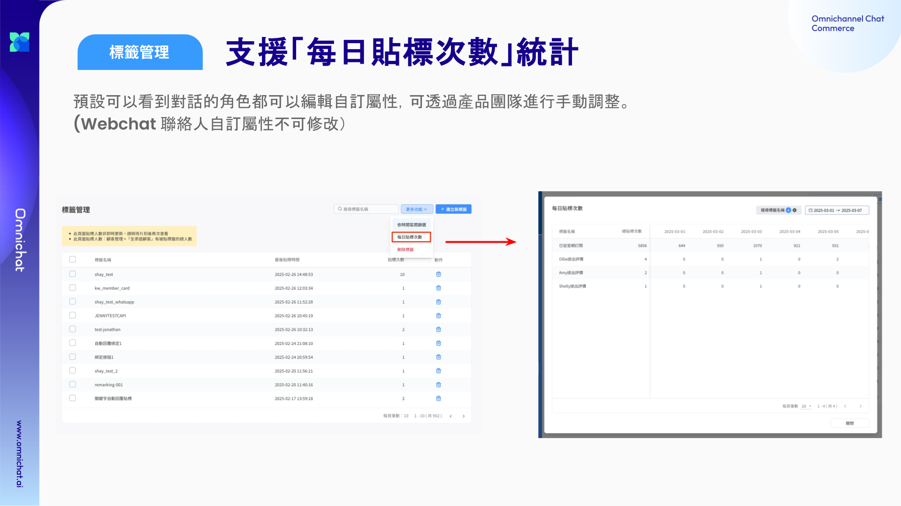

# Mar 5, 2025

哈囉，親愛的 Omnichat 用戶！

以下是我們為您帶來的功能更新：

1. [受眾管理](mar-5-2025.md#shou-zhong-guan-li-zhi-yuan-tong-bu-shou-zhong-zhi-facebook-guang-gao)：支援同步受眾至 Facebook 廣告
2. [Social Ads](mar-5-2025.md#social-ads-zhi-yuan-duo-qu-dao-tou-guo-gu-kelcheng-hui-chuan-meta-guang-gao-shi-jian)：支援多渠道透過顧客旅程，回傳 Meta 廣告事件
3. Omnichat [手機 App 支援編輯「自訂屬性」](mar-5-2025.md#omnichat-shou-ji-app-zhi-yuan-bian-ji-zi-ding-shu-xing)
4. [標籤管理](mar-5-2025.md#biao-qian-guan-li-tong-ji-ji-lu-zhi-yuan-shai-xuan-biao-qian-mei-ri-tie-biao-ci-shu)升級！貼標紀錄篩選名稱、新增一段區間每日的貼標紀錄
5. [LINE Flex Message](mar-5-2025.md#line-flex-message-tai-wan-xian-ding-dan-xing-zhi-zuo-ge-zhong-line-xun-xi-mu-ban) LINE 訊息模板
6. [其他功能優化](mar-5-2025.md#qi-ta-gong-neng-you-hua)：
   1. 91APP 會員綁定：LINE 好友完成綁定後，會儲存手機號碼、Member ID
   2. 社群身份綁定：支援綁定成功後貼標
   3. Loyalty Point：點數手動上傳支援所有社群平台
   4. 社群聯絡人：支援顯示原生社群名稱

## 受眾管理：支援同步受眾至 Facebook 廣告

🙌🏻 **適用方案**：需開通受眾管理模組

📍 **功能路徑**：社群客戶資料平台 > [受眾管理](https://console.omnichat.ai/audiences)

現在透過 Omnichat 的受眾管理，你不只可以建立一個可長期使用的推播受眾名單，將受眾同步到 LINE 廣告平台，現在還可以同步受眾到 Meta 廣告平台、建立相似受眾，投放 Facebook、Instagram 廣告喔！

<figure><figcaption></figcaption></figure>

## Social Ads：支援多渠道透過顧客旅程，回傳 Meta 廣告事件

🙌🏻 **適用方案**：需開通 Social Ads Enhancement 模組（OMO）與顧客旅程

📍 **功能路徑**：進階自動化功能 > [全渠道顧客旅程](https://console.omnichat.ai/customer-journey)

你有想過當顧客加入你的 LINE 好友、在 LINE 玩遊戲、領優惠券，你可以傳送轉換事件回去給 Meta 廣告管理員嗎？

Omnichat 的顧客旅程，已經可以支援將 LINE、Instagram、Facebook Messenger 聯絡人互動事件，回傳到 Meta 廣告平台囉！

<figure><figcaption></figcaption></figure>

備註：以上述範例來說，可以成功回傳資料的前提是，有比對到顧客 LINE 身份與 Facebook 身份，所以非常建議搭配 OmniLink 來進行 Campaign 操作，欲知詳情，請洽你的業務窗口！

## Omnichat 手機 App 支援編輯「自訂屬性」

🙌🏻 **適用方案**：需開通自訂屬性功能

除了電腦版的「對話 2.0」以外，在手機 APP 的對話中，也可以直接編輯顧客的自訂屬性值囉！

<figure><figcaption></figcaption></figure>

## 標籤管理：統計紀錄支援篩選標籤、每日貼標次數

📍 **功能路徑**：社群客戶資料平台 > [標籤管理](https://console.omnichat.ai/tags-management)

隨著蒐集到越來越多顧客標籤，發現要查看數據變得越來越難嗎？

標籤管理功能，本次有兩個更新可以幫助到你！

* 標籤管理：報表支援標籤搜尋（[操作教學](https://scribehow.com/shared/Filtering_Tags_in_Omnichat_Console__wDMbXfwLShOMFyhTUuprVQ)）
* 標籤管理：支援每日貼標次數統計（[操作教學](https://scribehow.com/shared/__uc2Rhig2QFyDgzNDp-S0Tw)）

<figure><figcaption></figcaption></figure>

## LINE Flex Message（台灣限定）：**彈性製作各種 LINE 訊息模板**

🙌🏻 **適用方案**：需加購 LINE Flex Message 模組

想要製作出更多元、更彈性的 LINE 訊息模板嗎？

開通 LINE Flex Message 功能，就可以設計更多元的 LINE 模板，搭配 Open API、Call an API 卡片使用這些訊息模板。


此功能適合內部有工程團隊的公司使用。


* LINE Flex Message
  * 支援新增訊息種類（需透過 [LINE FLEX MESSAGE SIMULATOR](https://developers.line.biz/flex-simulator/) 設計後取得 JSON 格式）
  * 支援查詢訊息名稱、ID
  * 支援發送訊息中放入 Omnichat 系統變數、自訂屬性、客戶自訂變數
  * 支援發送後追蹤訊息開封率、按鈕或圖片點擊率
* Open API / Send Direct Message API 擴充
  * 支援發送 LINE Flex Message 中設定好的訊息
  * 支援將單個訊息組成輪播訊息（需參考 API 文件設計發送格式）
* Call an API 卡片擴充
  * 支援發送 LINE Flex Message 中設定好的訊息
  * 支援將單個訊息組成輪播訊息（需參考 API 文件設計發送格式）
* Open API 紀錄
  * 不支援已讀率、數（其他數據皆支援）

<figure><figcaption></figcaption></figure>

## 其他功能優化

1. 91APP 會員綁定：LINE 好友完成綁定後，會儲存手機號碼、Member ID
2. 社群身份綁定：支援綁定成功後貼標
3. Loyalty Point：點數手動上傳支援所有社群平台
4. 社群聯絡人：支援顯示原生社群名稱
