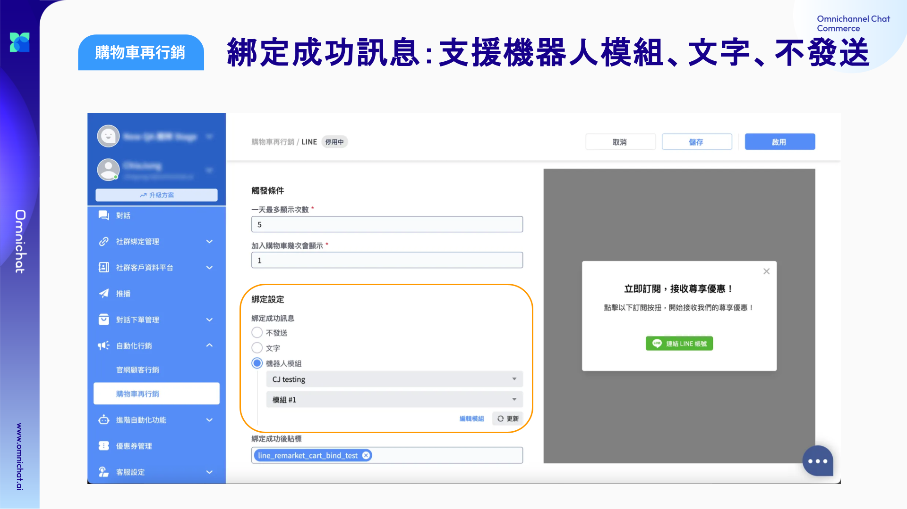

# May 14, 2025

哈囉，親愛的 Omnichat 用戶！

以下是我們為您帶來的功能更新：

1. [購物車再行銷功能優化](may-14-2025.md#gou-wu-ju-zai-xing-xiao-gong-neng-you-hua)
   1. 數據報表：支援查看指定區間數據與報表匯出
   2. 綁定成功訊息：支援機器人模組、不發送、文字
2. [LINE 通知快捷](may-14-2025.md#line-tong-zhi-kuai-jie-zhi-yuan-shopline)：支援 SHOPLINE

## 購物車再行銷功能優化

Omnichat 最受電商喜愛，轉換率、ROAS 最高的購物車再行銷又進化囉！

### 數據報表：支援查看指定區間數據與報表匯出

現在只要你設定了時間區間，上方的數據欄位和下方的統計圖表，都會一起變化，也可以將數據匯出喔！

<figure><figcaption></figcaption></figure>

### 彈出式綁定訊息：綁定成功訊息**支援機器人模組、文字、不發送**

購物車再行銷的綁定成功訊息，過往只支援文字訊息，現在也支援了機器人模組，讓訊息格式更加多元，也可以視需求選擇不發送訊息喔！

<figure><figcaption></figcaption></figure>

## LINE 通知快捷：支援 SHOPLINE

SHOPLINE 的商家現在也可以很容易的完成 SHOPLINE 和 Omnichat 通知快捷的串接，輕鬆發送 LINE 通知，包含推送訊息、LINE 通知型訊息和 SMS 簡訊。

只要依照以下設定，就可以完成串接，設定要發送通知的情境以及要發送通知的訂單來源囉！

<figure><figcaption></figcaption></figure>

<figure><figcaption></figcaption></figure>

<figure><figcaption></figcaption></figure>
