# May 22, 2024

哈囉，親愛的 Omnichat 用戶！

以下是我們為您帶來的功能更新：

1. [WhatsApp Flows ](may-22-2024.md#whatsapp-flows-quan-xin-gong-neng-shang-xian)上線
2. [WhatsApp 會員卡](may-22-2024.md#whatsapp-hui-yuan-ka-shang-xian)上線
3. [遊戲模組](may-22-2024.md#you-hu-mo-zu-zhi-yuan-instagram-ping-tai)：支援 Instagram 囉！
4. 商品導購連結、購物車未結商品卡片，[依據產品目錄顯示幣別](may-22-2024.md#shang-pin-dao-gou-lian-jie-gou-wu-che-wei-jie-shang-pin-ka-pian-yi-ju-chan-pin-mu-lu-xian-shi-bi-bie)
5. [官網顧客行銷 2.0 ](may-22-2024.md#guan-wang-gu-ke-hang-xiao-2.0-gai-ban-tui-chu)改版推出
6. [關鍵字自動回覆 2.0](may-22-2024.md#guan-wang-gu-ke-hang-xiao-2.0-gai-ban-tui-chu) 改版推出
7. [對話 2.0 ](may-22-2024.md#dui-hua-2.0-gai-ban-jie-mian-quan-mian-kai-fang)改版介面全面上線
   1. 傳送訊息狀態
   2. 發送 WhatsApp 貼圖包、LINE 官方貼圖

## WhatsApp Flows：全新功能上線！

🙌🏻 **適用方案**：需加購 WhatsApp Flows

📍 **功能路徑**：通訊渠道 > [WhatsApp Flows](https://console.omnichat.ai/whatsapp-flows)

想要在 WhatsApp 上面呈現專業表單，讓顧客無需跳轉就可以完成預約、顧客調查、活動報名嗎？

不能錯過全新推出的 WhatsApp Flows！

<figure><figcaption></figcaption></figure>


注意： 目前 Omnichat 支援儲存顧客在 WhatsApp Flows 上提交的資訊，同時可以對提交表單的顧客貼標、傳送回應訊息。下一個階段，我們會支援 API 數據交換，如在 Flow 上依據可預約時段提供精確選項、同步其他系統進行帳戶認證等等。


### **步驟 1、設定 WhatsApp Flow 表單內容**

我們的客戶支援團隊可以幫助你在 WhatsApp 管理後台設定客製化 WhatsApp Flows。

### **步驟 2、查看 WhatsApp Flow 列表**

Flows 在 WhatsApp 管理後台發布後，就會出現在 Omnichat 平台上，接著就可以設定回應與互動內容。

<figure><figcaption></figcaption></figure>

* 名稱：
  * 供內部參照的名稱，不會顯示在前台給顧客
  * 依據在 WhatsApp 管理後台的設定呈現，不可設定重複名稱
  * 最長 200 字
* Flow ID：用來識別 Flow 的 ID
* 類別：依據在 WhatsApp 管理後台的設定呈現，用來識別 Flow 的類型，一個 Flow 可以有多種類別，共有以下幾種：
  * 註冊 Sign up
  * 登入 Sign in
  * 預約 Appointment booking
  * 潛在客戶生成 Lead generation
  * 聯絡我們 Contact us
  * 客服支援 Customer support
  * 問券調查 Survey
  * 其他 Other
* 狀態
  * 草稿：可以編輯 Flow 內容，此階段的 Flow 不可發送給 user。
  * 已發佈：不可編輯 Flow 內容
  * 已棄用：棄用的 Flow 不可刪除、發送以及回復已發佈狀態。若有將 Flow 設定在訊息中（如 Chatbot、範本訊息），也無法透過已發送出去的訊息開啟已棄用的 Flow。
  * 已暫停：被 WhatsApp Flow 偵測到 Flow 異常，因此將狀態變更為暫停。此狀態下不可以發送或開啟。
  * 被限制：被 WhatsApp Flow 偵測到 Flow 異常，因此將狀態改為被限制。此狀態下可以發送或開啟，但限制每小時只能發 10 則 Flows 訊息。
* 總回應數：該 Flow 的回應總數
* 動作
  * 編輯：前往編輯 Flow 回應後觸發動作
  * 回應紀錄：查看顧客回應紀錄及內容

### **步驟 3、設定 WhatsApp Flow 表單回應內容、分眾標籤**

在 WhatsApp Flows 列表找到你要使用的 WhatsApp，在動作處選擇「編輯」，就可以進一步設定回應訊息和分眾標籤囉！

<figure><figcaption></figcaption></figure>

**➊ 回應成功訊息**

* 當客人完成 Flow 時回覆該訊息內容
* 預設訊息（可自訂內容）：**感謝你完成表單回覆！Thank you for completing the response form.**
* 可以加入 emoji、聯絡人名稱

**➋ 附加訊息**

選項包含：

* 不發送 (預設選項)
* 文字
* 機器人模組 (限 WhatsApp 機器人)

**➌ 貼上標籤**

* 當顧客完成 Flow 填寫時貼上標籤

### **步驟 4、分享 WhatsApp Flow 給顧客**

您可以通過以下方式將 Flow 分享給你的顧客：

#### 一、在聊天機器人中分享你的 Flow

我們新增了一個專門用於 WhatsApp Flow 的聊天機器人卡片。卡片內容包括：

**➊ 標題**

* 無：不設置標題
* 文字：80 個字元為限。
* 圖片：5 MB 為上限，超過會自動壓縮圖片。
* 影片：10 MB 為上限

**➋ 內文**

* 內文：必填，可以放 emoji、聯絡人參數。限 550 個字

**➌ 頁尾**

* 選填，限制 60 個字元。

**❹ 按鈕行動**

* 按鈕名稱：必填，限制 20 個字元（不能有表情符號）
* Flow ID：必填，只可選到狀態為 **草稿 、 已發佈 、 被限制** 的 Flow。
* Screen ID：預設第一組 Screen，不可更改
* 最多只可設定一組按鈕

<figure><figcaption></figcaption></figure>

#### 二、透過 WhatsApp 訊息範本分享你的 Flow

你可以將 WhatsApp 訊息範本的 CTA 按鈕設定為開啟 WhatsApp Flow。

每個範本只設定一個 Flow 按鈕，且不可與其他 CTA 同時存在。

WhatsApp Flow 按鈕：

* 按鈕名稱：必填，限 20 字元，中文 1 字算 3 字元。
* Flow ID：僅限選擇狀態為 **已發佈**、**被限制** 的 Flow。
* Screen ID：預設第一組 Screen，不可更改。

<figure><figcaption></figcaption></figure>

這些可以開啟 Flow 的 Chatbot 訊息、範本訊息都可以被應用在一對一對話、旅程、推播、銷售人員群發中。

### **步驟 5、查看或匯出回應紀錄**

你透過 WhatsApp Chatbot、範本訊息將 Flow 分享給顧客後，會陸續收到顧客提交的回應。

這時候你可以回到 WhatsApp Flows 列表頁，選擇你要查看回應的 WhatsApp Flow 在動作處，選擇「查看回應」。

<figure><figcaption></figcaption></figure>

#### 查看回應紀錄

進入 Flow 的回應紀錄頁面後，可以看到所有日期的回應資料，依據回應時間由新到舊排序。

* 搜尋及篩選
  * 搜尋：支援以姓名或手機搜尋
  * 篩選：支援指定日期區間篩選，沒有日期長度限制。
* 列表欄位
  * 姓名：顧客在 WhatsApp 的姓名
  * 電話：顧客的 WhatsApp 電話
  * 回應時間：顧客完成 Flow 的回應時間，格式：yyyy-MM-dd HH:mm:ss
* 列表動作
  * 查看回應內容
    * Label：代表題目名稱，於 Flow 中設定的欄位為 label
    * 回應內容：顧客回覆的內容
  * 刪除回應

#### 匯出回應紀錄

* 預設匯出 Flow 所有回應資料
* 如果有篩選時間，則會匯出篩選區間的回應資料
* 如果有下搜尋條件，則會匯出搜尋結果的回應資料
* 匯出檔名：Flow 名稱
* 匯出 csv 欄位：
  * customer\_name: 為該顧客姓名，系統預設欄位。
  * customer\_phone: 為該顧客手機號碼，系統預設欄位。
  * customer\_reponse\_time: 為該顧客回應時間，系統預設欄位。
  * 其他欄位則會依 Flow 設定而顯示。

<figure><figcaption></figcaption></figure>

### **各角色 WhatsApp Flow 操作權限說明**

| 角色 / 動作 | 查看 Flow | 編輯 Flow | 查看回應紀錄 | 匯出 CSV |   |
| ------- | ------- | ------- | ------ | ------ | - |
| 管理員     | O       | O       | O      | O      |   |
| 主管      | O       | O       | O      | O      |   |
| 行銷人員    | O       | O       | O      | O      |   |
| 客服經理    | O       | O       | O      | O      |   |
| 客服人員    | O       | Ｘ       | O      | Ｘ      |   |
| 銷售經理    | Ｘ       | Ｘ       | Ｘ      | Ｘ      |   |
| 銷售人員    | Ｘ       | Ｘ       | Ｘ      | Ｘ      |   |
| 行銷客服    | O       | O       | O      | O      |   |

### 今年即將推出的 WhatsApp Flows 功能

* Webhook 設置，允許在客戶完成後轉發回應事件
* Conversion API 追蹤 Flow 提交：當客戶通過 Messenger 廣告填寫 Flow 時，轉換事件可以被回傳到 Meta 廣告平台
* 將在 Omnichat 平台內提供使用者友善的 WhatsApp Flow 建置工具
* 依據顧客 Flow 填寫內容，可提供個人化回應訊息
* 將顧客 Flow 填寫內容入自訂屬性

## WhatsApp 會員卡上線！

🙌🏻 **適用方案**：需加購會員卡模組

📍 **功能路徑**：通訊渠道 > [會員卡設定](https://console.omnichat.ai/member-card-setting/)

會員卡模組支援 WhatsApp 平台囉！

去年 Omnichat 推出 LINE 會員卡模組，讓顧客在 LINE 即可開啟會員卡，查看會員編號、等級、點數、購物金⋯⋯等多種會員資料，創造更無縫的全通路會員體驗，現在這件事也可以在 WhatsApp 平台實現囉！不論是系統預設顧客資料，還是儲存於自訂屬性的資料，都可以呈現在會員卡中！

WhatsApp 會員卡設定包含：

* 會員卡顯示條件
* 會員中心（顯示內容設定）
* 外觀設定（會員卡 Banner）

在設定的同時，右側都可以即時預覽！

<figure><figcaption></figcaption></figure>

### 會員卡顯示條件

此區塊可以設定聯絡人需符合哪些條件才可開啟會員卡，以及當聯絡人不符合資格時會顯示的提示訊息。

#### 「在 Omnichat 中具備會員編號」設定為開啟

，顧客點選會員卡連結時，系統會先檢查顧客資料中是否有會員編號

1. 顧客資料中有會員編號的顧客，可順利開啟會員卡
2. 查無聯絡人會員編號時，無法開啟會員卡，但會彈出視窗引導顧客動作，可設定
   * 彈窗文字
   * 按鈕文字
   * 按鈕連結

#### 「在 Omnichat 中具備會員編號」設定為關閉

顧客點選會員卡連結時，一律會顯示會員卡畫面，若無資料則會顯示 “-”。

<figure>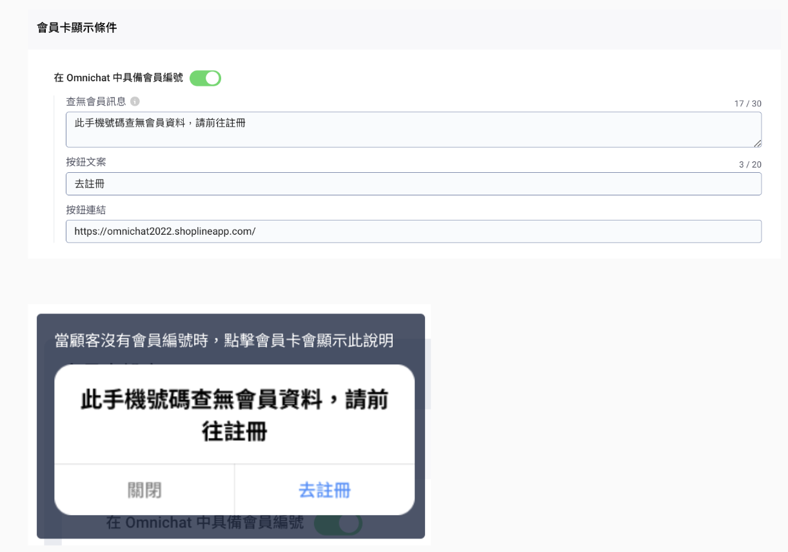<figcaption></figcaption></figure>

### 會員卡內容設定

在「會員中心」區塊，可以設定會員卡顯示的內容。

#### 會員條碼

可以設定開啟或關閉。

顯示格式支援 Code128、Code39、EAN-13、QR Code。

<figure>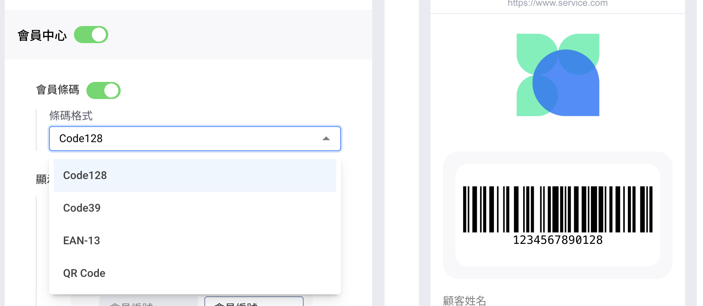<figcaption></figcaption></figure>

#### 顯示資訊

可自訂會員卡資料欄位，以及各欄位顯示名稱。

* 顯示欄位可自訂順序
* 顯示欄位沒有上限，但不可重覆顯示同一資料
* 支援的顯示資訊包含
  * 顧客姓名
  * 會員編號
  * 電話
  * Email
  * 累積點數 (須購買點數功能)
  * 點數餘額 (須購買點數功能)
  * 自訂屬性 (須購買自訂屬性功能)

<figure>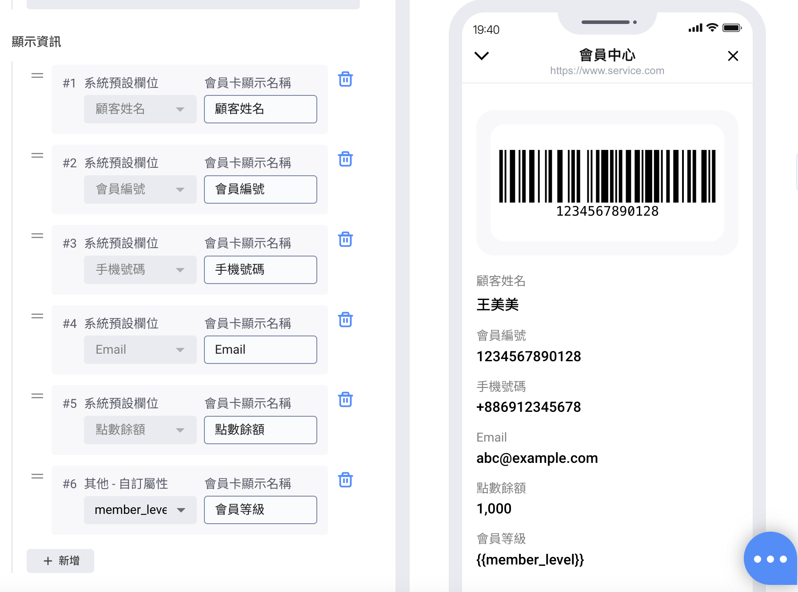<figcaption></figcaption></figure>

#### 外觀設定

可設定會員卡頁面上方 Banner。

* 若沒有上傳圖片，則會員卡畫面則不會有這個區塊
* 上傳圖片的建議尺寸為：1200 \* 512 px，會等比例自動縮放圖片大小，若比例不等處會留白

<figure>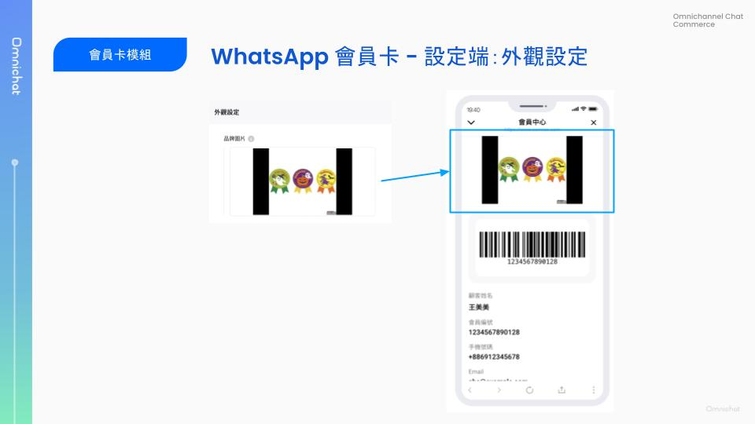<figcaption></figcaption></figure>

### 設定完成後，如何讓顧客開啟會員卡？

WhatsApp 會員卡完成設定並啟用後，可透過以下方式將會員卡連結提供給顧客：

1. 在自助設計機器人中使用系統預設模組「會員中心」
   * 設定方式：在 **自助設計機器人** 中 > 新增 WhatsApp 機器人 > 新增「文字訊息」卡片 > 點擊按鈕名稱 > 回覆對話模組下拉選擇系統預設模組「會員中心」
2. WhatsApp 訊息範本的快速回覆按鈕
   * 在 **推播、旅程、對話** 發送 WhatsApp 訊息範本時， 可於編輯內容 > 按鈕（類型 - 快速回覆）> 按鈕動作選取「會員中心」

觸發會員中心模組後，系統會提供「開啟會員中心」按鈕，顧客點擊此按鈕即可開啟會員卡頁面。

請注意，為保護顧客資料安全，「開啟會員中心」提供的有效期為 30 分鐘的動態連結，超過 30 分鐘會自動失效，需重新取得連結才能再度開啟會員卡。

<figure><figcaption></figcaption></figure>

<figure><figcaption></figcaption></figure>

<figure><figcaption></figcaption></figure>

## 遊戲模組支援 Instagram 平台

🙌🏻 **適用方案**：需加購遊戲模組

📍 **功能路徑**：[遊戲模組](https://console.omnichat.ai/games-management)

藉由遊戲模組，吸引新客加入好友、提升舊客互動、提高轉換率，遊戲模組讓行銷團隊可以快速完成檔期活動規劃，只需自訂獎項、中獎機率、調整遊戲畫面，就可以快速上線一檔活動！

Omnichat 遊戲模組更支援多社群應用，不論是在 LINE、WhatsApp 上都已經有許多品牌透過 Omnichat 遊戲模組完成一檔檔成功活動，現在遊戲模組更新增支援 Instagram 啦！

期待你使用遊戲模組在 Instagram 玩出具能擴散又帶轉換的好活動！

可以將 IG 遊戲連結，放置於機器人中訊息卡片的「按鈕」，或讓顧客從外部直接點擊連結來觸發遊戲。

<figure>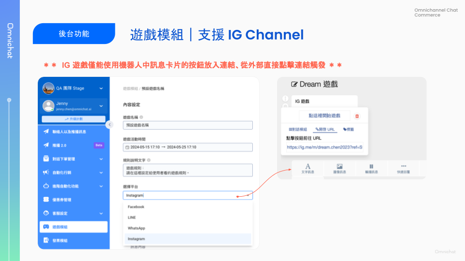<figcaption></figcaption></figure>

## 商品導購連結、購物車未結商品卡片，依據產品目錄顯示幣別

🙌🏻 **適用方案**：所有方案

📍 **上傳產品目錄**：設定 > [產品目錄](https://app.omnichat.ai/product-feed.html)

發送的「導購商品訊息」以及購物車再行銷的「未結商品訊息」中，貨幣符號由統一的「$」改由依產品目錄中的金額欄位 (sale\_price) 所填入的幣值顯示。

目前支援的幣值與符號：

* USD 美元 → US$
* HKD 港幣 → HK$
* MOP 澳門幣 → MOP$
* TWD 新台幣 → NT$
* SGD 新加坡元 → S$
* MYR 馬來西亞令吉 → RM
* THB 泰銖 → ฿
* IDR 印尼盾 → Rp
* AUD 澳大利亞元 → A$
* JPY 日圓 → JPY￥
* KRW 韓圓 → ₩

若產品目錄所上傳的貨幣不包含在上述列表，則維持顯示「$」。

<figure><figcaption></figcaption></figure>

## 官網顧客行銷 2.0 改版推出！

🙌🏻 **適用方案**：包含行銷功能的所有方案

📍 **功能路徑**：自動化行銷 > [官網顧客行銷 2.0](https://console.omnichat.ai/campaign)

Omnichat 的官網顧客行銷，讓你可以依據顧客的網站瀏覽行為（停留頁面、時間、訪問次數），貼標籤、顯示站內訊息、傳送社群再行銷訊息、觸發顧客旅程。

現在，這個功能介面改版囉！

除了設計風格的更新以外，還有以下介面優化：

1. 活動狀態：舊版僅有開啟、關閉 2 種狀態，新版調整成 3 種
   1. 停用中：尚未發布的活動、手動關閉的活動
   2. 進行中：目前正在運行中的活動
   3. 已結束：行銷活動期間有設定結束時間，結束時間已過的活動
2. 行銷活動總覽頁面：不必點開活動即可查看多項活動資訊，比起舊版新增的包含以下內容
   1. 活動期間
   2. 觸發條件：訪網頁面、總訪問次數
   3. 建立時間

最後，數據統計統一集中在「統計圖表」頁面，要查看統計圖表請點擊總覽頁的上方的「更多功能」後，就會出現前往統計圖表的選項囉！

<figure>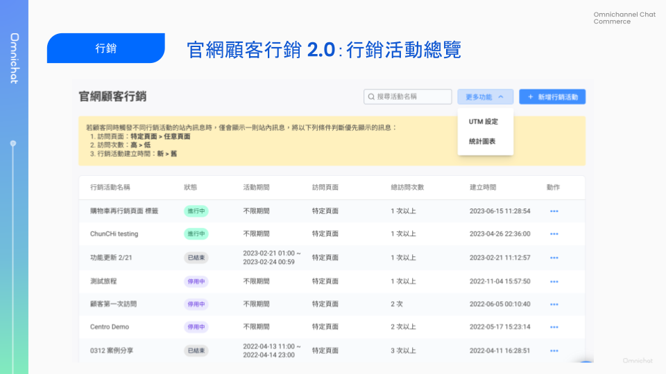<figcaption></figcaption></figure>

<figure>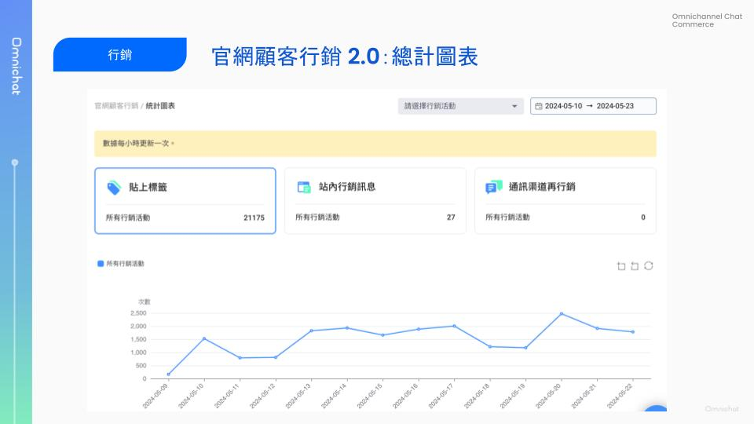<figcaption></figcaption></figure>

## 關鍵字自動回覆 2.0，改版推出！

🙌🏻 **適用方案**：包含客服功能的所有方案

📍 **功能路徑**：進階自動化功能 > [關鍵字自動回覆 2.0](https://console.omnichat.ai/keyword-auto-reply)

Omnichat 的關鍵字自動回覆，有高度的彈性，不論是在行銷、客服上都受到使用者廣泛地應用與喜愛。

值得重提的特色包含：

1. 彈性的關鍵字設定：一次不只可以針對一組關鍵字回應，可以設定多組關鍵字、收到任何內容皆回應，或是訊息完全符合設定才做回應
2. 多渠道分組設定：可以將關鍵字自動回覆分組，每個分組內也可以針對指定的多個渠道回應。讓你可以一次啟用、暫停、刪除多組關鍵字自動回覆。這樣的機制，讓多個品牌管理、檔期活動管理變得更方便。
3. 關鍵字自動回覆連結、QRcode：關鍵字自動回覆設定完成後，除了可以偵測社群對話去反應，也可以取得觸發該關鍵字自動回覆的連結、QRcode，只要讓顧客點選連結、掃描 QRcode，就可以不受通路限制地與顧客精準互動、提供準確回應。常見應用如：掃描 QRcode 領取優惠券、掃描 QRcode 開始遊戲模組。

### 關鍵字自動回覆 2.0：列表頁

<figure>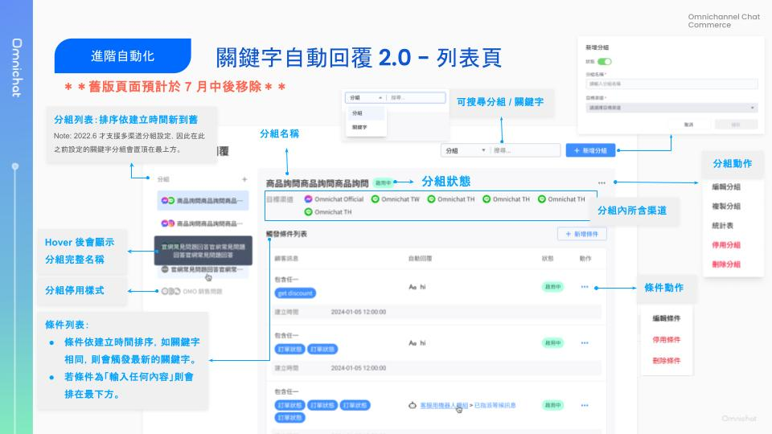<figcaption></figcaption></figure>

#### 錯誤提示

錯誤提示為本次改版後新支援項目。

以下情況會顯示錯誤提示：

* 分組：任一目標渠道被刪除
* 自動回覆條件：
  * 機器人被刪除
  * 回應內容與平台條件不符合。如：關鍵字觸發訊息設定為貼圖包後，再將 WhatsApp 渠道移除。

<figure>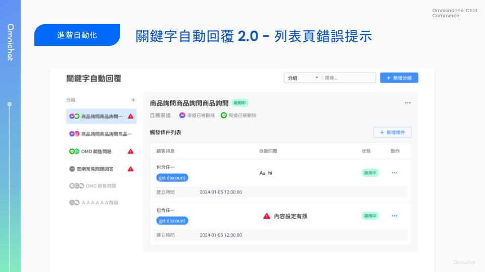<figcaption></figcaption></figure>

### 關鍵字自動回覆 2.0：回覆條件

點擊新增條件或編輯條件，則會進入關鍵字自動回覆條件編輯頁面。

此頁面除了設計優化以外，更增加了「訊息預覽」功能，讓你設定時更方便確認自己有選到正確的回應內容。

<figure>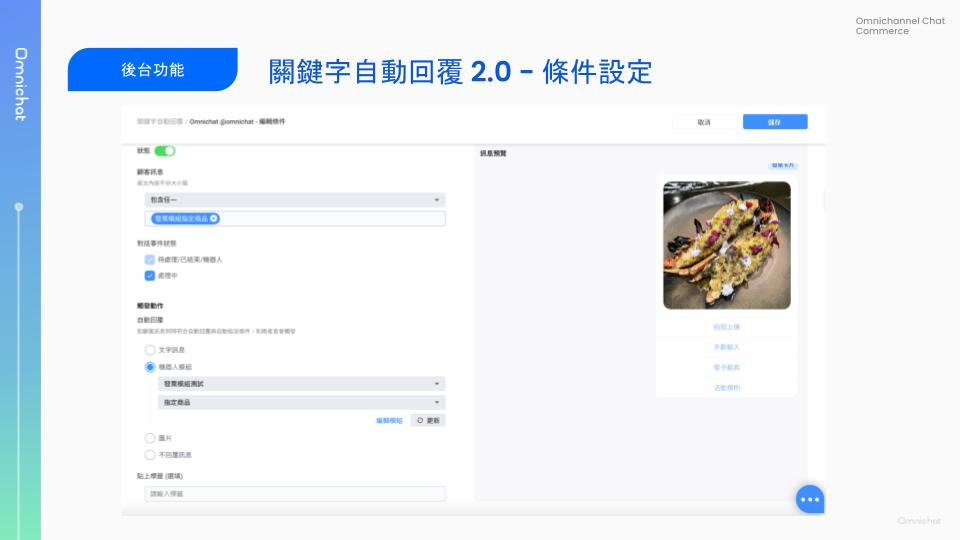<figcaption></figcaption></figure>

### 關鍵字自動回覆 2.0：分組統計表

要查看關鍵字自動回覆觸發次數，可以從回覆分組右上角的「⋯」點開更多動作，選擇「統計表」。

進入統計表後，可以查看每一個自動回覆條件的分組觸發次數、各渠道觸發次數。

<figure>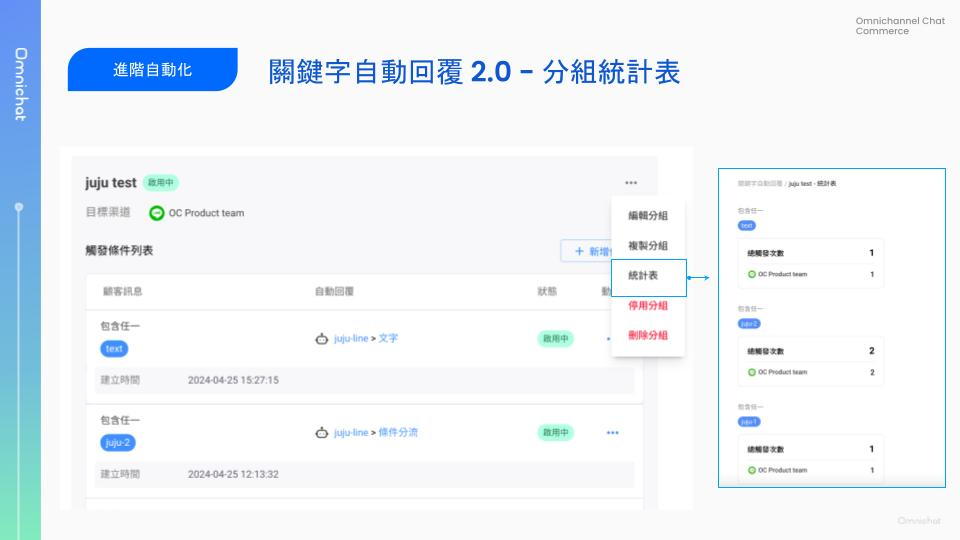<figcaption></figcaption></figure>

## 對話 2.0：改版介面全面開放！

🙌🏻 **適用方案**：包含客服功能的所有方案

📍 **功能路徑**：[對話 2.0](https://console.omnichat.ai/conversation)

對話 2.0 版本，已經全面開放各團隊使用！

預計於 8 月下架舊版對話頁面，請把握時間熟悉新版介面。

### **訊息狀態說明**

* 發送中 (Sending)：訊息發送中
* 已送出 (Sent)：訊息送至 Social media message API 成功
* 已收到 (Received)：訊息已成功發送至顧客端
  * 無法發送到顧客端的可能原因：
    * 顧客沒有接受通訊平台的相關隱私條款
    * 顧客的手機沒有網絡
* 已讀 (Read)：
  * 僅支援 FB / IG / WhatsApp
  * LINE：官方沒有提供已讀 webhook，訊息會停留在已收到，但如果顧客有回覆訊息，會將店員傳送的訊息都改為已讀。
  * Ｗebchat：當顧客打開對話插件時，會將訊息改為已讀。
* 傳送失敗 (Failed)：訊息到已送出後，有可能無法順利送達到客戶手機，會在對話上顯示錯誤原因。

### 支援發送 WhatsApp 貼圖包、LINE 官方貼圖

對話 2.0 支援發送貼圖囉！

1. 發送訊息中，新增\*\*「貼圖」\*\*按鈕，點擊後，顯示貼圖視窗 (2\~4)
2. 貼圖視窗底部可切換「貼圖包」（預設第一張貼圖作選單呈現）
3. 切換貼圖包，顯示對應「貼圖清單」，點擊後即可發送貼圖
4. \*\*「近期發送」\*\*紀錄該團隊成員，最後發送的 16 張貼圖（限定同裝置、瀏覽器）
5.  **限定 WhatsApp, LINE 渠道功能**

    LINE 皆可使用 LINE 官方貼圖、WhatsApp 需**加購功能**並上傳貼圖包

<figure>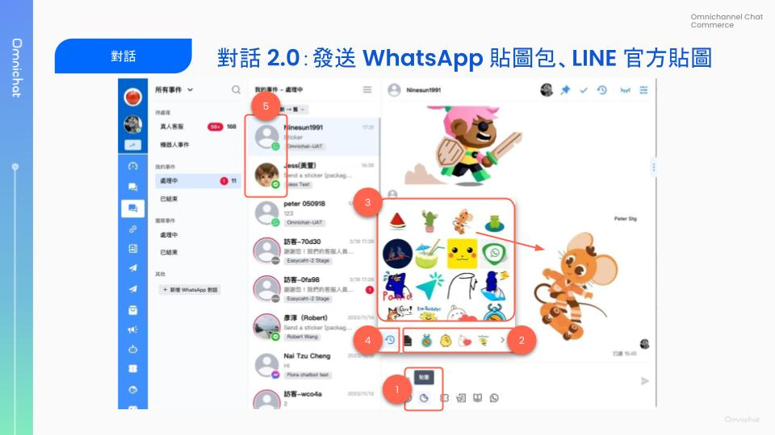<figcaption></figcaption></figure>

