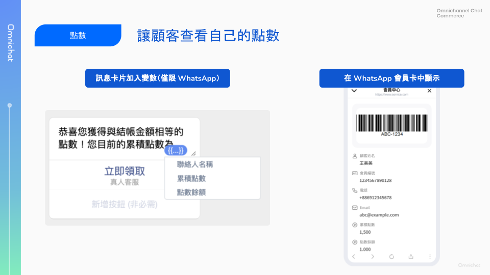

# May 29, 2024

哈囉，親愛的 Omnichat 用戶！

以下是我們為您帶來的功能更新：

1. [點數功能上線](may-29-2024.md#dian-shu-gong-neng-shang-xian)
2. 推播測試功能上線
   1. 社群聯絡人支援建立測試名單
   2. 推播支援發送測試名單
3. 設定：支援[設定顧客端顯示語言](may-29-2024.md#she-ding-zhi-yuan-she-ding-gu-ke-duan-xian-shi-yu-yan)
4. [其他優化項目](may-29-2024.md#qi-ta-gong-neng-you-hua)
   1. 社群聯絡人 2.0：支援編輯標籤
   2. 對話 2.0：新增 WhatsApp 對話功能國碼欄位，自動紀錄上一次使用的國碼

## 點數功能上線！

🙌🏻 **適用方案**：加購點數模組

📍 **功能路徑**：統計表 > 點數紀錄

想要擁有一套跨官網、門市、社群，皆可集點的顧客忠誠度經營系統嗎？

Omnichat 點數功能能滿足你的需求！

不論是官網購物、門市消費，還是活動參與、社群互動，都可以設定給點機制，給予顧客點數獎勵。

再加上「點數兌換優惠券」的機制，方便顧客兌換獎勵。

透過 Omnichat 點數功能，從集點、會員分級、兌換獎勵，讓你輕鬆建立品牌顧客忠誠計畫。


&#x20;顧客資料需具備「電話號碼」，才可進行集點。



目前社群僅支援 WhatsApp，其他社群開發中，若有興趣使用，請向您的業務窗口聯繫。


### 前置作業：官網消費給點公式

Omnichat 可以追蹤顧客在你官網的消費，並依據消費金額給予相應的點數。

在開啟點數功能前，請先提供點數換算公式：

* 一個團隊僅能提供一種換算方式（例如：$100 = 1 Point、$100 = 2 Points）
* 點數換算後會四捨五入（例如：每消費 100 元可以拿 1 點，若消費 150 元則會得到 2 點）
* 公式設定後不可更改且不針對幣別作換算

### 顧客資料欄位：點數餘額、累積點數

開啟點數功能後，顧客資料上會新增 2 個欄位：

* **點數餘額**：顧客當下可以使用的點數（可能因兌換優惠券、商品退貨⋯⋯等原因而減少）
* **累積點數**：顧客從第一天到現在獲得過的總點數，不會因為兌換獎勵而減少，可用來評估顧客價值、顧客忠誠度

### 點數增減的方式

#### 官網消費

透過 Omnichat Pixel 追蹤，依據您設定的給點公式給予點數。

#### 手動匯入

📍 **功能路徑**：社群客戶資料平台 > 匯入顧客資料 > 匯入社群聯絡人

目前僅支援透過 WhatsApp 匯入點數，匯入聯絡人渠道選擇 WhatsApp 帳號後，才顯示會點數相關設定。

**匯入聯絡人資料「Point Balance」來做點數增減：**

* 若有開啟點數功能，「下載範例」的 CSV 檔會包含「Point Balance」欄位。
* Point Balance 欄位代表此次匯入要新增或減少的點數數量，若填寫正值則為新增點數、若填寫負值則為扣除點數。

**累積點數變動規則：**

* 新增點數：會同時針對「點數餘額」及「累積點數」做增加
* 扣除點數：若開啟「一併扣除累積點數」，則會對應扣除該筆資料中點數餘額設定的扣除。若未開啟「一併扣除累積點數」，則僅扣除「點數餘額」。

<figure><figcaption></figcaption></figure>

#### 顧客旅程

📍 **功能路徑**：進階自動化功能 > 全渠道顧客旅程

開啟點數功能後，你的顧客旅程會多一個動作節點「**增加/扣除點數餘額**」。

這個功能將幫助你在客戶參與特定活動後，如填寫問卷、參加活動、提交反饋表格、掃描 QR 碼等，給予他們點數。

* 新增：觸發後增加 **點數餘額**、**累積點數**
* 扣除：觸發後扣除 **點數餘額**（不會扣除累積點數）

<figure><figcaption></figcaption></figure>

#### 點數兌換優惠券

開啟點數功能後，你的優惠券設定頁面也會新增一個區塊，讓你可以設定點數兌換優惠券的條件。

顧客可以使用他們的點數來兌換優惠券，兌換後會從他的「點數餘額」中扣除相應點數。

優惠券設定：

* 須選擇 **行銷類型優惠券**
* 領取設定 - 點數兌換優惠券
  * 兌換後扣除點數：自行輸入任一值
  * 點數不足訊息：
    * 點數不足時的說明文字
    * 可加入點數餘額變數 \{{system:loyaltyPoint:balance\}} ，讓顧客獲得資訊

<figure><figcaption></figcaption></figure>

### 查看點數

**你可以在哪裡查看顧客點數？**

1. 對話：對話介面右側顧客資料
2. 顧客管理
3. 社群聯絡人管理

<figure><figcaption></figcaption></figure>

**顧客可以在哪裡查看自己的點數？**

1. WhatsApp 對話訊息：你可以在訊息卡片中插入點數餘額、累積點數變數，讓顧客得知資訊
2. WhatsApp 會員卡：可以在 WhatsApp 會員卡中顯示點數餘額、累積點數，讓顧客隨時可以查看

<figure><figcaption></figcaption></figure>

### 其他相關功能應用

1. 訊息卡片：支援加入點數餘額、累積點數 變數（WhatsApp）
2. 條件分流卡片：支援根據 點數餘額、累積點數分流

## 推播測試功能：支援設定測試名單與發送測試訊息

🙌🏻 **適用方案**：包含行銷的所有方案

許多用戶期待已久的推播測試功能上線囉！

發送測試訊息分成兩步驟：

1. 建立測試名單：將經常協助測試的團隊成員加入名單中，方便日後選取
2. 發送測試訊息：在推播內容設定完畢後，可選擇對測試名單中的部分或全部成員發送測試訊息

### 社群聯絡人：建立測試名單

📍 **功能路徑**：社群聯絡人 2.0

單一渠道最多可新增 100 個聯絡人至測試名單，可將多個團隊成員加入名單，實際發送測試訊息時，最多可對 5 位聯絡人發送。

建立測試名單：

1. 勾選欲加入測試名單的聯絡人
2. 點選右上角更多功能 > **新增至測試名單**

<figure><figcaption></figcaption></figure>

查看測試名單與刪除測試人員：

1. 可點選 更多功能 > **查看測試名單**。
2. 點選聯絡人動作的刪除符號，將聯絡人從測試名單中移除

<figure><figcaption></figcaption></figure>

### 推播：發送測試訊息

📍 **功能路徑**：推播

須先完成「建立測試名單」，才有辦法發送測試訊息喔！

在推播時，分為受眾設定與推播設定兩步驟。

如果要發送測試訊息，在第二步驟推播內容設定完成後：

1. 點擊右上角「發送測試訊息」
2. 從測試名單中勾選此次要發送的名單，進行發送測試訊息

一次最多可發送給五位聯絡人，測試訊息會即時發送並告知發送結果，但不會產生「推播紀錄」。


請注意發送 LINE 和 WhatsApp 測試訊息時，會按照一般推播訊息費率收費


<figure><figcaption></figcaption></figure>

## 設定：支援設定顧客端顯示語言

📍 **功能路徑**：設定 > 團隊資料

支援顧客端顯示語言調整，可設定的語言包含：

* 繁體中文
* 简体中文
* English

此設定應用範圍：

* 網站對話插件
* 會員卡動態連結訊息文字
* 優惠券兌換按鈕文字

<figure><figcaption></figcaption></figure>

## 其他功能優化

1. 社群聯絡人 2.0：支援編輯標籤
2. 對話 2.0：新增 WhatsApp 對話國碼欄位，自動紀錄上一次使用的國碼

<figure><figcaption></figcaption></figure>
