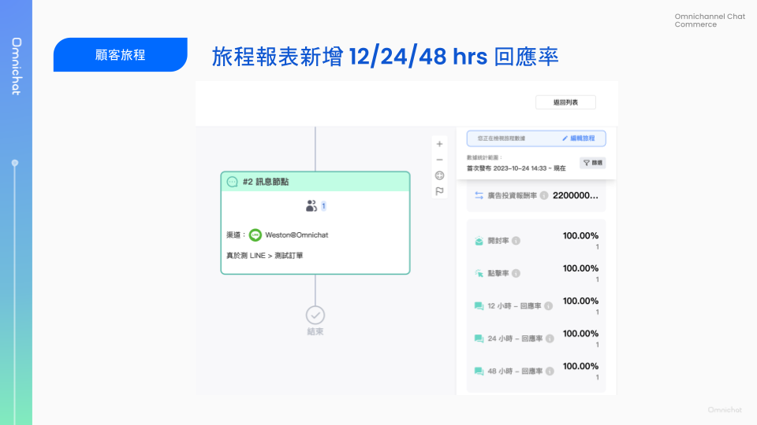
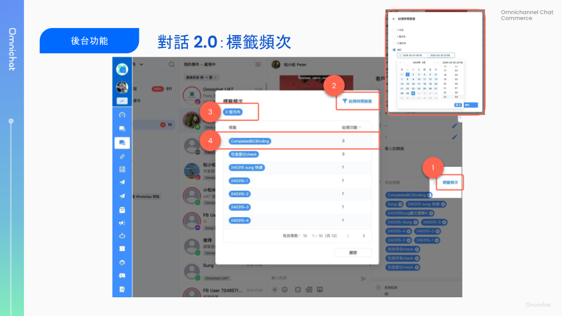

# May 8, 2024

哈囉，親愛的 Omnichat 用戶！

以下是我們為您帶來的功能更新：

1. [顧客旅程](may-8-2024.md#gu-ke-lv-cheng-bao-biao-xin-zeng-122448-xiao-shi-hui-ying-lv)：報表新增 12、24、48 小時回應率
2. [對話 2.0 ](may-8-2024.md#dui-hua-2.0-zhi-yuan-cha-kan-biao-qian-bin-ci)支援查看標籤頻次
3. [其他功能優化](may-8-2024.md#qi-ta-gong-neng-you-hua)
   1. LINE 圖文選單：OMO 指定分店選單支援多個排程
   2. Contact API 支援一次讀取所有聯絡人

## 顧客旅程：報表新增 12、24、48 小時回應率

🙌🏻 適用方案：開通全渠道顧客旅程

過去顧客旅程僅計算 24 小時回應數與回應率，這次改版後調整為分別計算 12 小時內、24 小時內、48 小時內回應數與回應率，讓您更能掌握顧客互動狀況。

<figure><figcaption></figcaption></figure>

## 對話 2.0 支援查看標籤頻次

🙌🏻 適用方案：所有方案

在對話 2.0 頁面支援檢視顧客在指定區間中，各標籤被貼標次數囉！

右側客戶資料，標籤欄位：

1. 點擊「標籤頻次」按鈕後，會彈出視窗顯示詳情
2. 右上角「貼標時間篩選」，可選擇指定相對區間、自訂區間之資料。
3. 貼標時間篩選條件，顯示於列表上方，條件預設 1 個月內，並即時更新列表資料
4. 顯示對應時間區間內，有貼過的標籤以及次數，並可依照貼標次數做排序。

**方案差異：**

* CDP 方案：貼標紀錄永久紀錄、可指定 180 天做區間查詢
* **非** CDP 方案：貼標紀錄僅保留 90 天

<figure><figcaption></figcaption></figure>

## 其他功能優化

1. LINE 圖文選單：OMO 指定分店選單支援多個排程
2. Contact API：過去限制一次讀取 7 天資料，優化後無時間區間限制
